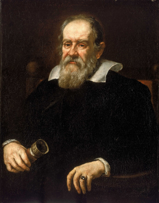

### Learning Objectives

By the end of this section, you will be able to:

* Explain how Copernicus developed the heliocentric model of the solar system
* Explain the Copernican model of planetary motion and describe evidence or arguments in favor of it
* Describe Galileo’s discoveries concerning the study of motion and forces
* Explain how Galileo’s discoveries tilted the balance of evidence in favor of the Copernican model

Astronomy made no major advances in strife-torn medieval Europe. The birth and expansion of Islam after the seventh century led to a flowering of Arabic and Jewish cultures that preserved, translated, and added to many of the astronomical ideas of the Greeks. Many of the names of the brightest stars, for example, are today taken from the Arabic, as are such astronomical terms as “zenith.”

As European culture began to emerge from its long, dark age, trading with Arab countries led to a rediscovery of ancient texts such as *Almagest* and to a reawakening of interest in astronomical questions. This time of rebirth (in French, “*renaissance*”) in astronomy was embodied in the work of Copernicus ([\[link\]](#OSC_Astro_02_04_Copernicus)).

 {: #OSC_Astro_02_04_Copernicus data-title="Nicolaus Copernicus (1473&#x2013;1543)."}

### Copernicus

One of the most important events of the Renaissance was the displacement of Earth from the center of the universe, an intellectual revolution initiated by a Polish cleric in the sixteenth century. Nicolaus **Copernicus**{: data-type="term" .no-emphasis} was born in Torun, a mercantile town along the Vistula River. His training was in law and medicine, but his main interests were astronomy and mathematics. His great contribution to science was a critical reappraisal of the existing theories of planetary motion and the development of a new Sun-centered, or **heliocentric**{: data-type="term"}, model of the solar system. Copernicus concluded that Earth is a planet and that all the planets circle the Sun. Only the Moon orbits Earth ([\[link\]](#OSC_Astro_02_04_CopSystem)).

 ![Copernicus&#x2019; Drawing of the Solar System. In this diagram the Sun (here labeled &#x201C;Sol&#x201D;) is at the center of a series of circles representing the orbits of the planets. The planets are labeled in Latin. Moving outward from the Sun are &#x201C;VII. Mercury&#x201D;, &#x201C;VI. Venus&#x201D;, &#x201C;V. Telluris&#x201D; (with the orbit of the Moon included), &#x201C;IIII. Martis&#x201D;, &#x201C;III. Jovis&#x201D;, &#x201C;II. Saturnus&#x201D;, and &#x201C;I. Stellarum Fixarum&#x201D;. The outer circle represents the sky beyond the planets &#x2013; the &#x201C;fixed stars&#x201D;.](../resources/OSC_Astro_02_04_CopSystem.jpg "Copernicus developed a heliocentric plan of the solar system. This system was published in the first edition of De Revolutionibus Orbium Coelestium. Notice the word Sol for &#x201C;Sun&#x201D; in the middle. (credit: Nicolai Copernici)"){: #OSC_Astro_02_04_CopSystem data-title="Copernicus&#x2019; System."}

**Copernicus**{: data-type="term" .no-emphasis} described his ideas in detail in his book *De Revolutionibus Orbium Coelestium* (*On the Revolution of Celestial Orbs*), published in 1543, the year of his death. By this time, the old Ptolemaic system needed significant adjustments to predict the positions of the planets correctly. Copernicus wanted to develop an improved theory from which to calculate planetary positions, but in doing so, he was himself not free of all traditional prejudices.

He began with several assumptions that were common in his time, such as the idea that the motions of the heavenly bodies must be made up of combinations of uniform circular motions. But he did not assume (as most people did) that Earth had to be in the center of the universe, and he presented a defense of the heliocentric system that was elegant and persuasive. His ideas, although not widely accepted until more than a century after his death, were much discussed among scholars and, ultimately, had a profound influence on the course of world history.

One of the objections raised to the heliocentric theory was that if Earth were moving, we would all sense or feel this motion. Solid objects would be ripped from the surface, a ball dropped from a great height would not strike the ground directly below it, and so forth. But a moving person is not necessarily aware of that motion. We have all experienced seeing an adjacent train, bus, or ship appear to move, only to discover that it is we who are moving.

Copernicus argued that the apparent motion of the Sun about Earth during the course of a year could be represented equally well by a motion of Earth about the Sun. He also reasoned that the apparent rotation of the celestial sphere could be explained by assuming that Earth rotates while the celestial sphere is stationary. To the objection that if Earth rotated about an axis it would fly into pieces, Copernicus answered that if such motion would tear Earth apart, the still faster motion of the much larger celestial sphere required by the geocentric hypothesis would be even more devastating.

### The Heliocentric Model

The most important idea in Copernicus’ *De Revolutionibus* is that Earth is one of six (then-known) planets that revolve about the Sun. Using this concept, he was able to work out the correct general picture of the solar system. He placed the planets, starting nearest the Sun, in the correct order: Mercury, Venus, Earth, Mars, Jupiter, and Saturn. Further, he deduced that the nearer a planet is to the Sun, the greater its orbital speed. With his theory, he was able to explain the complex retrograde motions of the planets without epicycles and to work out a roughly correct scale for the solar system.

Copernicus could not prove that Earth revolves about the Sun. In fact, with some adjustments, the old Ptolemaic system could have accounted, as well, for the motions of the planets in the sky. But Copernicus pointed out that the Ptolemaic cosmology was clumsy and lacking the beauty and symmetry of its successor.

In Copernicus’ time, in fact, few people thought there were ways to prove whether the heliocentric or the older geocentric system was correct. A long philosophical tradition, going back to the Greeks and defended by the Catholic Church, held that pure human thought combined with divine revelation represented the path to truth. Nature, as revealed by our senses, was suspect. For example, Aristotle had reasoned that heavier objects (having more of the quality that made them heavy) must fall to Earth faster than lighter ones. This is absolutely incorrect, as any simple experiment dropping two balls of different weights shows. However, in Copernicus’ day, experiments did not carry much weight (if you will pardon the expression); Aristotle’s reasoning was more convincing.

In this environment, there was little motivation to carry out observations or experiments to distinguish between competing cosmological theories (or anything else). It should not surprise us, therefore, that the heliocentric idea was debated for more than half a century without any tests being applied to determine its validity. (In fact, in the North American colonies, the older geocentric system was still taught at Harvard University in the first years after it was founded in 1636.)

Contrast this with the situation today, when scientists rush to test each new hypothesis and do not accept any ideas until the results are in. For example, when two researchers at the University of Utah announced in 1989 that they had discovered a way to achieve nuclear fusion (the process that powers the stars) at room temperature, other scientists at more than 25 laboratories around the United States attempted to duplicate “cold fusion” within a few weeks—without success, as it turned out. The cold fusion theory soon went down in flames.

How would we look at Copernicus’ model today? When a new hypothesis or theory is proposed in science, it must first be checked for consistency with what is already known. Copernicus’ heliocentric idea passes this test, for it allows planetary positions to be calculated at least as well as does the geocentric theory. The next step is to determine which predictions the new hypothesis makes that differ from those of competing ideas. In the case of **Copernicus**{: data-type="term" .no-emphasis}, one example is the prediction that, if Venus circles the Sun, the planet should go through the full range of phases just as the Moon does, whereas if it circles Earth, it should not ([\[link\]](#OSC_Astro_02_04_VenusPhase)). Also, we should not be able to see the full phase of Venus from Earth because the Sun would then be between Venus and Earth. But in those days, before the telescope, no one imagined testing these predictions.

 ![The phases of Venus as seen from Earth. At bottom center of this illustration the Earth is shown with an arrow pointing to the right indicating its direction of motion. Directly above the center of the diagram is the Sun. A blue ellipse is drawn around the Sun with an arrow pointing to the right, representing the orbit and motion of Venus. Venus is drawn in six different positions along its orbit to illustrate the different phases. The three on the left side of the orbit show the phases as Venus approaches Earth, with sunlight arriving from the right. Beginning at upper left, Venus is further from Earth than the Sun and appears gibbous. As Venus travels to a point on the left side of the orbit it appears half illuminated as seen from Earth. As Venus gets closer to the line between Earth and Sun, it appears as a thin crescent. The three positions on the right side of the orbit show the phases as Venus gets farther from Earth, with sunlight arriving from the left. The right side of the diagram is a mirror view of the left. Venus appears as thin crescent close to Earth, then moves further to the right to appear half illuminated, and finally appears as gibbous before moving behind the Sun.](../resources/OSC_Astro_02_04_VenusPhase.jpg "As Venus moves around the Sun, we see changing illumination of its surface, just as we see the face of the Moon illuminated differently in the course of a month."){: #OSC_Astro_02_04_VenusPhase data-title="Phases of Venus."}

This [animation][1] shows the phases of **Venus**{: data-type="term" .no-emphasis}. You can also see its distance from Earth as it orbits the Sun.

### Galileo and the Beginning of Modern Science

Many of the modern scientific concepts of observation, experimentation, and the testing of hypotheses through careful quantitative measurements were pioneered by a man who lived nearly a century after Copernicus. **Galileo**{: data-type="term" .no-emphasis} Galilei ([\[link\]](#OSC_Astro_02_04_Galileo)), a contemporary of Shakespeare, was born in Pisa. Like Copernicus, he began training for a medical career, but he had little interest in the subject and later switched to mathematics. He held faculty positions at the University of Pisa and the University of Padua, and eventually became mathematician to the Grand Duke of Tuscany in Florence.

 {: #OSC_Astro_02_04_Galileo data-title="Galileo Galilei (1564&#x2013;1642)."}

Galileo’s greatest contributions were in the field of mechanics, the study of motion and the actions of forces on bodies. It was familiar to all persons then, as it is to us now, that if something is at rest, it tends to remain at rest and requires some outside influence to start it in motion. Rest was thus generally regarded as the natural state of matter. Galileo showed, however, that rest is no more natural than motion.

If an object is slid along a rough horizontal floor, it soon comes to rest because friction between it and the floor acts as a retarding force. However, if the floor and the object are both highly polished, the object, given the same initial speed, will slide farther before stopping. On a smooth layer of ice, it will slide farther still. Galileo reasoned that if all resisting effects could be removed, the object would continue in a steady state of motion indefinitely. He argued that a force is required not only to start an object moving from rest but also to slow down, stop, speed up, or change the direction of a moving object. You will appreciate this if you have ever tried to stop a rolling car by leaning against it, or a moving boat by tugging on a line.

**Galileo**{: data-type="term" .no-emphasis} also studied the way objects **accelerate**{: data-type="term"}—change their speed or direction of motion. Galileo watched objects as they fell freely or rolled down a ramp. He found that such objects accelerate uniformly; that is, in equal intervals of time they gain equal increments in speed. Galileo formulated these newly found laws in precise mathematical terms that enabled future experimenters to predict how far and how fast objects would move in various lengths of time.

In theory, if Galileo is right, a feather and a hammer, dropped at the same time from a height, should land at the same moment. On Earth, this experiment is not possible because air resistance and air movements make the feather flutter, instead of falling straight down, accelerated only by the force of gravity. For generations, physics teachers had said that the place to try this experiment is somewhere where there is no air, such as the Moon. In 1971, *Apollo 15* astronaut David Scott took a hammer and feather to the Moon and tried it, to the delight of physics nerds everywhere. NASA provides the [video of the hammer and feather][2] as well as a brief explanation.

Sometime in the 1590s, Galileo adopted the Copernican hypothesis of a heliocentric solar system. In Roman Catholic Italy, this was not a popular philosophy, for Church authorities still upheld the ideas of Aristotle and Ptolemy, and they had powerful political and economic reasons for insisting that Earth was the center of creation. Galileo not only challenged this thinking but also had the audacity to write in Italian rather than scholarly Latin, and to lecture publicly on those topics. For him, there was no contradiction between the authority of the Church in matters of religion and morality, and the authority of nature (revealed by experiments) in matters of science. It was primarily because of Galileo and his “dangerous” opinions that, in 1616, the Church issued a prohibition decree stating that the Copernican doctrine was “false and absurd” and not to be held or defended.

### Galileo’s Astronomical Observations

It is not certain who first conceived of the idea of combining two or more pieces of glass to produce an instrument that enlarged images of distant objects, making them appear nearer. The first such “spyglasses” (now called *telescopes*) that attracted much notice were made in 1608 by the Dutch spectacle maker Hans Lippershey (1570–1619). Galileo heard of the discovery and, without ever having seen an assembled telescope, constructed one of his own with a three-power magnification (3×), which made distant objects appear three times nearer and larger ([\[link\]](#OSC_Astro_02_04_Telescope)).

 {: #OSC_Astro_02_04_Telescope data-title="Telescope Used by Galileo."}

On August 25, 1609, **Galileo**{: data-type="term" .no-emphasis} demonstrated a telescope with a magnification of 9× to government officials of the city-state of Venice. By a magnification of 9×, we mean the linear dimensions of the objects being viewed appeared nine times larger or, alternatively, the objects appeared nine times closer than they really were. There were obvious military advantages associated with a device for seeing distant objects. For his invention, Galileo’s salary was nearly doubled, and he was granted lifetime tenure as a professor. (His university colleagues were outraged, particularly because the invention was not even original.)

Others had used the telescope before Galileo to observe things on Earth. But in a flash of insight that changed the history of astronomy, Galileo realized that he could turn the power of the telescope toward the heavens. Before using his telescope for astronomical observations, Galileo had to devise a stable mount and improve the optics. He increased the magnification to 30×. Galileo also needed to acquire confidence in the telescope.

At that time, human eyes were believed to be the final arbiter of truth about size, shape, and color. Lenses, mirrors, and prisms were known to distort distant images by enlarging, reducing, or inverting them, or spreading the light into a spectrum (rainbow of colors). Galileo undertook repeated experiments to convince himself that what he saw through the telescope was identical to what he saw up close. Only then could he begin to believe that the miraculous phenomena the telescope revealed in the heavens were real.

Beginning his astronomical work late in 1609, Galileo found that many stars too faint to be seen with the unaided eye became visible with his telescope. In particular, he found that some nebulous blurs resolved into many stars, and that the Milky Way—the strip of whiteness across the night sky—was also made up of a multitude of individual stars.

Examining the planets, Galileo found four moons revolving about **Jupiter**{: data-type="term" .no-emphasis} in times ranging from just under 2 days to about 17 days. This discovery was particularly important because it showed that not everything has to revolve around Earth. Furthermore, it demonstrated that there could be centers of motion that are themselves in motion. Defenders of the geocentric view had argued that if Earth was in motion, then the Moon would be left behind because it could hardly keep up with a rapidly moving planet. Yet, here were Jupiter’s moons doing exactly that. (To recognize this discovery and honor his work, NASA named a spacecraft that explored the Jupiter system Galileo.)

With his telescope, Galileo was able to carry out the test of the Copernican theory mentioned earlier, based on the phases of **Venus**{: data-type="term" .no-emphasis}. Within a few months, he had found that Venus goes through phases like the Moon, showing that it must revolve about the Sun, so that we see different parts of its daylight side at different times (see [\[link\]](#OSC_Astro_02_04_VenusPhase).) These observations could not be reconciled with Ptolemy’s model, in which Venus circled about Earth. In Ptolemy’s model, Venus could also show phases, but they were the wrong phases in the wrong order from what Galileo observed.

Galileo also observed the Moon and saw craters, mountain ranges, valleys, and flat, dark areas that he thought might be water. These discoveries showed that the Moon might be not so dissimilar to Earth—suggesting that Earth, too, could belong to the realm of celestial bodies.

For more information about the life and work of Galileo, see the [Galileo Project][3] at Rice University.

After Galileo’s work, it became increasingly difficult to deny the Copernican view, and Earth was slowly dethroned from its central position in the universe and given its rightful place as one of the planets attending the Sun. Initially, however, Galileo met with a great deal of opposition. The Roman Catholic Church, still reeling from the Protestant Reformation, was looking to assert its authority and chose to make an example of Galileo. He had to appear before the Inquisition to answer charges that his work was heretical, and he was ultimately condemned to house arrest. His books were on the Church’s forbidden list until 1836, although in countries where the Roman Catholic Church held less sway, they were widely read and discussed. Not until 1992 did the Catholic Church admit publicly that it had erred in the matter of censoring Galileo’s ideas.

The new ideas of **Copernicus**{: data-type="term" .no-emphasis} and **Galileo**{: data-type="term" .no-emphasis} began a revolution in our conception of the cosmos. It eventually became evident that the universe is a vast place and that Earth’s role in it is relatively unimportant. The idea that Earth moves around the Sun like the other planets raised the possibility that they might be worlds themselves, perhaps even supporting life. As Earth was demoted from its position at the center of the universe, so, too, was humanity. The universe, despite what we may wish, does not revolve around us.

Most of us take these things for granted today, but four centuries ago such concepts were frightening and heretical for some, immensely stimulating for others. The pioneers of the Renaissance started the European world along the path toward science and technology that we still tread today. For them, nature was rational and ultimately knowable, and experiments and observations provided the means to reveal its secrets.

Observing the Planets

At most any time of the night, and at any season, you can spot one or more bright planets in the sky. All five of the planets known to the ancients—Mercury, Venus, Mars, Jupiter, and Saturn—are more prominent than any but the brightest stars, and they can be seen even from urban locations if you know where and when to look. One way to tell planets from bright stars is that planets twinkle less.

Venus, which stays close to the Sun from our perspective, appears either as an “evening star” in the west after sunset or as a “morning star” in the east before sunrise. It is the brightest object in the sky after the Sun and Moon. It far outshines any real star, and under the most favorable circumstances, it can even cast a visible shadow. Some young military recruits have tried to shoot Venus down as an approaching enemy craft or UFO.

Mars, with its distinctive red color, can be nearly as bright as Venus is when close to Earth, but normally it remains much less conspicuous. Jupiter is most often the second-brightest planet, approximately equaling in brilliance the brightest stars. Saturn is dimmer, and it varies considerably in brightness, depending on whether its large rings are seen nearly edge-on (faint) or more widely opened (bright).

Mercury is quite bright, but few people ever notice it because it never moves very far from the Sun (it’s never more than 28° away in the sky) and is always seen against bright twilight skies.

True to their name, the planets “wander” against the background of the “fixed” stars. Although their apparent motions are complex, they reflect an underlying order upon which the heliocentric model of the solar system, as described in this chapter, was based. The positions of the planets are often listed in newspapers (sometimes on the weather page), and clear maps and guides to their locations can be found each month in such magazines as *Sky &amp; Telescope* and *Astronomy* (available at most libraries and online). There are also a number of computer programs and phone and tablet apps that allow you to display where the planets are on any night.

<section data-depth="1" class="summary" markdown="1">
Nicolaus Copernicus introduced the heliocentric cosmology to Renaissance Europe in his book *De Revolutionibus*. Although he retained the Aristotelian idea of uniform circular motion, Copernicus suggested that Earth is a planet and that the planets all circle about the Sun, dethroning Earth from its position at the center of the universe. Galileo was the father of both modern experimental physics and telescopic astronomy. He studied the acceleration of moving objects and, in 1610, began telescopic observations, discovering the nature of the Milky Way, the large-scale features of the Moon, the phases of Venus, and four moons of Jupiter. Although he was accused of heresy for his support of heliocentric cosmology, Galileo is credited with observations and brilliant writings that convinced most of his scientific contemporaries of the reality of the Copernican theory.

</section>

### For Further Exploration

#### Articles

##### *Ancient Astronomy*

Gingerich, O. “From Aristarchus to Copernicus.” *Sky &amp; Telescope* (November 1983): 410.

Gingerich, O. “Islamic Astronomy.” *Scientific American* (April 1986): 74.

##### *Astronomy and Astrology*

Fraknoi, A. “Your Astrology Defense Kit.” *Sky &amp; Telescope* (August 1989): 146.

##### *Copernicus and Galileo*

Gingerich, O. “Galileo and the Phases of Venus.” *Sky &amp; Telescope* (December 1984): 520.

Gingerich, O. “How Galileo Changed the Rules of Science.” *Sky &amp; Telescope* (March 1993): 32.

Maran, S., and Marschall, L. “The Moon, the Telescope, and the Birth of the Modern World.” *Sky &amp; Telescope* (February 2009): 28.

Sobel, D. “The Heretic’s Daughter: A Startling Correspondence Reveals a New Portrait of Galileo.” *The New Yorker* (September 13, 1999): 52.

#### Websites

##### *Ancient Astronomy*

Aristarchos of Samos: [http://adsabs.harvard.edu//full/seri/JRASC/0075//0000029.000.html][4]. By Dr. Alan Batten.

Claudius Ptolemy: [http://www-history.mcs.st-and.ac.uk/Biographies/Ptolemy.html][5]. An interesting biography.

Hipparchus of Rhodes: [http://www-history.mcs.st-andrews.ac.uk/Biographies/Hipparchus.html][6]. An interesting biography.

##### *Astronomy and Astrology*

Astrology and Science: [http://www.astrology-and-science.com/hpage.htm][7]. The best site for a serious examination of the issues with astrology and the research on whether it works.

Real Romance in the Stars: [http://www.independent.co.uk/voices/the-real-romance-in-the-stars-1527970.html][8]. 1995 newspaper commentary attacking astrology.

##### *Copernicus and Galileo*

Galileo Galilei: [http://www-history.mcs.st-andrews.ac.uk/Biographies/Galileo.html][9]. A good biography with additional links.

Galileo Project: [http://galileo.rice.edu/][10]. Rice University’s repository of information on Galileo.

Nicolaus Copernicus: [http://www-groups.dcs.st-and.ac.uk/~history/Biographies/Copernicus.html][11]. A biography including links to photos about his life.

#### Videos

##### *Astronomy and Astrology*

Astrology Debunked: [https://www.youtube.com/watch?v=y84HX2pMo5U][12]. A compilation of scientists and magicians commenting skeptically on astrology (9:09).

##### *Copernicus and Galileo*

Galileo: [http://www.biography.com/people/galileo-9305220][13]. A brief biography (2:51).

Galileo’s Battle for the Heavens: [https://www.youtube.com/watch?v=VnEH9rbrIkk][14]. A NOVA episode on PBS (1:48:55)

Nicolaus Copernicus: [http://www.biography.com/people/nicolaus-copernicus-9256984][15]. An overview of his life and work (2:41).

### Collaborative Group Activities

1.  With your group, consider the question with which we began this chapter. How many ways can you think of to prove to a member of the “Flat Earth Society” that our planet is, indeed, round?
2.  Make a list of ways in which a belief in astrology (the notion that your life path or personality is controlled by the position of the Sun, Moon, and planets at the time of your birth) might be harmful to an individual or to society at large.
3.  Have members of the group compare their experiences with the night sky. Did you see the Milky Way? Can you identify any constellations? Make a list of reasons why you think so many fewer people know the night sky today than at the time of the ancient Greeks. Discuss reasons for why a person, today, may want to be acquainted with the night sky.
4.  Constellations commemorate great heroes, dangers, or events in the legends of the people who name them. Suppose we had to start from scratch today, naming the patterns of stars in the sky. Whom or what would you choose to commemorate by naming a constellation after it, him, or her and why (begin with people from history; then if you have time, include living people as well)? Can the members of your group agree on any choices?
5.  Although astronomical mythology no longer holds a powerful sway over the modern imagination, we still find proof of the power of astronomical images in the number of products in the marketplace that have astronomical names. How many can your group come up with? (Think of things like Milky Way candy bars, Eclipse and Orbit gum, or Comet cleanser.)
{: data-number-style="upper-alpha"}

### Review Questions

From where on Earth could you observe all of the stars during the course of a year? What fraction of the sky can be seen from the North Pole?

Give four ways to demonstrate that Earth is spherical.

Explain, according to both geocentric and heliocentric cosmologies, why we see retrograde motion of the planets.

In what ways did the work of Copernicus and Galileo differ from the views of the ancient Greeks and of their contemporaries?

What were four of Galileo’s discoveries that were important to astronomy?

Explain the origin of the magnitude designation for determining the brightness of stars. Why does it seem to go backward, with smaller numbers indicating brighter stars?

Ursa Minor contains the pole star, Polaris, and the asterism known as the Little Dipper. From most locations in the Northern Hemisphere, all of the stars in Ursa Minor are circumpolar. Does that mean these stars are also above the horizon during the day? Explain.

How many degrees does the Sun move per day relative to the fixed stars? How many days does it take for the Sun to return to its original location relative to the fixed stars?

How many degrees does the Moon move per day relative to the fixed stars? How many days does it take for the Moon to return to its original location relative to the fixed stars?

Explain how the zodiacal constellations are different from the other constellations.

The Sun was once thought to be a planet. Explain why.

Is the ecliptic the same thing as the celestial equator? Explain.

What is an asterism? Can you name an example?

Why did Pythagoras believe that Earth should be spherical?

How did Aristotle deduce that the Sun is farther away from Earth than the Moon?

What are two ways in which Aristotle deduced that Earth is spherical?

How did Hipparchus discover the wobble of Earth’s axis, known as *precession*?

Why did Ptolemy have to introduce multiple circles of motion for the planets instead of a single, simple circle to represent the planet’s motion around the Sun?

Why did Copernicus want to develop a completely new system for predicting planetary positions? Provide two reasons.

What two factors made it difficult, at first, for astronomers to choose between the Copernican heliocentric model and the Ptolemaic geocentric model?

What phases would Venus show if the geocentric model were correct?

### Thought Questions

Describe a practical way to determine in which constellation the Sun is found at any time of the year.

What is a constellation as astronomers define it today? What does it mean when an astronomer says, “I saw a comet in Orion last night”?

Draw a picture that explains why Venus goes through phases the way the Moon does, according to the heliocentric cosmology. Does Jupiter also go through phases as seen from Earth? Why?

Show with a simple diagram how the lower parts of a ship disappear first as it sails away from you on a spherical Earth. Use the same diagram to show why lookouts on old sailing ships could see farther from the masthead than from the deck. Would there be any advantage to posting lookouts on the mast if Earth were flat? (Note that these nautical arguments for a spherical Earth were quite familiar to Columbus and other mariners of his time.)

Parallaxes of stars were not observed by ancient astronomers. How can this fact be reconciled with the heliocentric hypothesis?

Why do you think so many people still believe in astrology and spend money on it? What psychological needs does such a belief system satisfy?

Consider three cosmological perspectives—the geocentric perspective, the heliocentric perspective, and the modern perspective—in which the Sun is a minor star on the outskirts of one galaxy among billions. Discuss some of the cultural and philosophical implications of each point of view.

The north celestial pole appears at an altitude above the horizon that is equal to the observer’s latitude. Identify Polaris, the North Star, which lies very close to the north celestial pole. Measure its altitude. (This can be done with a protractor. Alternatively, your fist, extended at arm’s length, spans a distance approximately equal to 10°.) Compare this estimate with your latitude. (Note that this experiment cannot be performed easily in the Southern Hemisphere because Polaris itself is not visible in the south and no bright star is located near the south celestial pole.)

What were two arguments or lines of evidence in support of the geocentric model?

Although the Copernican system was largely correct to place the Sun at the center of all planetary motion, the model still gave inaccurate predictions for planetary positions. Explain the flaw in the Copernican model that hindered its accuracy.

During a retrograde loop of Mars, would you expect Mars to be brighter than usual in the sky, about average in brightness, or fainter than usual in the sky? Explain.

The Great Pyramid of Giza was constructed nearly 5000 years ago. Within the pyramid, archaeologists discovered a shaft leading from the central chamber out of the pyramid, oriented for favorable viewing of the bright star Thuban at that time. Thinking about Earth’s precession, explain why Thuban might have been an important star to the ancient Egyptians.

Explain why more stars are circumpolar for observers at higher latitudes.

What is the altitude of the north celestial pole in the sky from your latitude? If you do not know your latitude, look it up. If you are in the Southern Hemisphere, answer this question for the south celestial pole, since the north celestial pole is not visible from your location.

If you were to drive to some city south of your current location, how would the altitude of the celestial pole in the sky change?

Hipparchus could have warned us that the dates associated with each of the natal astrology sun signs would eventually be wrong. Explain why.

Explain three lines of evidence that argue against the validity of astrology.

What did Galileo discover about the planet Jupiter that cast doubt on exclusive geocentrism?

What did Galileo discover about Venus that cast doubt on geocentrism?

### Figuring for Yourself

Suppose Eratosthenes had found that, in Alexandria, at noon on the first day of summer, the line to the Sun makes an angle 30° with the vertical. What, then, would he have found for Earth’s circumference?

Suppose Eratosthenes’ results for Earth’s circumference were quite accurate. If the diameter of Earth is 12,740 km, what is the length of his stadium in kilometers?

Suppose you are on a strange planet and observe, at night, that the stars do not rise and set, but circle parallel to the horizon. Next, you walk in a constant direction for 8000 miles, and at your new location on the planet, you find that all stars rise straight up in the east and set straight down in the west, perpendicular to the horizon. How could you determine the circumference of the planet without any further observations? What is the circumference, in miles, of the planet?

### Glossary
{: data-type="glossary-title"}

accelerate
: to change velocity; to speed up, slow down, or change direction.
^

heliocentric
: centered on the Sun

[1]: https://openstaxcollege.org/l/30venusphases
[2]: https://openstaxcollege.org/l/30HamVsFeath
[3]: https://openstaxcollege.org/l/30GalProj
[4]: http://adsabs.harvard.edu//full/seri/JRASC/0075//0000029.000.html
[5]: http://www-history.mcs.st-and.ac.uk/Biographies/Ptolemy.html
[6]: http://www-history.mcs.st-andrews.ac.uk/Biographies/Hipparchus.html
[7]: http://www.astrology-and-science.com/hpage.htm
[8]: http://www.independent.co.uk/voices/the-real-romance-in-the-stars-1527970.html
[9]: http://www-history.mcs.st-andrews.ac.uk/Biographies/Galileo.html
[10]: http://galileo.rice.edu/
[11]: http://www-groups.dcs.st-and.ac.uk/~history/Biographies/Copernicus.html
[12]: https://www.youtube.com/watch?v=y84HX2pMo5U
[13]: http://www.biography.com/people/galileo-9305220
[14]: https://www.youtube.com/watch?v=VnEH9rbrIkk
[15]: http://www.biography.com/people/nicolaus-copernicus-9256984
