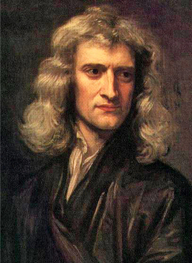

### Learning Objectives

By the end of this section, you will be able to:

* Describe Newton’s three laws of motion
* Explain how Newton’s three laws of motion relate to momentum
* Define mass, volume, and density and how they differ
* Define angular momentum

It was the genius of Isaac **Newton**{: data-type="term" .no-emphasis} that found a conceptual framework that completely explained the observations and rules assembled by Galileo, Brahe, Kepler, and others. Newton was born in Lincolnshire, England, in the year after Galileo’s death ([\[link\]](#OSC_Astro_03_02_Newton)). Against the advice of his mother, who wanted him to stay home and help with the family farm, he entered Trinity College at Cambridge in 1661 and eight years later was appointed professor of mathematics. Among Newton’s contemporaries in England were architect Christopher Wren, authors Aphra Behn and Daniel Defoe, and composer G. F. Handel.

 {: #OSC_Astro_03_02_Newton data-title="Isaac Newton (1643&#x2013;1727), 1689 Portrait by Sir Godfrey Kneller."}

### Newton’s Laws of Motion

As a young man in college, Newton became interested in natural philosophy, as science was then called. He worked out some of his first ideas on machines and optics during the plague years of 1665 and 1666, when students were sent home from college. Newton, a moody and often difficult man, continued to work on his ideas in private, even inventing new mathematical tools to help him deal with the complexities involved. Eventually, his friend Edmund **Halley**{: data-type="term" .no-emphasis} (profiled in [Comets and Asteroids: Debris of the Solar System](/m59865){: .target-chapter}) prevailed on him to collect and publish the results of his remarkable investigations on motion and gravity. The result was a volume that set out the underlying system of the physical world, *Philosophiae Naturalis Principia Mathematica*. The *Principia*, as the book is generally known, was published at Halley’s expense in 1687.

At the very beginning of the *Principia*, Newton proposes three laws that would govern the motions of all objects:

* **Newton’s first law**{: data-type="term"}\: Every object will continue to be in a state of rest or move at a constant speed in a straight line unless it is compelled to change by an outside force.
* **Newton’s second law**{: data-type="term"}\: The change of motion of a body is proportional to and in the direction of the force acting on it.
* **Newton’s third law**{: data-type="term"}\: For every action there is an equal and opposite reaction (*or:* the mutual actions of two bodies upon each other are always equal and act in opposite directions).
{: data-bullet-style="bullet"}

In the original Latin, the three laws contain only 59 words, but those few words set the stage for modern science. Let us examine them more carefully.

### Interpretation of Newton’s Laws

Newton’s first law is a restatement of one of Galileo’s discoveries, called the *conservation of momentum*. The law states that in the absence of any outside influence, there is a measure of a body’s motion, called its **momentum**{: data-type="term"}, that remains unchanged. You may have heard the term momentum used in everyday expressions, such as “This bill in Congress has a lot of momentum; it’s going to be hard to stop.”

Newton’s first law is sometimes called the *law of inertia*, where inertia is the tendency of objects (and legislatures) to keep doing what they are already doing. In other words, a stationary object stays put, and a moving object keeps moving unless some force intervenes.

Let’s define the precise meaning of momentum—it depends on three factors: (1) speed—how fast a body moves (zero if it is stationary), (2) the direction of its motion, and (3) its mass—a measure of the amount of matter in a body, which we will discuss later. Scientists use the term **velocity**{: data-type="term"} to describe the speed and direction of motion. For example, 20 kilometers per hour due south is velocity, whereas 20 kilometers per hour just by itself is speed. Momentum then can be defined as an object’s mass times its velocity.

It’s not so easy to see this rule in action in the everyday world because of the many forces acting on a body at any one time. One important force is friction, which generally slows things down. If you roll a ball along the sidewalk, it eventually comes to a stop because the sidewalk exerts a rubbing force on the ball. But in the space between the stars, where there is so little matter that friction is insignificant, objects can in fact continue to move (to coast) indefinitely.

The momentum of a body can change only under the action of an outside influence. Newton’s second law expresses *force* in terms of its ability to change momentum with time. A force (a push or a pull) has both size and direction. When a force is applied to a body, the momentum changes in the direction of the applied force. This means that a force is required to change either the speed or the direction of a body, or both—that is, to start it moving, to speed it up, to slow it down, to stop it, or to change its direction.

As you learned in [Observing the Sky: The Birth of Astronomy](/m59769){: .target-chapter}, the rate of change in an object’s velocity is called *acceleration*. Newton showed that the acceleration of a body was proportional to the force being applied to it. Suppose that after a long period of reading, you push an astronomy book away from you on a long, smooth table. (We use a smooth table so we can ignore friction.) If you push the book steadily, it will continue to speed up as long as you are pushing it. The harder you push the book, the larger its acceleration will be. How much a force will accelerate an object is also determined by the object’s mass. If you kept pushing a pen with the same force with which you pushed the textbook, the pen—having less mass—would be accelerated to a greater speed.

Newton’s third law is perhaps the most profound of the rules he discovered. Basically, it is a generalization of the first law, but it also gives us a way to define mass. If we consider a system of two or more objects isolated from outside influences, Newton’s first law says that the total momentum of the objects should remain constant. Therefore, any change of momentum within the system must be balanced by another change that is equal and opposite so that the momentum of the entire system is not changed.

This means that forces in nature do not occur alone: we find that in each situation there is always a *pair* of forces that are equal to and opposite each other. If a force is exerted on an object, it must be exerted by something else, and the object will exert an equal and opposite force back on that something. We can look at a simple example to demonstrate this.

Suppose that a daredevil astronomy student—and avid skateboarder—wants to jump from his second-story dorm window onto his board below (we don’t recommend trying this!). The force pulling him down after jumping (as we will see in the next section) is the force of gravity between him and Earth. Both he and Earth must experience the same total change of momentum because of the influence of these mutual forces. So, both the student and Earth are accelerated by each other’s pull. However, the student does much more of the moving. Because Earth has enormously greater mass, it can experience the same change of momentum by accelerating only a very small amount. Things fall toward Earth all the time, but the acceleration of our planet as a result is far too small to be measured.

A more obvious example of the mutual nature of forces between objects is familiar to all who have batted a baseball. The recoil you feel as you swing your bat shows that the ball exerts a force on it during the impact, just as the bat does on the ball. Similarly, when a rifle you are bracing on your shoulder is discharged, the force pushing the bullet out of the muzzle is equal to the force pushing backward upon the gun and your shoulder.

This is the principle behind jet engines and rockets: the force that discharges the exhaust gases from the rear of the rocket is accompanied by the force that pushes the rocket forward. The exhaust gases need not push against air or Earth; a rocket actually operates best in a vacuum ([\[link\]](#OSC_Astro_03_02_ThirdLaw)).

 , powered by three fuel engines burning liquid oxygen and liquid hydrogen, with two solid fuel boosters, demonstrates Newton&#x2019;s third law. (credit: modification of work by NASA)"){: #OSC_Astro_03_02_ThirdLaw data-title="Demonstrating Newton&#x2019;s Third Law."}

For more about Isaac Newton’s life and work, check out this [timeline page][1] with snapshots from his career, produced by the British Broadcasting Corporation (BBC).

### Mass, Volume, and Density

Before we go on to discuss Newton’s other work, we want to take a brief look at some terms that will be important to sort out clearly. We begin with *mass,* which is a measure of the amount of material within an object.

The *volume* of an object is the measure of the physical space it occupies. Volume is measured in cubic units, such as cubic centimeters or liters. The **volume**{: data-type="term" .no-emphasis} is the “size” of an object. A penny and an inflated balloon may both have the same **mass**{: data-type="term" .no-emphasis}, but they have very different volumes. The reason is that they also have very different *densities*, which is a measure of how much mass there is per unit volume. Specifically, **density**{: data-type="term"} is the mass divided by the volume. Note that in everyday language we often use “heavy” and “light” as indications of density (rather than weight) as, for instance, when we say that iron is heavy or that whipped cream is light.

The units of density that will be used in this book are grams per cubic centimeter (g/cm3).[1](#footnote1){: data-type="footnote-link"} If a block of some material has a mass of 300 grams and a volume of 100 cm3, its density is 3 g/cm3. Familiar materials span a considerable range in density, from artificial materials such as plastic insulating foam (less than 0.1 g/cm3) to gold (19.3 g/cm3). [\[link\]](#fs-id1163976527872) gives the densities of some familiar materials. In the astronomical universe, much more remarkable densities can be found, all the way from a comet’s tail (10–16 g/cm3) to a collapsed “star corpse” called a neutron star (1015 g/cm3).

<table class="span-all" summary="This table contains two columns and ten rows. The first row is a header row and it labels each column: &#x201C;Material&#x201D; and &#x201C;Density (g/cm3)&#x201D;. Under the &#x201C;Material&#x201D; column are the values: &#x201C;Gold&#x201D;, &#x201C;Lead&#x201D;, &#x201C;Iron&#x201D;, &#x201C;Earth (bulk)&#x201D;, &#x201C;Rock (typical)&#x201D;, &#x201C;Water&#x201D;, &#x201C;Wood (typical)&#x201D;, &#x201C;Insulating foam&#x201D; and &#x201C;Silica gel&#x201D;. Under the &#x201C;Density (g/cm3)&#x201D; column are the values: &#x201C;19.3&#x201D;, &#x201C;11.4&#x201D;, &#x201C;7.9&#x201D;, &#x201C;5.6&#x201D;, &#x201C;2.5&#x201D;, &#x201C;1.0&#x201D;, &#x201C;0.8&#x201D;, &#x201C;0.1&#x201D; and &#x201C;0.02&#x201D;."><thead>
<tr valign="top">
<th colspan="2" data-valign="top" data-align="center">Densities of Common Materials</th>
</tr>
<tr valign="top">
<th data-valign="top" data-align="center">Material</th>
<th data-valign="top" data-align="center">Density (g/cm3)</th>
</tr>
</thead><tbody>
<tr valign="top">
<td data-valign="top" data-align="left">Gold</td>
<td data-valign="top" data-align="left">19.3</td>
</tr>
<tr valign="top">
<td data-valign="top" data-align="left">Lead</td>
<td data-valign="top" data-align="left">11.3</td>
</tr>
<tr valign="top">
<td data-valign="top" data-align="left">Iron</td>
<td data-valign="top" data-align="left">7.9</td>
</tr>
<tr valign="top">
<td data-valign="top" data-align="left">Earth (bulk)</td>
<td data-valign="top" data-align="left">5.5</td>
</tr>
<tr valign="top">
<td data-valign="top" data-align="left">Rock (typical)</td>
<td data-valign="top" data-align="left">2.5</td>
</tr>
<tr valign="top">
<td data-valign="top" data-align="left">Water</td>
<td data-valign="top" data-align="left">1</td>
</tr>
<tr valign="top">
<td data-valign="top" data-align="left">Wood (typical)</td>
<td data-valign="top" data-align="left">0.8</td>
</tr>
<tr valign="top">
<td data-valign="top" data-align="left">Insulating foam</td>
<td data-valign="top" data-align="left">0.1</td>
</tr>
<tr valign="top">
<td data-valign="top" data-align="left">Silica gel</td>
<td data-valign="top" data-align="left">0.02</td>
</tr>
</tbody></table>

To sum up, mass is *how much*, volume is *how big*, and density is *how tightly packed*.

You can play with a [simple animation][2] demonstrating the relationship between the concepts of density, mass, and volume, and find out why objects like wood float in water.

### Angular Momentum

A concept that is a bit more complex, but important for understanding many astronomical objects, is **angular momentum**{: data-type="term"}, which is a measure of the rotation of a body as it revolves around some fixed point (an example is a planet orbiting the Sun). The angular momentum of an object is defined as the product of its mass, its velocity, and its distance from the fixed point around which it revolves.

If these three quantities remain constant—that is, if the motion of a particular object takes place at a constant velocity at a fixed distance from the spin center—then the angular momentum is also a constant. Kepler’s second law is a consequence of the *conservation of angular momentum*. As a planet approaches the Sun on its elliptical orbit and the distance to the spin center decreases, the planet speeds up to conserve the angular momentum. Similarly, when the planet is farther from the Sun, it moves more slowly.

The **conservation of angular momentum**{: data-type="term" .no-emphasis} is illustrated by figure skaters, who bring their arms and legs in to spin more rapidly, and extend their arms and legs to slow down ([\[link\]](#OSC_Astro_03_02_Angular)). You can duplicate this yourself on a well-oiled swivel stool by starting yourself spinning slowly with your arms extended and then pulling your arms in. Another example of the conservation of angular momentum is a shrinking cloud of dust or a star collapsing on itself (both are situations that you will learn about as you read on). As material moves to a lesser distance from the spin center, the speed of the material increases to conserve angular momentum.

 {: #OSC_Astro_03_02_Angular data-title="Conservation of Angular Momentum."}

### Key Concepts and Summary

In his *Principia*, Isaac Newton established the three laws that govern the motion of objects: (1) objects continue to be at rest or move with a constant velocity unless acted upon by an outside force; (2) an outside force causes an acceleration (and changes the momentum) for an object; and (3) for every action there is an equal and opposite reaction. Momentum is a measure of the motion of an object and depends on both its mass and its velocity. Angular momentum is a measure of the motion of a spinning or revolving object and depends on its mass, velocity, and distance from the point around which it revolves. The density of an object is its mass divided by its volume.

### Footnotes
{: data-type="footnote-refs-title"}

* {: data-type="footnote-ref" #footnote1} [1](#footnote-ref1){: data-type="footnote-ref-link"} Generally we use standard metric (or SI) units in this book. The proper metric unit of density in that system is kg/m3. But to most people,* * *
  {: data-type="newline"}
  
  g/cm3 provides a more meaningful unit because the density of water is exactly 1 g/cm3, and this is useful information for comparison. Density expressed in g/cm3 is sometimes called specific density or specific weight.
{: data-list-type="bulleted" data-bullet-style="none"}

### Glossary
{: data-type="glossary-title"}

angular momentum
: the measure of the motion of a rotating object in terms of its speed and how widely the object’s mass is distributed around its axis
^

density
: the ratio of the mass of an object to its volume
^

momentum
: the measure of the amount of motion of a body; the momentum of a body is the product of its mass and velocity; in the absence of an unbalanced force, momentum is conserved
^

Newton’s first law
: every object will continue to be in a state of rest or move at a constant speed in a straight line unless it is compelled to change by an outside force
^

Newton’s second law
: the change of motion of a body is proportional to and in the direction of the force acting on it
^

Newton’s third law
: for every action there is an equal and opposite reaction (*or:* the mutual actions of two bodies upon each other are always equal and act in opposite directions)
^

velocity
: the speed and direction a body is moving—for example, 44 kilometers per second toward the north galactic pole

[1]: https://openstaxcollege.org/l/30IsaacNewTime
[2]: https://openstaxcollege.org/l/30phetsimdenmas
