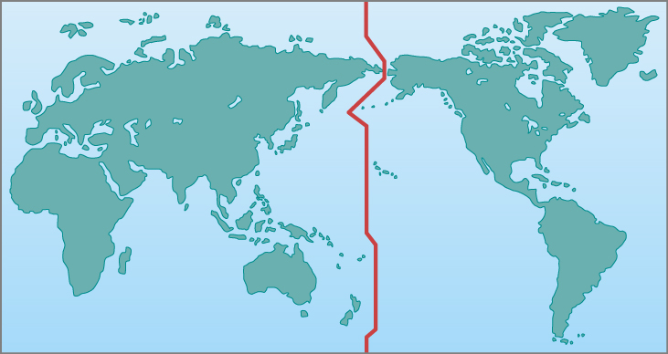

### Learning Objectives

By the end of this section, you will be able to:

* Explain the difference between the solar day and the sidereal day
* Explain mean solar time and the reason for **time zones**{: data-type="term" .no-emphasis}

The measurement of time is based on the rotation of Earth. Throughout most of human history, time has been reckoned by positions of the Sun and stars in the sky. Only recently have mechanical and electronic clocks taken over this function in regulating our lives.

### The Length of the Day

The most fundamental astronomical unit of time is the day, measured in terms of the rotation of Earth. There is, however, more than one way to define the day. Usually, we think of it as the rotation period of Earth with respect to the Sun, called the **solar day**{: data-type="term"}. After all, for most people sunrise is more important than the rising time of Arcturus or some other star, so we set our clocks to some version of Sun-time. However, astronomers also use a **sidereal day**{: data-type="term"}, which is defined in terms of the rotation period of Earth with respect to the stars.

A solar day is slightly longer than a sidereal day because (as you can see from [\[link\]](#OSC_Astro_04_03_Sidereal)) Earth not only turns but also moves along its path around the Sun in a day. Suppose we start when Earth’s orbital position is at day 1, with both the Sun and some distant star (located in the direction indicated by the long white arrow pointing left), directly in line with the zenith for the observer on Earth. When Earth has completed one rotation with respect to the distant star and is at day 2, the long arrow again points to the same distant star. However, notice that because of the movement of Earth along its orbit from day 1 to 2, the Sun has not yet reached a position above the observer. To complete a solar day, Earth must rotate an additional amount, equal to 1/365 of a full turn. The time required for this extra rotation is 1/365 of a day, or about 4 minutes. So the solar day is about 4 minutes longer than the sidereal day.

 ![Illustration of Sidereal Time. The Sun is drawn at left as a yellow disc and the Earth is drawn at two positions at far right. The upper position labeled &#x201C;Earth, day 1&#x201D; shows an observer looking up at the Sun, whose line of sight indicated by a white arrow connecting the Earth to the Sun. A short curved arrow pointing clockwise is drawn from the observer&#x2019;s line of sight to indicate the direction of Earth&#x2019;s rotation. The lower position labeled &#x201C;Earth, day 2&#x201D; shows the observer looking up again one day later. (The clockwise arrow is now drawn circling the Earth.) Due to the motion of Earth along its orbit, the observer&#x2019;s line of sight no longer points to the Sun but now points &#x201C;To remote point on celestial sphere&#x201D;. A dashed line connects the observers position on day 2 to the Sun as seen on day 1. The angle between the new line of sight and the previous line of sight to the Sun is labeled &#x201C;1&#xB0;&#x201D;.](../resources/OSC_Astro_04_03_Sidereal_Errata.jpg "This is a top view, looking down as Earth orbits the Sun. Because Earth moves around the Sun (roughly 1&#xB0; per day), after one complete rotation of Earth relative to the stars, we do not see the Sun in the same position."){: #OSC_Astro_04_03_Sidereal data-title="Difference Between a Sidereal Day and a Solar Day."}

Because our ordinary clocks are set to solar time, stars rise 4 minutes earlier each day. Astronomers prefer sidereal time for planning their observations because in that system, a star rises at the same time every day.

Sidereal Time and Solar Time The Sun makes a complete circle in the sky approximately every 24 hours, while the stars make a complete circle in the sky in 4 minutes less time, or 23 hours and 56 minutes. This causes the positions of the stars at a given time of day or night to change slightly each day. Since stars rise 4 minutes earlier each day, that works out to about 2 hours per month (4 minutes × 30 = 120 minutes or 2 hours). So, if a particular constellation rises at sunset during the winter, you can be sure that by the summer, it will rise about 12 hours earlier, with the sunrise, and it will not be so easily visible in the night sky. Let’s say that tonight the bright star **Sirius**{: data-type="term" .no-emphasis} rises at 7:00 p.m. from a given location so that by midnight, it is very high in the sky. At what time will Sirius rise in three months?

Solution In three months’ time, Sirius will be rising earlier by:

<math xmlns="http://www.w3.org/1998/Math/MathML"><mrow><mn>90</mn><mspace width="0.2em" /><mtext>days</mtext><mspace width="0.2em" /><mo>×</mo><mspace width="0.2em" /><mfrac><mrow><mn>4</mn><mspace width="0.2em" /><mtext>minutes</mtext></mrow><mrow><mtext>day</mtext></mrow></mfrac><mo>=</mo><mtext>360 minutes or 6 hours</mtext></mrow></math>

It will rise at about 1:00 p.m. and be high in the sky at around sunset instead of midnight. Sirius is the brightest star in the constellation of Canis Major (the big dog). So, some other constellation will be prominently visible high in the sky at this later date.

Check Your Learning If a star rises at 8:30 p.m. tonight, approximately what time will it rise two months from now?

Answer:

In two months, the star will rise:* * *
{: data-type="newline"}

 <math xmlns="http://www.w3.org/1998/Math/MathML"><mrow><mn>60</mn><mspace width="0.2em" /><mtext>days</mtext><mspace width="0.2em" /><mo>×</mo><mspace width="0.2em" /><mfrac><mrow><mn>4</mn><mspace width="0.2em" /><mtext>minutes</mtext></mrow><mrow><mtext>day</mtext></mrow></mfrac><mo>=</mo><mn>24</mn><mtext>0 minutes or 4 hours earlier.</mtext></mrow></math>

* * *
{: data-type="newline"}

 This means it will rise at 4:30 p.m.

### Apparent Solar Time

We can define **apparent solar time**{: data-type="term"} as time reckoned by the actual position of the Sun in the sky (or, during the night, its position below the horizon). This is the kind of time indicated by sundials, and it probably represents the earliest measure of time used by ancient civilizations. Today, we adopt the middle of the night as the starting point of the day and measure time in hours elapsed since midnight.

During the first half of the day, the Sun has not yet reached the meridian (the great circle in the sky that passes through our zenith). We designate those hours as before midday (*ante meridiem*, or a.m.), before the Sun reaches the local meridian. We customarily start numbering the hours after noon over again and designate them by p.m. (*post meridiem*), after the Sun reaches the local meridian.

Although apparent solar time seems simple, it is not really very convenient to use. The exact length of an apparent solar day varies slightly during the year. The eastward progress of the Sun in its annual journey around the sky is not uniform because the speed of Earth varies slightly in its elliptical orbit. Another complication is that Earth’s axis of rotation is not perpendicular to the plane of its revolution. Thus, apparent solar time does not advance at a uniform rate. After the invention of mechanical clocks that run at a uniform rate, it became necessary to abandon the apparent solar day as the fundamental unit of time.

### Mean Solar Time and Standard Time

Instead, we can consider the **mean solar time**{: data-type="term"}, which is based on the average value of the solar day over the course of the year. A mean solar day contains exactly 24 hours and is what we use in our everyday timekeeping. Although mean solar time has the advantage of progressing at a uniform rate, it is still inconvenient for practical use because it is determined by the position of the Sun. For example, noon occurs when the Sun is highest in the sky on the meridian (but not necessarily at the zenith). But because we live on a round Earth, the exact time of noon is different as you change your longitude by moving east or west.

If mean solar time were strictly observed, people traveling east or west would have to reset their watches continually as the longitude changed, just to read the local mean time correctly. For instance, a commuter traveling from Oyster Bay on Long Island to New York City would have to adjust the time on the trip through the East River tunnel because Oyster Bay time is actually about 1.6 minutes more advanced than that of Manhattan. (Imagine an airplane trip in which an obnoxious flight attendant gets on the intercom every minute, saying, “Please reset your watch for local mean time.”)

Until near the end of the nineteenth century, every city and town in the United States kept its own local mean time. With the development of railroads and the telegraph, however, the need for some kind of standardization became evident. In 1883, the United States was divided into four standard time zones (now six, including Hawaii and Alaska), each with one system of time within that zone.

By 1900, most of the world was using the system of 24 standardized global time zones. Within each zone, all places keep the same *standard time*, with the local mean solar time of a standard line of longitude running more or less through the middle of each zone. Now travelers reset their watches only when the time change has amounted to a full hour. Pacific standard time is 3 hours earlier than eastern standard time, a fact that becomes painfully obvious in California when someone on the East Coast forgets and calls you at 5:00 a.m.

Globally, almost all countries have adopted one or more standard time zones, although one of the largest nations, India, has settled on a half-zone, being 5.5 hours from Greenwich standard. Also, China officially uses only one time zone, so all the clocks in that country keep the same time. In Tibet, for example, the Sun rises while the clocks (which keep Beijing time) say it is midmorning already.

*Daylight saving time* is simply the local standard time of the place plus 1 hour. It has been adopted for spring and summer use in most states in the United States, as well as in many countries, to prolong the sunlight into evening hours, on the apparent theory that it is easier to change the time by government action than it would be for individuals or businesses to adjust their own schedules to produce the same effect. It does not, of course, “save” any daylight at all—because the amount of sunlight is not determined by what we do with our clocks—and its observance is a point of legislative debate in some states.

### The International Date Line

The fact that time is always advancing as you move toward the east presents a problem. Suppose you travel eastward around the world. You pass into a new time zone, on the average, about every 15° of longitude you travel, and each time you dutifully set your watch ahead an hour. By the time you have completed your trip, you have set your watch ahead a full 24 hours and thus gained a day over those who stayed at home.

The solution to this dilemma is the **International Date Line**{: data-type="term"}, set by international agreement to run approximately along the 180° meridian of longitude. The date line runs down the middle of the Pacific Ocean, although it jogs a bit in a few places to avoid cutting through groups of islands and through Alaska ([\[link\]](#OSC_Astro_04_03_Sidereal2)). By convention, at the date line, the date of the calendar is changed by one day. Crossing the date line from west to east, thus advancing your time, you compensate by decreasing the date; crossing from east to west, you increase the date by one day. To maintain our planet on a rational system of timekeeping, we simply must accept that the date will differ in different cities at the same time. A good example is the date when the Imperial Japanese Navy bombed Pearl Harbor in Hawaii, known in the United States as Sunday, December 7, 1941, but taught to Japanese students as Monday, December 8.

 {: #OSC_Astro_04_03_Sidereal2 data-title="Where the Date Changes."}

### Key Concepts and Summary

The basic unit of astronomical time is the day—either the solar day (reckoned by the Sun) or the sidereal day (reckoned by the stars). Apparent solar time is based on the position of the Sun in the sky, and mean solar time is based on the average value of a solar day during the year. By international agreement, we define 24 time zones around the world, each with its own standard time. The convention of the International Date Line is necessary to reconcile times on different parts of Earth.

### Glossary
{: data-type="glossary-title"}

apparent solar time
: time as measured by the position of the Sun in the sky (the time that would be indicated by a sundial)
^

International Date Line
: an arbitrary line on the surface of Earth near longitude 180° across which the date changes by one day
^

mean solar time
: time based on the rotation of Earth; mean solar time passes at a constant rate, unlike apparent solar time
^

sidereal day
: Earth’s rotation period as defined by the positions of the stars in the sky; the time between successive passages of the same star through the meridian
^

solar day
: Earth’s rotation period as defined by the position of the Sun in the sky; the time between successive passages of the Sun through the meridian

