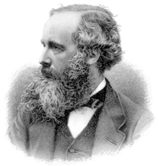

### Learning Objectives

By the end of this section, you will be able to:

* Explain the evidence for Maxwell’s electromagnetic model of light
* Describe the relationship between wavelength, frequency, and speed of light
* Discuss the particle model of light and the definition of photon
* Explain how and why the amount of light we see from an object depends upon its distance

Coded into the light and other kinds of radiation that reach us from objects in the universe is a wide range of information about what those objects are like and how they work. If we can decipher this code and read the messages it contains, we can learn an enormous amount about the cosmos without ever having to leave Earth or its immediate environment.

The visible light and other radiation we receive from the stars and planets is generated by processes at the atomic level—by changes in the way the parts of an atom interact and move. Thus, to appreciate how light is generated, we must explore how atoms work. There is a bit of irony in the fact that in order to understand some of the largest structures in the universe, we must become acquainted with some of the smallest.

Notice that we have twice used the phrase “light and other radiation.” One of the key ideas explored in this chapter is that visible light is not unique; it is merely the most familiar example of a much larger family of radiation that can carry information to us.

The word “**radiation**{: data-type="term" .no-emphasis}” will be used frequently in this book, so it is important to understand what it means. In everyday language, “radiation” is often used to describe certain kinds of energetic subatomic particles released by radioactive materials in our environment. (An example is the kind of radiation used to treat some cancers.) But this is not what we mean when we use the word “radiation” in an astronomy text. *Radiation*, as used in this book, is a general term for waves (including light waves) that *radiate* outward from a source.

As we saw in [Orbits and Gravity](/m59773){: .target-chapter}, Newton’s theory of gravity accounts for the motions of planets as well as objects on Earth. Application of this theory to a variety of problems dominated the work of scientists for nearly two centuries. In the nineteenth century, many physicists turned to the study of electricity and magnetism, which are intimately connected with the production of light.

The scientist who played a role in this field comparable to Newton’s role in the study of gravity was physicist James Clerk **Maxwell**{: data-type="term" .no-emphasis}, born and educated in Scotland ([\[link\]](#OSC_Astro_05_01_Clerk)). Inspired by a number of ingenious experiments that showed an intimate relationship between electricity and magnetism, Maxwell developed a theory that describes both electricity and magnetism with only a small number of elegant equations. It is this theory that gives us important insights into the nature and behavior of light.

 {: #OSC_Astro_05_01_Clerk data-title="James Clerk Maxwell (1831&#x2013;1879)."}

### Maxwell’s Theory of Electromagnetism

We will look at the structure of the atom in more detail later, but we begin by noting that the typical atom consists of several types of particles, a number of which have not only mass but an additional property called electric charge. In the nucleus (central part) of every atom are *protons*, which are positively charged; outside the nucleus are electrons, which have a negative charge.

Maxwell’s theory deals with these electric charges and their effects, especially when they are moving. In the vicinity of an electron charge, another charge feels a force of attraction or repulsion: opposite charges attract; like charges repel. When charges are not in motion, we observe only this electric attraction or repulsion. If charges are in motion, however (as they are inside every atom and in a wire carrying a current), then we measure another force called *magnetism*.

Magnetism was well known for much of recorded human history, but its cause was not understood until the nineteenth century. Experiments with electric charges demonstrated that **magnetism**{: data-type="term" .no-emphasis} was the result of moving charged particles. Sometimes, the motion is clear, as in the coils of heavy wire that make an industrial electromagnet. Other times, it is more subtle, as in the kind of magnet you buy in a hardware store, in which many of the electrons inside the atoms are spinning in roughly the same direction; it is the alignment of their motion that causes the material to become magnetic.

Physicists use the word *field* to describe the action of forces that one object exerts on other distant objects. For example, we say the Sun produces a *gravitational field* that controls Earth’s orbit, even though the Sun and Earth do not come directly into contact. Using this terminology, we can say that stationary electric charges produce *electric fields*, and moving electric charges also produce *magnetic fields*.

Actually, the relationship between electric and magnetic phenomena is even more profound. Experiments showed that changing magnetic fields could produce electric currents (and thus changing electric fields), and changing electric currents could in turn produce changing magnetic fields. So once begun, electric and magnetic field changes could continue to trigger each other.

**Maxwell**{: data-type="term" .no-emphasis} analyzed what would happen if electric charges were oscillating (moving constantly back and forth) and found that the resulting pattern of electric and magnetic fields would spread out and travel rapidly through space. Something similar happens when a raindrop strikes the surface of water or a frog jumps into a pond. The disturbance moves outward and creates a pattern we call a *wave* in the water ([\[link\]](#OSC_Astro_05_01_Waves)). You might, at first, think that there must be very few situations in nature where electric charges oscillate, but this is not at all the case. As we shall see, atoms and molecules (which consist of charged particles) oscillate back and forth all the time. The resulting electromagnetic disturbances are among the most common phenomena in the universe.

 "){: #OSC_Astro_05_01_Waves data-title="Making Waves."}

Maxwell was able to calculate the speed at which an electromagnetic disturbance moves through space; he found that it is equal to the speed of light, which had been measured experimentally. On that basis, he speculated that light was one form of a family of possible electromagnetic disturbances called **electromagnetic radiation**{: data-type="term"}, a conclusion that was again confirmed in laboratory experiments. When light (reflected from the pages of an astronomy textbook, for example) enters a human eye, its changing electric and magnetic fields stimulate nerve endings, which then transmit the information contained in these changing fields to the brain. The science of astronomy is primarily about analyzing radiation from distant objects to understand what they are and how they work.

### The Wave-Like Characteristics of Light

The changing electric and magnetic fields in light are similar to the **waves**{: data-type="term" .no-emphasis} that can be set up in a quiet pool of water. In both cases, the disturbance travels rapidly outward from the point of origin and can use its energy to disturb other things farther away. (For example, in water, the expanding ripples moving away from our frog could disturb the peace of a dragonfly resting on a leaf in the same pool.) In the case of electromagnetic waves, the radiation generated by a transmitting antenna full of charged particles and moving electrons at your local radio station can, sometime later, disturb a group of electrons in your car radio antenna and bring you the news and weather while you are driving to class or work in the morning.

The waves generated by charged particles differ from water waves in some profound ways, however. Water waves require water to travel in. The sound waves we hear, to give another example, are pressure disturbances that require air to travel though. But electromagnetic waves do not require water or air: the fields generate each other and so can move through a vacuum (such as outer space). This was such a disturbing idea to nineteenth-century scientists that they actually made up a substance to fill all of space—one for which there was not a single shred of evidence—just so light waves could have something to travel through: they called it the *aether*. Today, we know that there is no aether and that electromagnetic waves have no trouble at all moving through empty space (as all the starlight visible on a clear night must surely be doing).

The other difference is that *all* electromagnetic waves move at the same speed in empty space (the speed of light—approximately 300,000 kilometers per second, or 300,000,000 meters per second, which can also be written as 3 × 108 m/s), which turns out to be the fastest possible speed in the universe. No matter where electromagnetic waves are generated from and no matter what other properties they have, when they are moving (and not interacting with matter), they move at the speed of light. Yet you know from everyday experience that there are different kinds of light. For example, we perceive that light waves differ from one another in a property we call color. Let’s see how we can denote the differences among the whole broad family of electromagnetic waves.

The nice thing about a wave is that it is a repeating phenomenon. Whether it is the up-and-down motion of a water wave or the changing electric and magnetic fields in a wave of light, the pattern of disturbance repeats in a cyclical way. Thus, any wave motion can be characterized by a series of crests and troughs ([\[link\]](#OSC_Astro_05_01_Elecwave)). Moving from one crest through a trough to the next crest completes one cycle. The horizontal length covered by one cycle is called the **wavelength**{: data-type="term"}. Ocean waves provide an analogy: the wavelength is the distance that separates successive wave crests.

  is the distance between crests, the frequency (f) is the number of cycles per second, and the speed (c) is the distance the wave covers during a specified period of time (e.g., kilometers per second)."){: #OSC_Astro_05_01_Elecwave data-title="Characterizing Waves."}

For visible light, our eyes perceive different wavelengths as different colors: red, for example, is the longest visible wavelength, and violet is the shortest. The main colors of visible light from longest to shortest wavelength can be remembered using the mnemonic ROY G BIV—for <u data-effect="underline">R</u>ed, <u data-effect="underline">O</u>range, <u data-effect="underline">Y</u>ellow, <u data-effect="underline">G</u>reen, <u data-effect="underline">B</u>lue, <u data-effect="underline">I</u>ndigo, and <u data-effect="underline">V</u>iolet. Other invisible forms of electromagnetic radiation have different wavelengths, as we will see in the next section.

We can also characterize different waves by their **frequency**{: data-type="term"}, the number of wave cycles that pass by per second. If you count 10 crests moving by each second, for example, then the frequency is 10 cycles per second (cps). In honor of Heinrich Hertz, the physicist who—inspired by Maxwell’s work—discovered radio waves, a cps is also called a *hertz* (Hz). Take a look at your radio, for example, and you will see the channel assigned to each radio station is characterized by its frequency, usually in units of KHz (kilohertz, or thousands of hertz) or MHz (megahertz, or millions of hertz).

Wavelength (λ) and frequency (*f*) are related because all electromagnetic waves travel at the same speed. To see how this works, imagine a parade in which everyone is forced by prevailing traffic conditions to move at exactly the same speed. You stand on a corner and watch the waves of marchers come by. First you see row after row of miniature ponies. Because they are not very large and, therefore, have a shorter wavelength, a good number of the ponies can move past you each minute; we can say they have a high frequency. Next, however, come several rows of circus elephants. The elephants are large and marching at the same speed as the ponies, so far fewer of them can march past you per minute: Because they have a wider spacing (longer wavelength), they represent a lower frequency.

The formula for this relationship can be expressed as follows: for any wave motion, the speed at which a wave moves equals the frequency times the wavelength. Waves with longer wavelengths have lower frequencies. Mathematically, we can express this as

<math xmlns="http://www.w3.org/1998/Math/MathML"><mrow><mi>c</mi><mo>=</mo><mtext>λ</mtext><mi>f</mi></mrow></math>

where the Greek letter for “l”—lambda, λ—is used to denote wavelength and *c* is the scientific symbol for the speed of light. Solving for the wavelength, this is expressed as:

<math xmlns="http://www.w3.org/1998/Math/MathML"><mrow><mtext>λ</mtext><mo>=</mo><mfrac><mi>c</mi><mi>f</mi></mfrac><mo>.</mo></mrow></math>

Deriving and Using the Wave Equation The equation for the relationship between the speed and other characteristics of a wave can be derived from our basic understanding of motion. The average speed of anything that is moving is:

<math xmlns="http://www.w3.org/1998/Math/MathML"><mrow><mtext>average speed</mtext><mo>=</mo><mfrac><mrow><mtext>distance</mtext></mrow><mrow><mtext>time</mtext></mrow></mfrac></mrow></math>

(So, for example, a car on the highway traveling at a speed of 100 km/h covers 100 km during the time of 1 h.) For an electromagnetic wave to travel the distance of one of its wavelengths, λ, at the speed of light, *c*, we have *c* = λ/*t*. The frequency of a wave is the number of cycles per second. If a wave has a frequency of a million cycles per second, then the time for each cycle to go by is a millionth of a second. So, in general, *t* = 1/*f*. Substituting into our **wave equation**{: data-type="term" .no-emphasis}, we get *c* = λ × *f*. Now let’s use this to calculate an example. What is the wavelength of visible light that has a frequency of 5.66 × 1014 Hz?

Solution Solving the wave equation for wavelength, we find:

<math xmlns="http://www.w3.org/1998/Math/MathML"><mrow><mtext>λ</mtext><mo>=</mo><mfrac><mi>c</mi><mi>f</mi></mfrac></mrow></math>

Substituting our values gives:

<math xmlns="http://www.w3.org/1998/Math/MathML"><mrow><mtext>λ</mtext><mo>=</mo><mfrac><mrow><mn>3.00</mn><mspace width="0.2em" /><mo>×</mo><mspace width="0.2em" /><msup><mrow><mn>10</mn></mrow><mn>8</mn></msup><mspace width="0.2em" /><mtext>m/s</mtext></mrow><mrow><mn>5.66</mn><mspace width="0.2em" /><mo>×</mo><mspace width="0.2em" /><msup><mrow><mn>10</mn></mrow><mrow><mn>14</mn></mrow></msup><mspace width="0.2em" /><mtext>Hz</mtext></mrow></mfrac><mo>=</mo><mn>5.30</mn><mspace width="0.2em" /><mo>×</mo><mspace width="0.2em" /><msup><mrow><mn>10</mn></mrow><mrow><mtext>–7</mtext></mrow></msup><mspace width="0.2em" /><mtext>m</mtext></mrow></math>

This answer can also be written as 530 nm, which is in the yellow-green part of the visible spectrum (nm stands for nanometers, where the term “nano” means “billionths”).

Check Your Learning “Tidal waves,” or tsunamis, are waves caused by earthquakes that travel rapidly through the ocean. If a tsunami travels at the speed of 600 km/h and approaches a shore at a rate of one wave crest every 15 min (4 waves/h), what would be the distance between those wave crests at sea?

Answer:

<math xmlns="http://www.w3.org/1998/Math/MathML"><mrow><mtext>λ</mtext><mo>=</mo><mfrac><mrow><mtext>600 km/h</mtext></mrow><mrow><mtext>4 waves/h</mtext></mrow></mfrac><mo>=</mo><mn>150</mn><mspace width="0.2em" /><mtext>km</mtext></mrow></math>

### Light as a Photon

The electromagnetic wave model of light (as formulated by Maxwell) was one of the great triumphs of nineteenth-century science. In 1887, when Heinrich **Hertz**{: data-type="term" .no-emphasis} actually made invisible electromagnetic waves (what today are called radio waves) on one side of a room and detected them on the other side, it ushered in a new era that led to the modern age of telecommunications. His experiment ultimately led to the technologies of television, cell phones, and today’s wireless networks around the globe.

However, by the beginning of the twentieth century, more sophisticated experiments had revealed that light behaves in certain ways that cannot be explained by the wave model. Reluctantly, physicists had to accept that sometimes light behaves more like a “particle”—or at least a self-contained packet of energy—than a wave. We call such a packet of electromagnetic energy a **photon**{: data-type="term"}.

The fact that light behaves like a wave in certain experiments and like a particle in others was a very surprising and unlikely idea. After all, our common sense says that waves and particles are opposite concepts. On one hand, a wave is a repeating disturbance that, by its very nature, is not in only one place, but spreads out. A particle, on the other hand, is something that can be in only one place at any given time. Strange as it sounds, though, countless experiments now confirm that electromagnetic radiation can sometimes behave like a wave and at other times like a particle.

Then, again, perhaps we shouldn’t be surprised that something that always travels at the “speed limit” of the universe and doesn’t need a medium to travel through might not obey our everyday common sense ideas. The confusion that this wave-particle duality of light caused in physics was eventually resolved by the introduction of a more complicated theory of waves and particles, now called quantum mechanics. (This is one of the most interesting fields of modern science, but it is mostly beyond the scope of our book. If you are interested in it, see some of the suggested resources at the end of this chapter.)

In any case, you should now be prepared when scientists (or the authors of this book) sometimes discuss electromagnetic radiation as if it consisted of waves and at other times refer to it as a stream of photons. A photon (being a packet of energy) carries a specific amount of energy. We can use the idea of energy to connect the photon and wave models. How much energy a photon has depends on its frequency when you think about it as a wave. A low-energy radio wave has a low frequency as a wave, while a high-energy X-ray at your dentist’s office is a high-frequency wave. Among the colors of visible light, violet-light photons have the highest energy and red-light photons have the lowest.

Test whether the connection between photons and waves is clear to you. In the above example, which photon would have the longer wavelength as a wave: the radio wave or the X-ray? If you answered the radio wave, you are correct. Radio waves have a lower frequency, so the wave cycles are longer (they are elephants, not miniature ponies).

### Propagation of Light

Let’s think for a moment about how **light**{: data-type="term" .no-emphasis} from a lightbulb moves through space. As waves expand, they travel away from the bulb, not just toward your eyes but in all directions. They must therefore cover an ever-widening space. Yet the total amount of light available can’t change once the light has left the bulb. This means that, as the same expanding shell of light covers a larger and larger area, there must be less and less of it in any given place. Light (and all other electromagnetic radiation) gets weaker and weaker as it gets farther from its source.

The increase in the area that the light must cover is proportional to the square of the distance that the light has traveled ([\[link\]](#OSC_Astro_05_01_Invlight)). If we stand twice as far from the source, our eyes will intercept two-squared (2 × 2), or four times less light. If we stand 10 times farther from the source, we get 10-squared, or 100 times less light. You can see how this weakening means trouble for sources of light at astronomical distances. One of the nearest stars, **Alpha Centauri**{: data-type="term" .no-emphasis} A, emits about the same total energy as the Sun. But it is about 270,000 times farther away, and so it appears about 73 billion times fainter. No wonder the stars, which close-up would look more or less like the Sun, look like faint pinpoints of light from far away.

 ![Figure illustrating the inverse square law for light. At left is a spherical light source such as a star. Four arrows move radially outward from the source toward the right, with each arrow representing one corner of a square. At one unit away from the source (labeled 1), the arrows are close together to form a square one unit high, and thus one unit square. At the next labeled unit (labeled 2), two steps away from the source, the square is now two units high, and thus four units square. At this distance from the source the energy is 4 times less than at step 1. The final labeled step (labeled 3) is 3 units away, thus the square bounded by the arrows is now 9 units in area, and the energy is 9 times less than at step 1.](../resources/OSC_Astro_05_01_Invlight.jpg "As light radiates away from its source, it spreads out in such a way that the energy per unit area (the amount of energy passing through one of the small squares) decreases as the square of the distance from its source."){: #OSC_Astro_05_01_Invlight data-title="Inverse Square Law for Light."}

This idea—that the apparent brightness of a source (how bright it looks to us) gets weaker with distance in the way we have described—is known as the **inverse square law**{: data-type="term"} for light propagation. In this respect, the propagation of light is similar to the effects of gravity. Remember that the force of gravity between two attracting masses is also inversely proportional to the square of their separation.

The Inverse Square Law for Light The intensity of a 120-W lightbulb observed from a distance 2 m away is 2.4 W/m2. What would be the intensity if this distance was doubled?

Solution If we move twice as far away, then the answer will change according to the inverse square of the distance, so the new intensity will be (1/2)2 = 1/4 of the original intensity, or 0.6 W/m2.

Check Your Learning How many times brighter or fainter would a star appear if it were moved to:

1.  twice its present distance?
2.  ten times its present distance?
3.  half its present distance?
{: type="a"}

Answer:

a. <math xmlns="http://www.w3.org/1998/Math/MathML"><mrow><msup><mrow><mrow><mo>(</mo><mrow><mfrac><mn>1</mn><mn>2</mn></mfrac></mrow><mo>)</mo></mrow></mrow><mn>2</mn></msup><mo>=</mo><mfrac><mn>1</mn><mn>4</mn></mfrac></mrow></math>

; b. <math xmlns="http://www.w3.org/1998/Math/MathML"><mrow><msup><mrow><mrow><mo>(</mo><mrow><mfrac><mn>1</mn><mrow><mn>10</mn></mrow></mfrac></mrow><mo>)</mo></mrow></mrow><mn>2</mn></msup><mo>=</mo><mfrac><mn>1</mn><mrow><mn>100</mn></mrow></mfrac></mrow></math>

; c. <math xmlns="http://www.w3.org/1998/Math/MathML"><mrow><msup><mrow><mrow><mo>(</mo><mrow><mfrac><mn>1</mn><mrow><mtext>1/2</mtext></mrow></mfrac></mrow><mo>)</mo></mrow></mrow><mn>2</mn></msup><mo>=</mo><mn>4</mn></mrow></math>

### Key Concepts and Summary

James Clerk Maxwell showed that whenever charged particles change their motion, as they do in every atom and molecule, they give off waves of energy. Light is one form of this electromagnetic radiation. The wavelength of light determines the color of visible radiation. Wavelength (λ) is related to frequency (*f*) and the speed of light (*c*) by the equation *c* = λ*f*. Electromagnetic radiation sometimes behaves like waves, but at other times, it behaves as if it were a particle—a little packet of energy, called a photon. The apparent brightness of a source of electromagnetic energy decreases with increasing distance from that source in proportion to the square of the distance—a relationship known as the inverse square law.

### Glossary
{: data-type="glossary-title"}

electromagnetic radiation
: radiation consisting of waves propagated through regularly varying electric and magnetic fields and traveling at the speed of light
^

frequency
: the number of waves that cross a given point per unit time (in radiation)
^

inverse square law
: (for light) the amount of energy (light) flowing through a given area in a given time decreases in proportion to the square of the distance from the source of energy or light
^

photon
: a discrete unit (or “packet”) of electromagnetic energy
^

wavelength
: the distance from crest to crest or trough to trough in a wave

