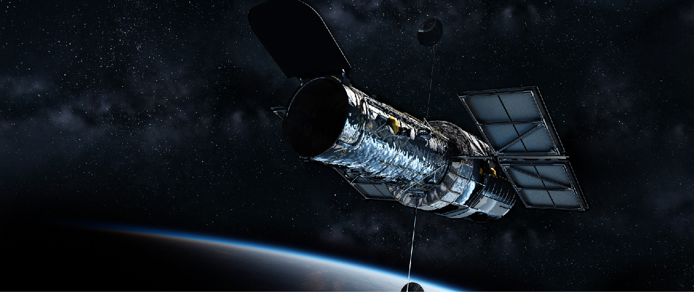

<cnx-pi data-type="cnx.flag.introduction"> class="introduction" </cnx-pi>

<cnx-pi data-type="cnx.eoc">class="summary" title="Summary"</cnx-pi>

<cnx-pi data-type="cnx.eoc">class="further-exploration" title="For Further Exploration"</cnx-pi>

<cnx-pi data-type="cnx.eoc">class="group-activities" title="Collaborative Group Activities"</cnx-pi>

<cnx-pi data-type="cnx.eoc">class="review-questions" title="Review Questions"</cnx-pi>

<cnx-pi data-type="cnx.eoc">class="thought-questions" title="Thought Questions"</cnx-pi>

<cnx-pi data-type="cnx.eoc">class="figuring-for-yourself" title="Figuring for Yourself"</cnx-pi>

 {: #OSC_Astro_06_00_HubbleST data-title="Hubble Space Telescope (HST)."}

If you look at the sky when you are far away from city lights, there seem to be an overwhelming number of stars up there. In reality, only about 9000 stars are visible to the unaided eye (from both hemispheres of our planet). The light from most stars is so weak that by the time it reaches Earth, it cannot be detected by the human eye. How can we learn about the vast majority of objects in the universe that our unaided eyes simply cannot see?

In this chapter, we describe the tools astronomers use to extend their vision into space. We have learned almost everything we know about the universe from studying electromagnetic radiation, as discussed in the chapter on [Radiation and Spectra](/m59791){: .target-chapter}. In the twentieth century, our exploration of space made it possible to detect electromagnetic radiation at all wavelengths, from gamma rays to radio waves. The different wavelengths carry different kinds of information, and the appearance of any given object often depends on the wavelength at which the observations are made.

