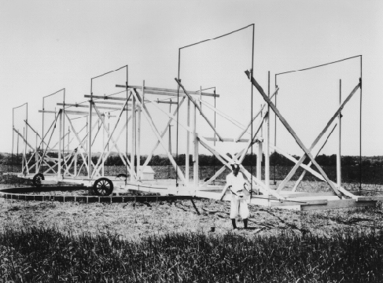

# Learning Objectives

By the end of this section, you will be able to:

* Describe how radio waves from space are detected
* Identify the world’s largest radio telescopes
* Define the technique of interferometry and discuss the benefits of interferometers over single-dish telescopes

In addition to visible and infrared radiation, radio waves from astronomical objects can also be detected from the surface of Earth. In the early 1930s, Karl G. **Jansky**{: data-type="term" .no-emphasis}, an engineer at Bell Telephone Laboratories, was experimenting with antennas for long-range radio communication when he encountered some mysterious static—radio radiation coming from an unknown source ([\[link\]](#OSC_Astro_06_04_RTelescope)). He discovered that this radiation came in strongest about four minutes earlier on each successive day and correctly concluded that since Earth’s sidereal rotation period (how long it takes us to rotate relative to the stars) is four minutes shorter than a solar day, the radiation must be originating from some region fixed on the celestial sphere. Subsequent investigation showed that the source of this radiation was part of the **Milky Way Galaxy**{: data-type="term" .no-emphasis}; Jansky had discovered the first source of cosmic radio waves.

 {: #OSC_Astro_06_04_RTelescope data-title="First Radio Telescope."}

In 1936, Grote **Reber**{: data-type="term" .no-emphasis}, who was an amateur astronomer interested in radio communications, used galvanized iron and wood to build the first antenna specifically designed to receive cosmic radio waves. Over the years, Reber built several such antennas and used them to carry out pioneering surveys of the sky for celestial radio sources; he remained active in radio astronomy for more than 30 years. During the first decade, he worked practically alone because professional astronomers had not yet recognized the vast potential of radio astronomy.

# Detection of Radio Energy from Space

It is important to understand that radio waves cannot be “heard”: they are not the sound waves you hear coming out of the radio receiver in your home or car. Like light, radio waves are a form of electromagnetic radiation, but unlike light, we cannot detect them with our senses—we must rely on electronic equipment to pick them up. In commercial radio broadcasting, we encode sound information (music or a newscaster’s voice) into radio waves. These must be decoded at the other end and then turned back into sound by speakers or headphones.

The radio waves we receive from space do not, of course, have music or other program information encoded in them. If cosmic radio signals were translated into sound, they would sound like the static you hear when scanning between stations. Nevertheless, there is information in the radio waves we receive—information that can tell us about the chemistry and physical conditions of the sources of the waves.

Just as vibrating charged particles can produce electromagnetic waves (see the [Radiation and Spectra](/m59791){: .target-chapter} chapter), electromagnetic waves can make charged particles move back and forth. Radio waves can produce a current in conductors of electricity such as metals. An antenna is such a conductor: it intercepts radio waves, which create a feeble current in it. The current is then amplified in a radio receiver until it is strong enough to measure or record. Like your television or radio, receivers can be tuned to select a single frequency (channel). In astronomy, however, it is more common to use sophisticated data-processing techniques that allow thousands of separate frequency bands to be detected simultaneously. Thus, the astronomical radio receiver operates much like a spectrometer on a visible-light or infrared telescope, providing information about how much radiation we receive at each wavelength or frequency. After computer processing, the radio signals are recorded on magnetic disks for further analysis.

Radio waves are reflected by conducting surfaces, just as light is reflected from a shiny metallic surface, and according to the same laws of optics. A radio-reflecting telescope consists of a concave metal reflector (called a *dish*), analogous to a telescope mirror. The radio waves collected by the dish are reflected to a focus, where they can then be directed to a receiver and analyzed. Because humans are such visual creatures, radio astronomers often construct a pictorial representation of the radio sources they observe. [\[link\]](#OSC_Astro_06_04_RadioImage) shows such a radio image of a distant galaxy, where radio telescopes reveal vast jets and complicated regions of radio emissions that are completely invisible in photographs taken with light.

 ![False color radio image of galaxy Cygnus A. This image shows two huge, diffuse clouds (lobes) of hot gas on either side of the galaxy. Thin jets of material are also seen, one on each side, connecting the galaxy to the lobes. The lobes are shown in three colors corresponding to the intensity of the radio energy detected. Blue is least intense and is concentrated in the regions of the lobes closest to the galaxy. Green is next and is located near the center and far edges of the lobes. Finally red is the most intense and is found at the edges of the lobes farthest from the galaxy.](../resources/OSC_Astro_06_04_RadioImage.jpg "This image has been constructed of radio observations at the Very Large Array of a galaxy called Cygnus A. Colors have been added to help the eye sort out regions of different radio intensities. Red regions are the most intense, blue the least. The visible galaxy would be a small dot in the center of the image. The radio image reveals jets of expelled material (more than 160,000 light-years long) on either side of the galaxy. (credit: NRAO/AUI)"){: #OSC_Astro_06_04_RadioImage data-title="Radio Image."}

Radio astronomy is a young field compared with visible-light astronomy, but it has experienced tremendous growth in recent decades. The world’s largest radio reflectors that can be pointed to any direction in the sky have apertures of 100 meters. One of these has been built at the US National Radio Astronomy Observatory in West Virginia ([\[link\]](#OSC_Astro_06_04_GreenBank)). [\[link\]](#fs-id1167470936824) lists some of the major radio telescopes of the world.

 "){: #OSC_Astro_06_04_GreenBank data-title="Robert C. Byrd Green Bank Telescope."}

<table summary="This table has 4 columns and 22 rows. The first row is a header with the values, &#x201C;Observatory&#x201D;, &#x201C;Location&#x201D;, &#x201C;Description&#x201D;, and &#x201C;Website&#x201D;. The second row is another header which spans all 4 columns, and has the value, &#x201C;Individual Radio Dishes&#x201D;. Under the column labeled &#x201C;Observatory&#x201D; are the values, &#x201C;Arecibo Observatory&#x201D;, &#x201C;Green Bank Telescope (GBT)&#x201D;, &#x201C;Effelsberg 100-m Telescope&#x201D;, &#x201D;Lovell Telescope&#x201D;, &#x201C;Canberra Deep Space Communication Complex (CDSCC)&#x201D;, &#x201C;Goldstone Deep Space Communications Complex (GDSCC)&#x201D;, and &#x201C;Parkes Observatory&#x201D;. At this point is another header row which spans all 4 columns with the value, &#x201C;Arrays of Radio Dishes&#x201D;. The &#x201C;Observatory&#x201D; column continues with the values, &#x201C;Square Kilometre Array (SKA)&#x201D;, &#x201C;Atacama Large Millimeter/submillimeter Array (ALMA)&#x201D;, &#x201C;Very Large Array (VLA)&#x201D;, &#x201C;Westerbork Synthesis Radio Telescope (WSRT)&#x201D;, &#x201C;Very Long Baseline Array (VLBA)&#x201D;, &#x201C;Australia Telescope Compact Array (ATCA)&#x201D;, and &#x201C;Multi-Element Radio Linked Interferometer Network (MERLIN)&#x201D;. At this point is the last header row which spans all 4 columns with the value, &#x201C;Millimeter-wave Telescopes&#x201D;. The &#x201C;Observatory&#x201D; column continues with the values, &#x201C;IRAM&#x201D;, &#x201C;James Clerk Maxwell Telescope (JCMT)&#x201D;, &#x201C;Nobeyama Radio Observatory (NRO)&#x201D;, and &#x201C;Hat Creek Radio Observatory (HCRO)&#x201D;. Under the column labeled &#x201C;Location&#x201D; are the values, &#x201C;Arecibo, Puerto Rico&#x201D;, &#x201C;Green Bank, WV&#x201D;, &#x201C;Bonn, Germany&#x201D;, &#x201C;Manchester, England&#x201D;, &#x201C;Tidbinbilla, Australia&#x201D;, &#x201C;Barstow, CA&#x201D;, and &#x201C;Parkes, Australia&#x201D;. At this point is another header row which spans all 4 columns with the value, &#x201C;Arrays of Radio Dishes&#x201D;. The &#x201C;Location&#x201D; column continues with the values, &#x201C;South Africa and Western Australia&#x201D;, &#x201C;Atacama desert, Northern Chile&#x201D;, &#x201C;Socorro, New Mexico&#x201D;, &#x201C;Westerbork, the Netherlands&#x201D;, &#x201C;Ten US sites, HI to the Virgin Islands&#x201D;, &#x201C;Several sites in Australia&#x201D;, and &#x201C;Cambridge, England, and other British sites&#x201D;. At this point is the last header row which spans all 4 columns with the value, &#x201C;Millimeter-wave Telescopes&#x201D;. The &#x201C;Location&#x201D; column continues with the values, &#x201C;Granada, Spain&#x201D;, &#x201C;Mauna Kea, HI&#x201D;, &#x201C;Minamimaki, Japan&#x201D;, and &#x201C;Cassel, CA&#x201D;. Under the column labeled &#x201C;Description&#x201D; are the values, &#x201C;305-m fixed dish&#x201D;, &#x201C;110&#xD7;100-m steerable dish&#x201D;, &#x201C;100-m steerable dish&#x201D;, &#x201C;76-m steerable dish,&#x201D; &#x201C;70-m steerable dish&#x201D;, &#x201C;70-m steerable dish&#x201D;, and &#x201C;64 m steerable dish&#x201D;. At this point is another header row which spans all 4 columns with the value, &#x201C;Arrays of Radio Dishes&#x201D;. The &#x201C;Description&#x201D; column continues with the values, &#x201C;Thousands of dishes, km2 collecting area, partial array in 2020&#x201D;, &#x201C;66 7-m and 12-m dishes&#x201D;, &#x201C;27-element array of 25-m dishes (36-km baseline)&#x201D;, &#x201C;12-element array of 25-m dishes (1.6-km baseline)&#x201D;, &#x201C;10-element array of 25-m dishes (9000-km baseline)&#x201D;, &#x201C;8-element array (seven 22-m dishes plus Parkes 64-m)&#x201D;, and &#x201C;Network of seven dishes (the largest is 32-m)&#x201D;. At this point is the last header row which spans all 4 columns with the value, &#x201C;Millimeter-wave Telescopes&#x201D;. The &#x201C;Description&#x201D; column continues with the values, &#x201C;30-m steerable mm-wave dish&#x201D;, &#x201C;15 m steerable mm-wave dish&#x201D;, &#x201C;6-element array of 10-m wave dishes&#x201D;, and &#x201C;6-element array of 5-m wave dishes&#x201D;. Under the column labeled &#x201C;Website&#x201D; are the values, &#x201C;www.naic.edu&#x201D;, &#x201C;www.science.nrao.edu/facilities/gbt&#x201D;, &#x201C;www.mpifr-bonn.mpg.de/en/effelsberg&#x201D;, &#x201C;www.jb.man.ac.uk/aboutus/lovell&#x201D;, &#x201C;www.cdscc.nasa.gov&#x201D;, &#x201C;www.gdscc.nasa.gov&#x201D;, and &#x201C;www.parkes.atnf.csiro.au&#x201D;. At this point is another header row which spans all 4 columns with the value, &#x201C;Arrays of Radio Dishes&#x201D;. The &#x201C;Website&#x201D; column continues with the values, www.skatelescope.org, &#x201C;www.almaobservatory.org&#x201D;, &#x201C;www.science.nrao.edu/facilities/vla&#x201D;, &#x201C;www.astron.nl/radio-observatory/public/public-0&#x201D;, &#x201C;www.science.nrao.edu/facilities/vlba&#x201D;, &#x201C;www.narrabri.atnf.csiro.au&#x201D;, and &#x201C;www.e-merlin.ac.uk&#x201D;. At this point is the last header row which spans all 4 columns with the value, &#x201C;Millimeter-wave Telescopes&#x201D;. The &#x201C;Website&#x201D; column continues with the values, &#x201C;www.iram-institute.org&#x201D;, &#x201C;www.eaobservatory.org/jcmt&#x201D;, &#x201C;www.nro.nao.ac.jp/en&#x201D;, and &#x201C;www.sri.com/research-development/specialized-facilities/hat-creek-radio-observatory&#x201D;." class="span-all"><thead>
<tr>
<th colspan="4" data-align="center">Major Radio Observatories of the World</th>
</tr>
<tr valign="top">
<th data-valign="top" data-align="center">Observatory</th>
<th data-valign="top" data-align="center">Location</th>
<th data-valign="top" data-align="center">Description</th>
<th data-valign="top" data-align="center">Website</th>
</tr>
</thead><tbody>
<tr>
<td colspan="4" data-align="left">Individual Radio Dishes</td>
</tr>
<tr>
<td data-valign="top" data-align="left"><strong data-type="term" class="no-emphasis">Arecibo Observatory</strong></td>
<td data-valign="top" data-align="left">Arecibo, Puerto Rico</td>
<td data-valign="top" data-align="left">305-m fixed dish</td>
<td data-valign="top" data-align="left">www.naic.edu</td>
</tr>
<tr>
<td data-valign="top" data-align="left"><strong data-type="term" class="no-emphasis">Green Bank Telescope</strong> (GBT)</td>
<td data-valign="top" data-align="left">Green Bank, WV</td>
<td data-valign="top" data-align="left">110 × 100-m steerable dish</td>
<td data-valign="top" data-align="left">www.science.nrao.edu/facilities/gbt</td>
</tr>
<tr>
<td data-valign="top" data-align="left"><strong data-type="term" class="no-emphasis">Effelsberg 100-m Telescope</strong></td>
<td data-valign="top" data-align="left">Bonn, Germany</td>
<td data-valign="top" data-align="left">100-m steerable dish</td>
<td data-valign="top" data-align="left">www.mpifr-bonn.mpg.de/en/effelsberg</td>
</tr>
<tr>
<td data-valign="top" data-align="left"><strong data-type="term" class="no-emphasis">Lovell Telescope</strong></td>
<td data-valign="top" data-align="left">Manchester, England</td>
<td data-valign="top" data-align="left">76-m steerable dish</td>
<td data-valign="top" data-align="left">www.jb.man.ac.uk/aboutus/lovell</td>
</tr>
<tr>
<td data-valign="top" data-align="left"><strong data-type="term" class="no-emphasis">Canberra Deep Space Communication Complex</strong> (CDSCC)</td>
<td data-valign="top" data-align="left">Tidbinbilla, Australia</td>
<td data-valign="top" data-align="left">70-m steerable dish</td>
<td data-valign="top" data-align="left">www.cdscc.nasa.gov</td>
</tr>
<tr>
<td data-valign="top" data-align="left"><strong data-type="term" class="no-emphasis">Goldstone Deep Space Communications Complex</strong> (GDSCC)</td>
<td data-valign="top" data-align="left">Barstow, CA</td>
<td data-valign="top" data-align="left">70-m steerable dish</td>
<td data-valign="top" data-align="left">www.gdscc.nasa.gov</td>
</tr>
<tr>
<td data-valign="top" data-align="left"><strong data-type="term" class="no-emphasis">Parkes Observatory</strong></td>
<td data-valign="top" data-align="left">Parkes, Australia</td>
<td data-valign="top" data-align="left">64-m steerable dish</td>
<td data-valign="top" data-align="left">www.parkes.atnf.csiro.au</td>
</tr>
<tr>
<td colspan="4" data-align="left">Arrays of Radio Dishes</td>
</tr>
<tr>
<td data-valign="top" data-align="left"><strong data-type="term" class="no-emphasis">Square Kilometre Array</strong> (SKA)</td>
<td data-valign="top" data-align="left">South Africa and Western Australia</td>
<td data-valign="top" data-align="left">Thousands of dishes, km2 collecting area, partial array in 2020</td>
<td data-valign="top" data-align="left">www.skatelescope.org</td>
</tr>
<tr>
<td data-valign="top" data-align="left"><strong data-type="term" class="no-emphasis">Atacama Large Millimeter/submillimeter Array</strong> (ALMA)</td>
<td data-valign="top" data-align="left">Atacama desert, Northern Chile</td>
<td data-valign="top" data-align="left">66 7-m and 12-m dishes</td>
<td data-valign="top" data-align="left">www.almaobservatory.org</td>
</tr>
<tr>
<td data-valign="top" data-align="left"><strong data-type="term" class="no-emphasis">Very Large Array</strong> (VLA)</td>
<td data-valign="top" data-align="left">Socorro, New Mexico</td>
<td data-valign="top" data-align="left">27-element array of 25-m dishes (36-km baseline)</td>
<td data-valign="top" data-align="left">www.science.nrao.edu/facilities/vla</td>
</tr>
<tr>
<td data-valign="top" data-align="left"><strong data-type="term" class="no-emphasis">Westerbork Synthesis Radio Telescope</strong> (WSRT)</td>
<td data-valign="top" data-align="left">Westerbork, the Netherlands</td>
<td data-valign="top" data-align="left">12-element array of 25-m dishes (1.6-km baseline)</td>
<td data-valign="top" data-align="left">www.astron.nl/radio-observatory/public/public-0</td>
</tr>
<tr>
<td data-valign="top" data-align="left"><strong data-type="term" class="no-emphasis">Very Long Baseline Array</strong> (VLBA)</td>
<td data-valign="top" data-align="left">Ten US sites, HI to the Virgin Islands</td>
<td data-valign="top" data-align="left">10-element array of 25-m dishes (9000 km baseline)</td>
<td data-valign="top" data-align="left">www.science.nrao.edu/facilities/vlba</td>
</tr>
<tr>
<td data-valign="top" data-align="left"><strong data-type="term" class="no-emphasis">Australia Telescope Compact Array</strong> (ATCA)</td>
<td data-valign="top" data-align="left">Several sites in Australia</td>
<td data-valign="top" data-align="left">8-element array (seven 22-m dishes plus Parkes 64 m)</td>
<td data-valign="top" data-align="left">www.narrabri.atnf.csiro.au</td>
</tr>
<tr>
<td data-valign="top" data-align="left"><strong data-type="term" class="no-emphasis">Multi-Element Radio Linked Interferometer Network</strong> (MERLIN)</td>
<td data-valign="top" data-align="left">Cambridge, England, and other British sites</td>
<td data-valign="top" data-align="left">Network of seven dishes (the largest is 32 m)</td>
<td data-valign="top" data-align="left">www.e-merlin.ac.uk</td>
</tr>
<tr>
<td colspan="4" data-align="left">Millimeter-wave Telescopes</td>
</tr>
<tr>
<td data-valign="top" data-align="left"><strong data-type="term" class="no-emphasis">IRAM</strong></td>
<td data-valign="top" data-align="left">Granada, Spain</td>
<td data-valign="top" data-align="left">30-m steerable mm-wave dish</td>
<td data-valign="top" data-align="left">www.iram-institute.org</td>
</tr>
<tr>
<td data-valign="top" data-align="left"><strong data-type="term" class="no-emphasis">James Clerk Maxwell Telescope</strong> (JCMT)</td>
<td data-valign="top" data-align="left">Mauna Kea, HI</td>
<td data-valign="top" data-align="left">15-m steerable mm-wave dish</td>
<td data-valign="top" data-align="left">www.eaobservatory.org/jcmt</td>
</tr>
<tr>
<td data-valign="top" data-align="left"><strong data-type="term" class="no-emphasis">Nobeyama Radio Observatory</strong> (NRO)</td>
<td data-valign="top" data-align="left">Minamimaki, Japan</td>
<td data-valign="top" data-align="left">6-element array of 10-m wave dishes</td>
<td data-valign="top" data-align="left">www.nro.nao.ac.jp/en</td>
</tr>
<tr>
<td data-valign="top" data-align="left"><strong data-type="term" class="no-emphasis">Hat Creek Radio Observatory</strong> (HCRO)</td>
<td data-valign="top" data-align="left">Cassel, CA</td>
<td data-valign="top" data-align="left">6-element array of 5-m wave dishes</td>
<td data-valign="top" data-align="left">www.sri.com/research-development/specialized-facilities/hat-creek-radio-observatory</td>
</tr>
</tbody></table>

# Radio Interferometry

As we discussed earlier, a telescope’s ability to show us fine detail (its resolution) depends upon its aperture, but it also depends upon the wavelength of the radiation that the telescope is gathering. The longer the waves, the harder it is to resolve fine detail in the images or maps we make. Because radio waves have such long wavelengths, they present tremendous challenges for astronomers who need good resolution. In fact, even the largest radio dishes on Earth, operating alone, cannot make out as much detail as the typical small visible-light telescope used in a college astronomy lab. To overcome this difficulty, radio astronomers have learned to sharpen their images by linking two or more radio telescopes together electronically. Two or more telescopes linked together in this way are called an **interferometer**{: data-type="term"}.

“Interferometer” may seem like a strange term because the telescopes in an interferometer work cooperatively; they don’t “interfere” with each other. **Interference**{: data-type="term"}, however, is a technical term for the way that multiple waves interact with each other when they arrive in our instruments, and this interaction allows us to coax more detail out of our observations. The resolution of an interferometer depends upon the separation of the telescopes, not upon their individual apertures. Two telescopes separated by 1 kilometer provide the same resolution as would a single dish 1 kilometer across (although they are not, of course, able to collect as much radiation as a radio-wave bucket that is 1 kilometer across).

To get even better resolution, astronomers combine a large number of radio dishes into an **interferometer array**{: data-type="term"}. In effect, such an array works like a large number of two-dish interferometers, all observing the same part of the sky together. Computer processing of the results permits the reconstruction of a high-resolution radio image. The most extensive such instrument in the United States is the National Radio Astronomy Observatory’s Very Large Array (VLA) near Socorro, New Mexico. It consists of 27 movable radio telescopes (on railroad tracks), each having an aperture of 25 meters, spread over a total span of about 36 kilometers. By electronically combining the signals from all of its individual telescopes, this array permits the radio astronomer to make pictures of the sky at radio wavelengths comparable to those obtained with a visible-light telescope, with a resolution of about 1 arcsecond.

The Atacama Large Millimeter/submillimeter array (ALMA) in the Atacama Desert of Northern Chile ([\[link\]](#OSC_Astro_06_04_ALMA)), at an altitude of 16,400 feet, consists of 12 7-meter and 54 12-meter telescopes, and can achieve baselines up to 16 kilometers. Since it became operational in 2013, it has made observations at resolutions down to 6 milliarcseconds (0.006 arcseconds), a remarkable achievement for radio astronomy.

 "){: #OSC_Astro_06_04_ALMA data-title="Atacama Large Millimeter/Submillimeter Array (ALMA)."}

Watch this [documentary][1] that explains the work that went into designing and building ALMA, discusses some of its first images, and explores its future.

Initially, the size of interferometer arrays was limited by the requirement that all of the dishes be physically wired together. The maximum dimensions of the array were thus only a few tens of kilometers. However, larger interferometer separations can be achieved if the telescopes do not require a physical connection. Astronomers, with the use of current technology and computing power, have learned to time the arrival of electromagnetic waves coming from space very precisely at each telescope and combine the data later. If the telescopes are as far apart as California and Australia, or as West Virginia and Crimea in Ukraine, the resulting resolution far surpasses that of visible-light telescopes.

The United States operates the Very Long Baseline Array (VLBA), made up of 10 individual telescopes stretching from the Virgin Islands to Hawaii ([\[link\]](#OSC_Astro_06_04_Baseline)). The VLBA, completed in 1993, can form astronomical images with a resolution of 0.0001 arcseconds, permitting features as small as 10 astronomical units (AU) to be distinguished at the center of our Galaxy.

 {: #OSC_Astro_06_04_Baseline data-title="Very Long Baseline Array."}

Recent advances in technology have also made it possible to do interferometry at visible-light and infrared wavelengths. At the beginning of the twenty-first century, three observatories with multiple telescopes each began using their dishes as interferometers, combining their light to obtain a much greater resolution. In addition, a dedicated interferometric array was built on Mt. Wilson in California. Just as in radio arrays, these observations allow astronomers to make out more detail than a single telescope could provide.

<table summary="This table has 5 columns and 4 rows. The first row is a header with the values &#x201C;Longest Baseline (m)&#x201D;, &#x201C;Telescope Name&#x201D;, &#x201C;Location&#x201D;, &#x201C;Mirrors&#x201D;, and &#x201C;Status&#x201D;. Under the &#x201C;Longest Baseline (m)&#x201D; column are the values, &#x201C;400&#x201D;, &#x201C;200&#x201D;, &#x201C;85&#x201D;, and &#x201C;22.8&#x201D;. Under &#x201C;Telescope Name&#x201D; are the values, &#x201C;&#x201C;CHARA Array(Center for High Angular Resolution Astronomy)&#x201D;, &#x201C;Very Large Telescope&#x201D;, &#x201C;Keck I and II telescopes&#x201D;, and &#x201C;Large Binocular Telescope&#x201D;. Under &#x201C;Location&#x201D; are the values, Mount Wilson, CA&#x201D;, &#x201C;Cerro Paranal, Chile&#x201D;, &#x201C;Mauna Kea, HI&#x201D;, and &#x201C;Mount Graham, AZ&#x201D;. Under the &#x201C;Mirrors&#x201D; column are the values, &#x201C;Six 1-m telescopes&#x201D;, &#x201C;Four 8.2-m telescopes&#x201D;, &#x201C;Two 10-m telescopes&#x201D;, and &#x201C;Two 8.4-m telescopes&#x201D;. Under &#x201C;Status&#x201D; are the values, &#x201C;Operational since 2004&#x201D;, &#x201C;Completed 2000&#x201D;, &#x201C;Operated from 2001 to 2012&#x201D;, and &#x201C;First light 2004&#x201D;." class="span-all"><thead>
<tr>
<th colspan="5" data-align="center">Visible-Light Interferometers</th>
</tr>
<tr valign="top">
<th data-valign="top" data-align="center">Longest Baseline (m)</th>
<th data-valign="top" data-align="center">Telescope Name</th>
<th data-valign="top" data-align="center">Location</th>
<th data-valign="top" data-align="center">Mirrors</th>
<th data-valign="top" data-align="center">Status</th>
</tr>
</thead><tbody>
<tr>
<td data-valign="top" data-align="left">400</td>
<td data-valign="top" data-align="left"><strong data-type="term" class="no-emphasis">CHARA</strong> Array (Center for High Angular Resolution Astronomy)</td>
<td data-valign="top" data-align="left">Mount Wilson, CA</td>
<td data-valign="top" data-align="left">Six 1-m telescopes</td>
<td data-valign="top" data-align="left">Operational since 2004</td>
</tr>
<tr>
<td data-valign="top" data-align="left">200</td>
<td data-valign="top" data-align="left"><strong data-type="term" class="no-emphasis">Very Large Telescope</strong></td>
<td data-valign="top" data-align="left">Cerro Paranal, Chile</td>
<td data-valign="top" data-align="left">Four 8.2-m telescopes</td>
<td data-valign="top" data-align="left">Completed 2000</td>
</tr>
<tr>
<td data-valign="top" data-align="left">85</td>
<td data-valign="top" data-align="left"><strong data-type="term" class="no-emphasis">Keck I and II</strong> telescopes</td>
<td data-valign="top" data-align="left">Mauna Kea, HI</td>
<td data-valign="top" data-align="left">Two 10-m telescopes</td>
<td data-valign="top" data-align="left">Operated from 2001 to 2012</td>
</tr>
<tr>
<td data-valign="top" data-align="left">22.8</td>
<td data-valign="top" data-align="left"><strong data-type="term" class="no-emphasis">Large Binocular Telescope</strong></td>
<td data-valign="top" data-align="left">Mount Graham, AZ</td>
<td data-valign="top" data-align="left">Two 8.4-m telescopes</td>
<td data-valign="top" data-align="left">First light 2004</td>
</tr>
</tbody></table>

# Radar Astronomy

**Radar**{: data-type="term"} is the technique of transmitting radio waves to an object in our solar system and then detecting the radio radiation that the object reflects back. The time required for the round trip can be measured electronically with great precision. Because we know the speed at which radio waves travel (the speed of light), we can determine the distance to the object or a particular feature on its surface (such as a mountain).

Radar observations have been used to determine the distances to planets and how fast things are moving in the solar system (using the Doppler effect, discussed in the [Radiation and Spectra](/m59791){: .target-chapter} chapter). Radar waves have played important roles in navigating spacecraft throughout the solar system. In addition, as will be discussed in later chapters, radar observations have determined the rotation periods of Venus and Mercury, probed tiny Earth-approaching asteroids, and allowed us to investigate the mountains and valleys on the surfaces of Mercury, Venus, Mars, and the large moons of Jupiter.

Any radio dish can be used as a radar telescope if it is equipped with a powerful transmitter as well as a receiver. The most spectacular facility in the world for radar astronomy is the 1000-foot (305-meter) telescope at Arecibo in Puerto Rico ([\[link\]](#OSC_Astro_06_04_Largest)). The Arecibo telescope is too large to be pointed directly at different parts of the sky. Instead, it is constructed in a huge natural “bowl” (more than a mere dish) formed by several hills, and it is lined with reflecting metal panels. A limited ability to track astronomical sources is achieved by moving the receiver system, which is suspended on cables 100 meters above the surface of the bowl. An even larger (500-meter) radar telescope is currently under construction. It is the **Five-hundred-meter Aperture Spherical Telescope**{: data-type="term" .no-emphasis} (FAST) in China and is expected to be completed in 2016.

 "){: #OSC_Astro_06_04_Largest data-title="Largest Radio and Radar Dish."}

<section data-depth="1" class="summary" markdown="1">
In the 1930s, radio astronomy was pioneered by Karl G. Jansky and Grote Reber. A radio telescope is basically a radio antenna (often a large, curved dish) connected to a receiver. Significantly enhanced resolution can be obtained with interferometers, including interferometer arrays like the 27-element VLA and the 66-element ALMA. Expanding to very long baseline interferometers, radio astronomers can achieve resolutions as precise as 0.0001 arcsecond. Radar astronomy involves transmitting as well as receiving. The largest radar telescope currently in operation is a 305-meter bowl at Arecibo.

</section>

## Glossary
{: data-type="glossary-title"}

interference
: process in which waves mix together such that their crests and troughs can alternately reinforce and cancel one another
{: .definition}

interferometer
: instrument that combines electromagnetic radiation from one or more telescopes to obtain a resolution equivalent to what would be obtained with a single telescope with a diameter equal to the baseline separating the individual separate telescopes
{: .definition}

interferometer array
: combination of multiple radio dishes to, in effect, work like a large number of two-dish interferometers
{: .definition}

radar
: technique of transmitting radio waves to an object and then detecting the radiation that the object reflects back to the transmitter; used to measure the distance to, and motion of, a target object or to form images of it
{: .definition}

[1]: https://openstax.org/l/30ALMAdoc
