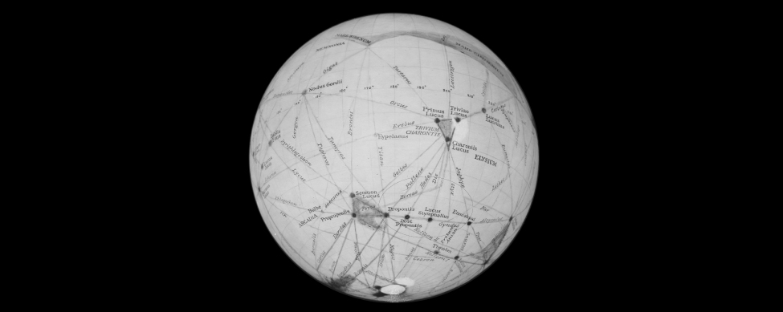
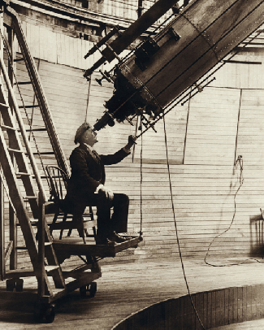

### Learning Objectives

By the end of this section, you will be able to:

* Explain why it’s difficult to learn about **Venus**{: data-type="term" .no-emphasis} from Earth-based observation alone
* Describe the history of our interest in **Mars**{: data-type="term" .no-emphasis} before the Space Age
* Compare the basic physical properties of Earth, Mars, and Venus, including their orbits

As you might expect from close neighbors, Mars and Venus are among the brightest objects in the night sky. The average distance of Mars from the Sun is 227 million kilometers (1.52 AU), or about half again as far from the Sun as Earth. Venus’ orbit is very nearly circular, at a distance of 108 million kilometers (0.72 AU) from the Sun. Like Mercury, Venus sometimes appears as an “evening star” and sometimes as a “morning star.” Venus approaches Earth more closely than does any other planet: at its nearest, it is only 40 million kilometers from us. The closest Mars ever gets to Earth is about 56 million kilometers.

### Appearance

**Venus**{: data-type="term" .no-emphasis} appears very bright, and even a small telescope reveals that it goes through phases like the Moon. Galileo discovered that Venus displays a full range of phases, and he used this as an argument to show that Venus must circle the Sun and not Earth. The planet’s actual surface is not visible because it is shrouded by dense clouds that reflect about 70% of the sunlight that falls on them, frustrating efforts to study the underlying surface, even with cameras in orbit around the planet ([\[link\]](#OSC_Astro_10_01_Venus)).

 "){: #OSC_Astro_10_01_Venus data-title="Venus as Photographed by the Pioneer Venus Orbiter."}

In contrast, Mars is more tantalizing as seen through a telescope ([\[link\]](#OSC_Astro_10_01_Mars)). The planet is distinctly red, due (as we now know) to the presence of iron oxides in its soil. This color may account for its association with war (and blood) in the legends of early cultures. The best resolution obtainable from telescopes on the ground is about 100 kilometers, or about the same as what we can see on the Moon with the unaided eye. At this resolution, no hint of topographic structure can be detected: no mountains, no valleys, not even impact craters. On the other hand, bright polar ice caps can be seen easily, together with dusky surface markings that sometimes change in outline and intensity from season to season.

 "){: #OSC_Astro_10_01_Mars data-title="Mars as Seen from Earth&#x2019;s Surface."}

For a few decades around the turn of the twentieth century, some astronomers believed that they saw evidence of an intelligent civilization on Mars. The controversy began in 1877, when Italian astronomer Giovanni **Schiaparelli**{: data-type="term" .no-emphasis} (1835–1910) announced that he could see long, faint, straight lines on Mars that he called *canale*, or channels. In English-speaking countries, the term was mistakenly translated as “canals,” implying an artificial origin.

Even before Schiaparelli’s observations, astronomers had watched the bright polar caps change size with the seasons and had seen variations in the dark surface features. With a little imagination, it was not difficult to picture the canals as long fields of crops bordering irrigation ditches that brought water from the melting polar ice to the parched deserts of the red planet. (They assumed the polar caps were composed of water ice, which isn’t exactly true, as we will see shortly.)

Until has death in 1916, the most effective proponent of intelligent life on Mars was Percival **Lowell**{: data-type="term" .no-emphasis}, a self-made American astronomer and member of the wealthy Lowell family of Boston (see the feature box on [Percival Lowell: Dreaming of an Inhabited Mars](#fs-id1168048373241)). A skilled author and speaker, Lowell made what seemed to the public to be a convincing case for intelligent Martians, who had constructed the huge canals to preserve their civilization in the face of a deteriorating climate ([\[link\]](#OSC_Astro_10_01_MarsGlobe)).

 {: #OSC_Astro_10_01_MarsGlobe data-title="Lowell&#x2019;s Mars Globe."}

The argument for a race of intelligent Martians, however, hinged on the reality of the canals, a matter that remained in serious dispute among astronomers. The canal markings were always difficult to study, glimpsed only occasionally because atmospheric conditions caused the tiny image of Mars to shimmer in the telescope. Lowell saw canals everywhere (even a few on Venus), but many other observers could not see them at all and remained unconvinced of their existence. When telescopes larger than Lowell’s failed to confirm the presence of canals, the skeptics felt vindicated. Now it is generally accepted that the straight lines were an optical illusion, the result of the human mind’s tendency to see order in random features that are glimpsed dimly at the limits of the eye’s resolution. When we see small, dim dots of surface markings, our minds tend to connect those dots into straight lines.

Percival Lowell: Dreaming of an Inhabited Mars

Percival **Lowell**{: data-type="term" .no-emphasis} was born into the well-to-do Massachusetts family about whom John Bossidy made the famous toast:

> And this is good old Boston,* * *
> {: data-type="newline"}
> 
>  The home of the bean and the cod,* * *
> {: data-type="newline"}
> 
>  Where the Lowells talk to the Cabots* * *
> {: data-type="newline"}
> 
>  And the Cabots talk only to God.

Percival’s brother Lawrence became president of Harvard University, and his sister, Amy, became a distinguished poet. Percival was already interested in astronomy as a boy: he made observations of Mars at age 13. His undergraduate thesis at Harvard dealt with the origin of the solar system, but he did not pursue this interest immediately. Instead, he entered the family business and traveled extensively in Asia. In 1892, however, he decided to dedicate himself to carrying on Schiaparelli’s work and solving the mysteries of the martian canals.

In 1894, with the help of astronomers at Harvard but using his own funds, Lowell built an observatory on a high plateau in Flagstaff, Arizona, where he hoped the seeing would be clear enough to show him Mars in unprecedented detail. He and his assistants quickly accumulated a tremendous number of drawings and maps, purporting to show a vast network of martian canals (see [\[link\]](#OSC_Astro_10_01_MarsGlobe)). He elaborated his ideas about the inhabitants of the red planet in several books, including *Mars* (1895) and *Mars and Its Canals* (1906), and in hundreds of articles and speeches.

As Lowell put it,

> A mind of no mean order would seem to have presided over the system we see—a mind certainly of considerably more comprehensiveness than that which presides over the various departments of our own public works. Party politics, at all events, have had no part in them; for the system is planet-wide. . . . Certainly what we see hints at the existence of beings who are in advance of, not behind us, in the journey of life.

Lowell’s views captured the public imagination and inspired many novels and stories, the most famous of which was H. G. Wells’ *War of the Worlds* (1897). In this famous “invasion” novel, the thirsty inhabitants of a dying planet Mars (based entirely on Lowell’s ideas) come to conquer Earth with advanced technology.

Although the Lowell Observatory first became famous for its work on the martian canals, both Lowell and the observatory eventually turned to other projects as well. He became interested in the search for a ninth (and then undiscovered) planet in the solar system. In 1930, Pluto was found at the Lowell Observatory, and it is not a coincidence that the name selected for the new planet starts with Lowell’s initials. It was also at the Lowell Observatory that the first measurements were made of the great speed at which galaxies are moving away from us, observations that would ultimately lead to our modern view of an expanding universe.

Lowell ([\[link\]](#OSC_Astro_10_01_Lowell)) continued to live at his observatory, marrying at age 53 and publishing extensively. He relished the debate his claims about Mars caused far more than the astronomers on the other side, who often complained that Lowell’s work was making planetary astronomy a less respectable field. At the same time, the public fascination with the planets fueled by Lowell’s work (and its interpreters) may, several generations later, have helped fan support for the space program and the many missions whose results grace the pages of our text.

{: #OSC_Astro_10_01_Lowell data-title="Percival Lowell (1855&#x2013;1916)."}

In October 1938, the Mercury Theater of the Air on radio dramatized *The War of the Worlds* as a series of radio news reports. This [broadcast][1] scared many people into thinking that Lowell’s Martians were really invading New Jersey, and caused something of a panic. You can listen to the original radio broadcast if you scroll down to “War of the Worlds.”

### Rotation of the Planets

Astronomers have determined the rotation period of **Mars**{: data-type="term" .no-emphasis} with great accuracy by watching the motion of permanent surface markings; its sidereal day is 24 hours 37 minutes 23 seconds, just a little longer than the rotation period of Earth. This high precision is not obtained by watching Mars for a single rotation, but by noting how many turns it makes over a long period of time. Good observations of Mars date back more than 200 years, a period during which tens of thousands of martian days have passed. As a result, the rotation period can be calculated to within a few hundredths of a second.

The rotational axis of Mars has a tilt of about 25°, similar to the tilt of Earth’s axis. Thus, Mars experiences seasons very much like those on Earth. Because of the longer martian year (almost two Earth years), however, each season there lasts about six of our months.

The situation with **Venus**{: data-type="term" .no-emphasis} is different. Since no surface detail can be seen through Venus’ clouds, its rotation period can be found only by bouncing radar signals off the planet (as explained for Mercury in the [Cratered Worlds](/m59830){: .target-chapter} chapter). The first radar observations of Venus’ rotation were made in the early 1960s. Later, topographical surface features were identified on the planet that showed up in the reflected radar signals. The rotation period of Venus, precisely determined from the motion of such “radar features” across its disk, is 243 days. Even more surprising than how *long* Venus takes to rotate is the fact that it spins in a backward or retrograde direction (east to west).

Stop for a moment and think about how odd this slow rotation makes the calendar on Venus. The planet takes 225 Earth days to orbit the Sun and 243 Earth days to spin on its axis. So the day on Venus (as defined by its spinning once) is longer than the year! As a result, the time the Sun takes to return to the same place in Venus’ sky—another way we might define the meaning of a day—turns out to be 117 Earth days. (If you say “See you tomorrow” on Venus, you’ll have a long time to wait.) Although we do not know the reason for Venus’ slow backward rotation, we can guess that it may have suffered one or more extremely powerful collisions during the formation process of the solar system.

### Basic Properties of Venus and Mars

Before discussing each planet individually, let us compare some of their basic properties with each other and with Earth ([\[link\]](#fs-id1168048335165)). **Venus**{: data-type="term" .no-emphasis} is in many ways Earth’s twin, with a mass 0.82 times the mass of Earth and an almost identical density. The average amount of geological activity has been also relatively high, almost as high as on Earth. On the other hand, with a surface pressure nearly 100 times greater than ours, Venus’ atmosphere is not at all like that of Earth. The surface of Venus is also remarkably hot, with a temperature of 730 K (over 850 °F), hotter than the self-cleaning cycle of your oven. One of the major challenges presented by Venus is to understand why the atmosphere and surface environment of this twin have diverged so sharply from those of our own planet.

<table summary="This table contains four columns and eleven rows. The first row is a header row, and it labels each column, &#x201C;Property,&#x201D; &#x201C;Earth,&#x201D; &#x201C;Venus,&#x201D; and &#x201C;Mars.&#x201D; Under the &#x201C;Property&#x201D; column are the values: &#x201C;Semimajor axis (A U),&#x201D; &#x201C;Period (year),&#x201D; &#x201C;Mass (Earth = 1),&#x201D; &#x201C;Diameter (k m),&#x201D; &#x201C;Density (g / c m3).&#x201D; &#x201C;Surface gravity (Earth = 1).&#x201D; &#x201C;Escape velocity (k m / s),&#x201D; &#x201C;Rotation period (hours or days),&#x201D; &#x201C;Surface area (Earth = 1),&#x201D; and &#x201C;Atmospheric pressure (bar).&#x201D; Under the &#x201C;Earth&#x201D; column are the values: &#x201C;1.00,&#x201D; &#x201C;1.00,&#x201D; &#x201C;1.00,&#x201D; &#x201C;12,756,&#x201D; &#x201C;5.5,&#x201D; &#x201C;1.00,&#x201D; &#x201C;11.2,&#x201D; &#x201C;23.9 h,&#x201D; &#x201C;1.00,&#x201D; and &#x201C;1.00.&#x201D; Under the &#x201C;Venus&#x201D; column are the values: &#x201C;0.72,&#x201D; &#x201C;0.61,&#x201D; &#x201C;0.82,&#x201D; &#x201C;12,102,&#x201D; &#x201C;5.3,&#x201D; &#x201C;0.91,&#x201D; &#x201C;10.4,&#x201D; &#x201C;243 d,&#x201D; &#x201C;0.90,&#x201D; and &#x201C;90.&#x201D; Finally, under the &#x201C;Mars&#x201D; column are the values: &#x201C;1.52,&#x201D; &#x201C;1.88,&#x201D; &#x201C;0.11,&#x201D; &#x201C;6,790,&#x201D; &#x201C;3.9,&#x201D; &#x201C;0.38,&#x201D; &#x201C;5.0,&#x201D; &#x201C;24.6 h,&#x201D; &#x201C;0.28,&#x201D; and &#x201C;0.007.&#x201D;" class="span-all"><thead>
<tr valign="top">
<th colspan="4" data-valign="top" data-align="center">Properties of Earth, Venus, and Mars</th>
</tr>
<tr valign="top">
<th data-valign="top" data-align="center">Property</th>
<th data-valign="top" data-align="center">Earth</th>
<th data-valign="top" data-align="center">Venus</th>
<th data-valign="top" data-align="center">Mars</th>
</tr>
</thead><tbody>
<tr valign="top">
<td data-valign="top" data-align="left">Semimajor axis (AU)</td>
<td data-valign="top" data-align="left">1.00</td>
<td data-valign="top" data-align="left">0.72</td>
<td data-valign="top" data-align="left">1.52</td>
</tr>
<tr valign="top">
<td data-valign="top" data-align="left">Period (year)</td>
<td data-valign="top" data-align="left">1.00</td>
<td data-valign="top" data-align="left">0.61</td>
<td data-valign="top" data-align="left">1.88</td>
</tr>
<tr valign="top">
<td data-valign="top" data-align="left">Mass (Earth = 1)</td>
<td data-valign="top" data-align="left">1.00</td>
<td data-valign="top" data-align="left">0.82</td>
<td data-valign="top" data-align="left">0.11</td>
</tr>
<tr valign="top">
<td data-valign="top" data-align="left">Diameter (km)</td>
<td data-valign="top" data-align="left">12,756</td>
<td data-valign="top" data-align="left">12,102</td>
<td data-valign="top" data-align="left">6,790</td>
</tr>
<tr valign="top">
<td data-valign="top" data-align="left">Density (g/cm3)</td>
<td data-valign="top" data-align="left">5.5</td>
<td data-valign="top" data-align="left">5.3</td>
<td data-valign="top" data-align="left">3.9</td>
</tr>
<tr valign="top">
<td data-valign="top" data-align="left">Surface gravity (Earth = 1)</td>
<td data-valign="top" data-align="left">1.00</td>
<td data-valign="top" data-align="left">0.91</td>
<td data-valign="top" data-align="left">0.38</td>
</tr>
<tr valign="top">
<td data-valign="top" data-align="left">Escape velocity (km/s)</td>
<td data-valign="top" data-align="left">11.2</td>
<td data-valign="top" data-align="left">10.4</td>
<td data-valign="top" data-align="left">5.0</td>
</tr>
<tr valign="top">
<td data-valign="top" data-align="left">Rotation period (hours or days)</td>
<td data-valign="top" data-align="left">23.9 h</td>
<td data-valign="top" data-align="left">243 d</td>
<td data-valign="top" data-align="left">24.6 h</td>
</tr>
<tr valign="top">
<td data-valign="top" data-align="left">Surface area (Earth = 1)</td>
<td data-valign="top" data-align="left">1.00</td>
<td data-valign="top" data-align="left">0.90</td>
<td data-valign="top" data-align="left">0.28</td>
</tr>
<tr valign="top">
<td data-valign="top" data-align="left">Atmospheric pressure (bar)</td>
<td data-valign="top" data-align="left">1.00</td>
<td data-valign="top" data-align="left">90</td>
<td data-valign="top" data-align="left">0.007</td>
</tr>
</tbody></table>

**Mars**{: data-type="term" .no-emphasis}, by contrast, is rather small, with a mass only 0.11 times the mass of Earth. It is larger than either the Moon or Mercury, however, and, unlike them, it retains a thin atmosphere. Mars is also large enough to have supported considerable geological activity in the distant past. But the most fascinating thing about Mars is that long ago it probably had a thick atmosphere and seas of liquid water—the conditions we associate with development of life. There is even a chance that some form of life persists today in protected environments below the martian surface.

### Key Concepts and Summary

Venus, the nearest planet, is a great disappointment through the telescope because of its impenetrable cloud cover. Mars is more tantalizing, with dark markings and polar caps. Early in the twentieth century, it was widely believed that the “canals” of Mars indicated intelligent life there. Mars has only 11% the mass of Earth, but Venus is nearly our twin in size and mass. Mars rotates in 24 hours and has seasons like Earth; Venus has a retrograde rotation period of 243 days. Both planets have been extensively explored by spacecraft.

[1]: https://openstax.org/l/30WarofWorlds
