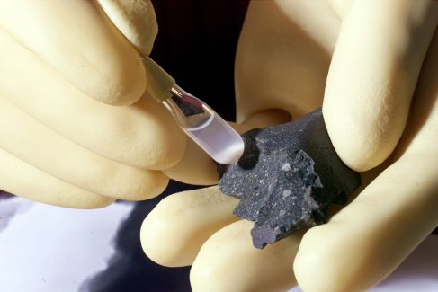

### Learning Objectives

By the end of this section, you will be able to:

* Explain the origin of meteorites and the difference between a meteor and a meteorite
* Describe how most meteorites have been found
* Explain how primitive stone meteorites are significantly different from other types
* Explain how the study of meteorites informs our understanding of the age of the solar system.

Any fragment of interplanetary debris that survives its fiery plunge through Earth’s atmosphere is called a **meteorite**{: data-type="term"}. Meteorites fall only very rarely in any one locality, but over the entire Earth thousands fall each year. Some meteorites are loners, but many are fragments from the breakup in the atmosphere of a single larger object. These rocks from the sky carry a remarkable record of the formation and early history of the solar system.

### Extraterrestrial Origin of Meteorites

Occasional meteorites have been found throughout history, but their extraterrestrial origin was not accepted by scientists until the beginning of the nineteenth century. Before that, these strange stones were either ignored or considered to have a supernatural origin.

The falls of the earliest recovered meteorites are lost in the fog of mythology. A number of religious texts speak of stones from heaven, which sometimes arrived at opportune moments to smite the enemies of the authors of those texts. At least one sacred meteorite has apparently survived in the form of the Ka’aba, the holy black stone in Mecca that is revered by Islam as a relic from the time of the Patriarchs—although understandably, no chip from this sacred stone has been subject to detailed chemical analysis.

The modern scientific history of the meteorites begins in the late eighteenth century, when a few scientists suggested that some strange-looking stones had such peculiar composition and structure that they were probably not of terrestrial origin. The idea that indeed “stones fall from the sky” was generally accepted only after a scientific team led by French physicist Jean-Baptiste Biot investigated a well-observed fall in 1803.

Meteorites sometimes fall in groups or showers. Such a fall occurs when a single larger object breaks up during its violent passage through the atmosphere. It is important to remember that such a *shower of meteorites* has nothing to do with a *meteor shower*. No meteorites have ever been recovered in association with meteor showers. Whatever the ultimate source of the meteorites, they do not appear to come from the comets or their associated particle streams.

### Meteorite Falls and Finds

Meteorites are found in two ways. First, sometimes bright meteors (fireballs) are observed to penetrate the atmosphere to low altitudes. If we search the area beneath the point where the fireball burned out, we may find one or more remnants that reached the ground. Observed *meteorite falls*, in other words, may lead to the recovery of fallen meteorites. (A few meteorites have even hit buildings or, very rarely, people; see [Making Connections: Some Striking Meteorites](#fs-id1163975372653)). The 2013 Chelyabinsk fireball, which we discussed in the chapter on [Comets and Asteroids: Debris of the Solar System](/m59865){: .target-chapter}, produced tens of thousands of small meteorites, many of them easy to find because these dark stones fell on snow.

There are, however, many false alarms about **meteorite fall**{: data-type="term" .no-emphasis}s. Most observers of a bright fireball conclude that part of it hit the ground, but that is rarely the case. Every few months news outlets report that a meteorite has been implicated in the start of a fire. Such stories have always proved to be wrong. The meteorite is ice-cold in space, and most of its interior remains cold even after its brief fiery plunge through the atmosphere. A freshly fallen meteorite is more likely to acquire a coating of frost than to start a fire.

People sometimes discover unusual-looking rocks that turn out to be meteoritic; these rocks are termed *meteorite finds*. Now that the public has become meteorite-conscious, many unusual fragments, not all of which turn out to be from space, are sent to experts each year. Some scientists divide these objects into two categories: “meteorites” and “meteorwrongs.” Outside Antarctica (see the next paragraph), genuine meteorites turn up at an average rate of 25 or so per year. Most of these end up in natural history museums or specialized meteoritical laboratories throughout the world ([\[link\]](#OSC_Astro_14_02_Meteorite)).

  This early twentieth century photo shows a 15-ton iron meteorite found in the Willamette Valley in Oregon. Although known to Native Americans in the area, it was &#x201C;discovered&#x201D; by an enterprising local farmer in 1902, who proceeded to steal it and put it on display. (b) It was eventually purchased for the American Museum of Natural History and is now on display in the museum&#x2019;s Rose Center in New York City as the largest iron meteorite in the United States. In this 1911 photo, two young boys are perched in the meteor&#x2019;s crevices."){: #OSC_Astro_14_02_Meteorite data-title="Meteorite Find."}

Since the 1980s, sources in the Antarctic have dramatically increased our knowledge of meteorites. More than ten thousand meteorites have been recovered from the Antarctic as a result of the motion of the ice in some parts of that continent ([\[link\]](#OSC_Astro_14_02_Antarctic)). Meteorites that fall in regions where ice accumulates are buried and then carried slowly to other areas where the ice is gradually worn away. After thousands of years, the rock again finds itself on the surface, along with other meteorites carried to these same locations. The ice thus concentrates the meteorites that have fallen both over a large area and over a long period of time. Once on the surface, the rocks stand out in contrast to the ice and are thus easier to spot than in other places on our rocky planet.

  The US Antarctic Search for Meteorites (ANSMET) team recovers a meteorite from the Antarctic ice during a 2001&#x2013;2002 mission. (b) The team is shown with some of the equipment used in the search. (credit a, b: modification of work by NASA)"){: #OSC_Astro_14_02_Antarctic data-title="Antarctic Meteorite."}

Some Striking Meteorites

Although meteorites fall regularly onto Earth’s surface, few of them have much of an impact on human civilization. There is so much water and uninhabited land on our planet that rocks from space typically fall where no one even sees them come down. But given the number of meteorites that land each year, you may not be surprised that a few have struck buildings, cars, and even people. In September 1938, for example, a meteorite plunged through the roof of Edward McCain’s garage, where it became embedded in the seat of his Pontiac Coupe ([\[link\]](#OSC_Astro_14_02_Benld)).

In November 1982, Robert and Wanda Donahue of Wethersfield, Connecticut, were watching *M\*A\*S\*H\** on television when a 6-pound meteorite came thundering through their roof, making a hole in the living room ceiling. After bouncing, it finally came to rest under their dining room table.

Eighteen-year-old Michelle Knapp of Peekskill, New York, got quite a surprise one morning in October 1992. She had just purchased her very first car, her grandmother’s 1980 Chevy Malibu. But she awoke to find its rear end mangled and a crater in the family driveway—thanks to a 3-pound meteorite. Michelle was not sure whether to be devastated by the loss of her car or thrilled by all the media attention.

In June 1994, Jose Martin and his wife were driving from Madrid, Spain, to a golfing vacation when a fist-sized meteorite crashed through the windshield of their car, bounced off the dashboard, broke Jose’s little finger, and then landed in the back seat. Before Martin, the most recent person known to have been struck by a meteorite was Annie Hodges of Sylacauga, Alabama. In November 1954, she was napping on a couch when a meteorite came through the roof, bounced off a large radio set, and hit her first on the arm and then on the leg.

The fireball that exploded at an altitude of about 20 kilometers near the Russian city of Chelyabinsk on February 15, 2013, produced a very large meteorite shower, and quite a few of the small rocks hit buildings. None is known to have hit people, however, and the individual meteorites were so small that they did not do much damage—much less than the shockwave from the exploding fireball, which broke the glass in thousands of windows.

 left a hole in the seat cushion of Edward McCain&#x2019;s car. (credit: &#x201C;Shsilver&#x201D;/Wikimedia Commons)"){: #OSC_Astro_14_02_Benld data-title="Benld Meteorite."}

### Meteorite Classification

The meteorites in our collections have a wide range of compositions and histories, but traditionally they have been placed into three broad classes. First are the **irons**{: data-type="term"}, composed of nearly pure metallic nickel-iron. Second are the **stones**{: data-type="term"}, the term used for any silicate or rocky meteorite. Third are the rarer **stony-irons**{: data-type="term"}, made (as the name implies) of mixtures of stone and metallic iron ([\[link\]](#OSC_Astro_14_02_Variety)).

  This piece of the Allende carbonaceous meteorite has white inclusions that may date back to before the formation of the solar nebula. (b) This fragment is from the iron meteorite responsible for the formation of Meteor Crater in Arizona. (c) This piece of the Imilac stony-iron meteorite is a beautiful mixture of green olivine crystals and metallic iron. (credit a: modification of work by James St. John; credit b: modification of work by &#x201C;Taty2007&#x201D;/Wikimedia Commons; credit c: modification of work by Juan Manuel Flux&#xE0;)"){: #OSC_Astro_14_02_Variety data-title="Meteorite Types."}

Of these three types, the irons and stony-irons are the most obviously extraterrestrial because of their metallic content. Pure iron almost never occurs naturally on Earth; it is generally found here as an oxide (chemically combined with oxygen) or other mineral ore. Therefore, if you ever come across a chunk of metallic iron, it is sure to be either man-made or a meteorite.

The stones are much more common than the irons but more difficult to recognize. Often laboratory analysis is required to demonstrate that a particular sample is really of extraterrestrial origin, especially if it has lain on the ground for some time and been subject to weathering. The most scientifically valuable stones are those collected immediately after they fall, or the Antarctic samples preserved in a nearly pristine state by ice.

[\[link\]](#fs-id1163975339382) summarizes the frequencies of occurrence of the different classes of meteorites among the fall, find, and Antarctic categories.

<table class="span-all" summary="This table titled &#x201C;Frequency of Occurrence of Meteorite Classes&#x201D; has four columns. The cells in the top row, which is a header row, name the columns below. From left to right, the first column is named &#x201C;Class,&#x201D; the second column is named &#x201C;Falls (percent),&#x201D; the third column is named &#x201C;Finds (percent),&#x201D; and the fourth column is named &#x201C;Antarctic (percent).&#x201D; The meteorite class &#x201C;Primitive stones&#x201D; constitutes 88 percent of falls, 51 percent of finds, and 85 percent of Antarctic samples. The meteorite class &#x201C;Differentiated stones&#x201D; constitutes 8 percent of falls, 2 percent of finds, and 12 percent of Antarctic samples. The meteorite class &#x201C;Irons&#x201D; constitutes 3 percent of falls, 42 percent of finds, and 2 percent of Antarctic samples. The meteorite class &#x201C;Stony-irons&#x201D; constitutes 1 percent of falls, 5 percent of finds, and 1 percent of Antarctic samples."><thead>
<tr valign="top">
<th colspan="4" data-valign="top" data-align="center">Frequency of Occurrence of Meteorite Classes</th>
</tr>
<tr valign="top">
<th data-valign="top" data-align="center">Class</th>
<th data-valign="top" data-align="center">Falls (%)</th>
<th data-valign="top" data-align="center">Finds (%)</th>
<th data-valign="top" data-align="center">Antarctic (%)</th>
</tr>
</thead><tbody>
<tr valign="top">
<td data-valign="top" data-align="left">Primitive stones</td>
<td data-valign="top" data-align="left">88</td>
<td data-valign="top" data-align="left">51</td>
<td data-valign="top" data-align="left">85</td>
</tr>
<tr valign="top">
<td data-valign="top" data-align="left">Differentiated stones</td>
<td data-valign="top" data-align="left">8</td>
<td data-valign="top" data-align="left">2</td>
<td data-valign="top" data-align="left">12</td>
</tr>
<tr valign="top">
<td data-valign="top" data-align="left">Irons</td>
<td data-valign="top" data-align="left">3</td>
<td data-valign="top" data-align="left">42</td>
<td data-valign="top" data-align="left">2</td>
</tr>
<tr valign="top">
<td data-valign="top" data-align="left">Stony-irons</td>
<td data-valign="top" data-align="left">1</td>
<td data-valign="top" data-align="left">5</td>
<td data-valign="top" data-align="left">1</td>
</tr>
</tbody></table>

### Ages and Compositions of Meteorites

It was not until the ages of **meteorites**{: data-type="term" .no-emphasis} were measured and their compositions analyzed in detail that scientists appreciated their true significance. The meteorites include the oldest and most primitive materials available for direct study in the laboratory. The ages of stony meteorites can be determined from the careful measurement of radioactive isotopes and their decay products. Almost all meteorites have radioactive ages between 4.50 and 4.56 billion years, as old as any ages we have measured in the solar system. The few younger exceptions are igneous rocks that have been ejected from cratering events on the Moon or Mars (and have made their way to Earth).

The average age for the most primitive meteorites, calculated using the most accurate values now available for radioactive half-lives, is 4.56 billion years, with an uncertainly of less than 0.01 billion years. This value (which we round off to 4.5 billion years in this book) is taken to represent the *age of the solar system*—the time since the first solids condensed and began to form into larger bodies.

The traditional classification of meteorites into irons, stones, and stony-irons is easy to use because it is obvious from inspection which category a meteorite falls into (although it may be much more difficult to distinguish a meteoritic stone from a terrestrial rock). More scientifically significant, however, is the distinction between *primitive* and *differentiated* meteorites. The differentiated meteorites are fragments of larger parent bodies that were molten before they broke up, allowing the denser materials (such as metals) to sink to their centers. Like many rocks on Earth, they have been subject to a degree of chemical reshuffling, with the different materials sorted according to density. Differentiated meteorites include the irons, which come from the metal cores of their parent bodies; stony-irons, which probably originate in regions between a metal core and a stony mantle; and some stones that are composed of mantle or crust material from the their differentiated parent bodies.

### The Most Primitive Meteorites

For information on the *earliest* history of the solar system, we turn to the **primitive meteorites**{: data-type="term" .no-emphasis}—those made of materials that have *not* been subject to great heat or pressure since their formation. We can look at the spectrum of sunlight reflected from asteroids and compare their compositions with those of primitive meteorites. Such analysis indicates that their parent bodies are almost certainly asteroids. Since **asteroids**{: data-type="term" .no-emphasis} are believed to be fragments left over from the formation process of the solar system, it makes sense that they should be the parent bodies of the primitive meteorites.

The great majority of the meteorites that reach Earth are primitive stones. Many of them are composed of light-colored gray silicates with some metallic grains mixed in, but there is also an important group of darker stones called *carbonaceous meteorites*. As their name suggests, these meteorites contain carbon, but we also find various complex organic molecules in them—chemicals based on carbon, which on Earth are the chemical building blocks of life. In addition, some of them contain chemically bound water, and many are depleted in metallic iron. The carbonaceous (or C-type) asteroids are concentrated in the outer part of the asteroid belt.

Among the most useful of these meteorites have been the Allende meteorite that fell in Mexico (see [\[link\]](#OSC_Astro_14_02_Variety)), the Murchison meteorite that fell in Australia (both in 1969), and the Tagish Lake meteorite that landed in a winter snowdrift on Tagish Lake, Canada, in 2000. (The fragile bits of dark material from the Tagish Lake meteorite were readily visible against the white snow, although at first they were mistaken for wolf droppings.)

The Murchison meteorite ([\[link\]](#OSC_Astro_14_02_Murchison)) is known for the variety of organic chemicals it has yielded. Most of the carbon compounds in carbonaceous meteorites are complex, tarlike substances that defy exact analysis. Murchison also contains 16 amino acids (the building blocks of proteins), 11 of which are rare on Earth. The most remarkable thing about these organic molecules is that they include equal numbers with right-handed and left-handed molecular symmetry. Amino acids can have either kind of symmetry, but all life on Earth has evolved using only the *left-handed* versions to make proteins. The presence of both kinds of amino acids clearly demonstrates that the ones in the meteorites had an extraterrestrial origin.

 {: #OSC_Astro_14_02_Murchison data-title="Murchison Meteorite."}

These naturally occurring amino acids and other complex organic molecules in Murchison—formed without the benefit of the sheltering environment of planet Earth—show that a great deal of interesting chemistry must have taken place when the solar system was forming. If so, then perhaps some of the molecular building blocks of life on Earth were first delivered by primitive meteorites and comets. This is an interesting idea because our planet was probably much too hot for any organic materials to survive its earliest history. But after Earth’s surface cooled, the asteroid and comet fragments that pelted it could have refreshed its supply of organic materials.

### Key Concepts and Summary

Meteorites are the debris from space (mostly asteroid fragments) that survive to reach the surface of Earth. Meteorites are called *finds* or *falls* according to how they are discovered; the most productive source today is the Antarctic ice cap. Meteorites are classified as irons, stony-irons, or stones accordingly to their composition. Most stones are primitive objects, dated to the origin of the solar system 4.5 billion years ago. The most primitive are the carbonaceous meteorites, such as Murchison and Allende. These can contain a number of organic (carbon-rich) molecules.

### Glossary
{: data-type="glossary-title"}

iron meteorite
: a meteorite composed primarily of iron and nickel
^

meteorite
: a portion of a meteor that survives passage through the atmosphere and strikes the ground
^

stony meteorite
: a meteorite composed mostly of stony material, either primitive or differentiated
^

stony-iron meteorite
: a type of differentiated meteorite that is a blend of nickel-iron and silicate materials

