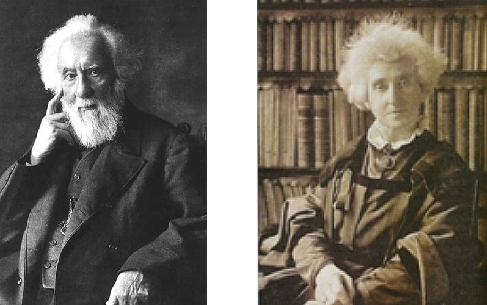

### Learning Objectives

By the end of this section, you will be able to:

* Describe how astronomers use spectral classes to characterize stars
* Explain the difference between a star and a brown dwarf

Measuring colors is only one way of analyzing starlight. Another way is to use a spectrograph to spread out the light into a spectrum (see the [Radiation and Spectra](/m59791){: .target-chapter} and the [Astronomical Instruments](/m59802){: .target-chapter} chapters). In 1814, the German physicist Joseph **Fraunhofer**{: data-type="term" .no-emphasis} observed that the spectrum of the Sun shows dark lines crossing a continuous band of colors. In the 1860s, English astronomers Sir William **Huggins**{: data-type="term" .no-emphasis} and Lady Margaret Huggins ([\[link\]](#OSC_Astro_17_03_Huggins)) succeeded in identifying some of the lines in stellar spectra as those of known elements on Earth, showing that the same chemical elements found in the Sun and planets exist in the stars. Since then, astronomers have worked hard to perfect experimental techniques for obtaining and measuring spectra, and they have developed a theoretical understanding of what can be learned from spectra. Today, spectroscopic analysis is one of the cornerstones of astronomical research.

 {: #OSC_Astro_17_03_Huggins data-title="William Huggins (1824&#x2013;1910) and Margaret Huggins (1848&#x2013;1915)."}

### Formation of Stellar Spectra

When the spectra of different stars were first observed, astronomers found that they were not all identical. Since the dark lines are produced by the chemical elements present in the stars, astronomers first thought that the spectra differ from one another because stars are not all made of the same chemical elements. This hypothesis turned out to be wrong. *The primary reason that* *stellar spectra look different is because the stars have different temperatures*. Most stars have nearly the same composition as the Sun, with only a few exceptions.

Hydrogen, for example, is by far the most abundant element in most stars. However, lines of hydrogen are not seen in the spectra of the hottest and the coolest stars. In the atmospheres of the hottest stars, hydrogen atoms are completely ionized. Because the electron and the proton are separated, ionized hydrogen cannot produce absorption lines. (Recall from the [Formation of Spectral Lines](/m59795){: .target-chapter} section, the lines are the result of electrons in orbit around a nucleus changing energy levels.)

In the atmospheres of the coolest stars, hydrogen atoms have their electrons attached and can switch energy levels to produce lines. However, practically all of the hydrogen atoms are in the lowest energy state (unexcited) in these stars and thus can absorb only those photons able to lift an electron from that first energy level to a higher level. Photons with enough energy to do this lie in the ultraviolet part of the electromagnetic spectrum, and there are very few ultraviolet photons in the radiation from a cool star. What this means is that if you observe the spectrum of a very hot or very cool star with a typical telescope on the surface of Earth, the most common element in that star, hydrogen, will show very weak spectral lines or none at all.

The hydrogen lines in the visible part of the spectrum (called *Balmer lines*) are strongest in stars with intermediate temperatures—not too hot and not too cold. Calculations show that the optimum temperature for producing visible hydrogen lines is about 10,000 K. At this temperature, an appreciable number of hydrogen atoms are excited to the second energy level. They can then absorb additional photons, rise to still-higher levels of excitation, and produce a dark absorption line. Similarly, every other chemical element, in each of its possible stages of ionization, has a characteristic temperature at which it is most effective in producing absorption lines in any particular part of the spectrum.

### Classification of Stellar Spectra

Astronomers use the patterns of lines observed in **stellar spectra**{: data-type="term" .no-emphasis} to sort stars into a **spectral class**{: data-type="term"}. Because a star’s temperature determines which absorption lines are present in its spectrum, these spectral classes are a measure of its surface temperature. There are seven standard spectral classes. From hottest to coldest, these seven spectral classes are designated O, B, A, F, G, K, and M. Recently, astronomers have added three additional classes for even cooler objects—L, T, and Y.

At this point, you may be looking at these letters with wonder and asking yourself why astronomers didn’t call the spectral types A, B, C, and so on. You will see, as we tell you the history, that it’s an instance where tradition won out over common sense.

In the 1880s, Williamina **Fleming**{: data-type="term" .no-emphasis} devised a system to classify stars based on the strength of hydrogen absorption lines. Spectra with the strongest lines were classified as “A” stars, the next strongest “B,” and so on down the alphabet to “O” stars, in which the hydrogen lines were very weak. But we saw above that hydrogen lines alone are not a good indicator for classifying stars, since their lines disappear from the visible light spectrum when the stars get too hot or too cold.

In the 1890s, Annie Jump **Cannon**{: data-type="term" .no-emphasis} revised this classification system, focusing on just a few letters from the original system: A, B, F, G, K, M, and O. Instead of starting over, Cannon also rearranged the existing classes—in order of decreasing temperature—into the sequence we have learned: O, B, A, F, G, K, M. As you can read in the feature on [Annie Cannon: Classifier of the Stars](#fs-id1170326186380) in this chapter, she classified around 500,000 stars over her lifetime, classifying up to three stars per minute by looking at the stellar spectra.

For a deep dive into spectral types, explore the interactive project at the [Sloan Digital Sky Survey][1] in which you can practice classifying stars yourself.

To help astronomers remember this crazy order of letters, Cannon created a mnemonic, “Oh Be A Fine Girl, Kiss Me.” (If you prefer, you can easily substitute “Guy” for “Girl.”) Other mnemonics, which we hope will not be relevant for you, include “Oh Brother, Astronomers Frequently Give Killer Midterms” and “Oh Boy, An F Grade Kills Me!” With the new L, T, and Y spectral classes, the mnemonic might be expanded to “Oh Be A Fine Girl (Guy), Kiss Me Like That, Yo!”

Each of these spectral classes, except possibly for the Y class which is still being defined, is further subdivided into 10 subclasses designated by the numbers 0 through 9. A B0 star is the hottest type of B star; a B9 star is the coolest type of B star and is only slightly hotter than an A0 star.

And just one more item of vocabulary: for historical reasons, astronomers call all the elements heavier than helium *metals*, even though most of them do not show metallic properties. (If you are getting annoyed at the peculiar jargon that astronomers use, just bear in mind that every field of human activity tends to develop its own specialized vocabulary. Just try reading a credit card or social media agreement form these days without training in law!)

Let’s take a look at some of the details of how the spectra of the stars change with temperature. (It is these details that allowed Annie Cannon to identify the spectral types of stars as quickly as three per minute!) As [\[link\]](#OSC_Astro_17_03_Absorption) shows, in the hottest O stars (those with temperatures over 28,000 K), only lines of ionized helium and highly ionized atoms of other elements are conspicuous. Hydrogen lines are strongest in A stars with atmospheric temperatures of about 10,000 K. Ionized metals provide the most conspicuous lines in stars with temperatures from 6000 to 7500 K (spectral type F). In the coolest M stars (below 3500 K), absorption bands of titanium oxide and other molecules are very strong. By the way, the spectral class assigned to the Sun is G2. The sequence of **spectral class**{: data-type="term" .no-emphasis}es is summarized in [\[link\]](#fs-id1170326111681).

 ![Graph showing the relative strength of absorption lines versus spectral class and temperature. The vertical axis plots the relative strength of lines in arbitrary units. The horizontal axis plots both spectral class and temperature in degrees Kelvin. The spectral classes start at O on the left, then B, A, F, G, K, and M on the right. The temperature scale starts at &gt;30,000 at left, then 30,000-10,000, 10,000-7500, 7500-6000, 6000-5200, 5200-3700, and 3700-2400 on the right. Six curves are plotted, each peaking as follows (from left to right): ionized helium peaks at spectral type O, neutral helium peaks at B, hydrogen peaks at about A, ionized metals peak between F and G, neutral metals peak at K, and molecules peak beyond M at right.](../resources/OSC_Astro_17_03_Absorption.jpg "This graph shows the strengths of absorption lines of different chemical species (atoms, ions, molecules) as we move from hot (left) to cool (right) stars. The sequence of spectral types is also shown."){: #OSC_Astro_17_03_Absorption data-title="Absorption Lines in Stars of Different Temperatures."}

<table summary="This table has 5 columns and 10 rows. The first row is the header and it labels each column, &#x201C;Spectral Class&#x201D;, &#x201C;Color&#x201D;, &#x201C;Approximate Temperature (K)&#x201D;, &#x201C;Principal Features&#x201D;, and &#x201C;Examples&#x201D;. The column labeled &#x201C;Spectral Class&#x201D; has the values, &#x201C;O&#x201D;, &#x201C;B&#x201D;, &#x201C;A&#x201D;, &#x201C;F&#x201D;, &#x201C;G&#x201D;, &#x201C;K&#x201D;, &#x201C;M&#x201D;, &#x201C;L&#x201D;, &#x201C;T&#x201D;, and &#x201C;Y&#x201D;. The column labeled &#x201C;Color&#x201D; has the values, &#x201C;Blue&#x201D;, &#x201C;Blue-white&#x201D;, &#x201C;White&#x201D;, &#x201C;Yellow-white&#x201D;, &#x201C;Yellow&#x201D;, &#x201C;Orange&#x201D;, &#x201C;Red&#x201D;, &#x201C;Red&#x201D;, &#x201C;Magenta&#x201D;, and &#x201C;Infrared&#xB0;&#x201D;. The column labeled &#x201C;Approximate Temperature (K)&#x201D; has the values, &#x201C;&gt; 30,000&#x201D;, &#x201C;10,000&#x2013;30,000&#x201D;, &#x201C;7500&#x2013;10,000&#x201D;, &#x201C;6000&#x2013;7500&#x201D;, &#x201C;5200&#x2013;6000&#x201D;, &#x201C;3700&#x2013;5200&#x201D;, &#x201C;2400&#x2013;3700&#x201D;, &#x201C;1300&#x2013;2400&#x201D;, &#x201C;700&#x2013;1300&#x201D;, and &#x201C;&lt; 700&#x201D;. The column labeled &#x201C;Principal Features&#x201D; has the values, &#x201C;Neutral and ionized helium lines, weak hydrogen lines&#x201D;, &#x201C;Neutral helium lines, strong hydrogen lines&#x201D;, &#x201C;Strongest hydrogen lines, weak ionized calcium lines, weak ionized metal (iron, magnesium, etc.) lines&#x201D;, &#x201C;Strong hydrogen lines, strong ionized calcium lines, weak sodium lines, many ionized metals&#x201D;, &#x201C;Weaker hydrogen, strong ionized calcium, strong sodium, many lines of ionized and neutral metals&#x201D;, &#x201C;Very weak hydrogen, strong ionized calcium, strong sodium, many lines of neutral metals&#x201D;, &#x201C;Strong lines of neutral metals and molecular bands of titanium oxide dominate.&#x201D;, &#x201C;Metal hydrides, alkali metals (e.g., sodium, potassium, rubidium).&#x201D;, &#x201C;Methane lines.&#x201D;, and &#x201C;Ammonia lines&#x201D;. The column labeled &#x201C;Examples&#x201D; has the values, &#x201C;10 Lacertae&#x201D;, &#x201C;Rigel Spica&#x201D;, &#x201C;Sirius Vega&#x201D;, &#x201C;Canopus Procyon&#x201D;, &#x201C;Sun Capella&#x201D;, &#x201C;Arcturus Aldebaran&#x201D;, &#x201C;Betelgeuse Antares&#x201D;, &#x201C;Teide 1&#x201D;, &#x201C;Gliese 229B&#x201D;, and &#x201C;WISE 1828+2650&#x201D;." class="span-all"><thead>
<tr>
<th colspan="5" data-align="center">Spectral Classes for Stars</th>
</tr>
<tr valign="top">
<th data-valign="top" data-align="center">Spectral Class</th>
<th data-valign="top" data-align="center">Color</th>
<th data-valign="top" data-align="center">Approximate Temperature (K)</th>
<th data-valign="top" data-align="center">Principal Features</th>
<th data-valign="top" data-align="center">Examples</th>
</tr>
</thead><tbody>
<tr valign="top">
<td data-valign="top" data-align="left">O</td>
<td data-valign="top" data-align="left">Blue</td>
<td data-valign="top" data-align="left">&gt; 30,000</td>
<td data-valign="top" data-align="left">Neutral and ionized helium lines, weak hydrogen lines</td>
<td data-valign="top" data-align="left">10 Lacertae</td>
</tr>
<tr valign="top">
<td data-valign="top" data-align="left">B</td>
<td data-valign="top" data-align="left">Blue-white</td>
<td data-valign="top" data-align="left">10,000–30,000</td>
<td data-valign="top" data-align="left">Neutral helium lines, strong hydrogen lines</td>
<td data-valign="top" data-align="left">Rigel, Spica</td>
</tr>
<tr valign="top">
<td data-valign="top" data-align="left">A</td>
<td data-valign="top" data-align="left">White</td>
<td data-valign="top" data-align="left">7500–10,000</td>
<td data-valign="top" data-align="left">Strongest hydrogen lines, weak ionized calcium lines, weak ionized metal (e.g., iron, magnesium) lines</td>
<td data-valign="top" data-align="left"><strong data-type="term" class="no-emphasis">Sirius</strong>, <strong data-type="term" class="no-emphasis">Vega</strong></td>
</tr>
<tr valign="top">
<td data-valign="top" data-align="left">F</td>
<td data-valign="top" data-align="left">Yellow-white</td>
<td data-valign="top" data-align="left">6000–7500</td>
<td data-valign="top" data-align="left">Strong hydrogen lines, strong ionized calcium lines, weak sodium lines, many ionized metal lines</td>
<td data-valign="top" data-align="left">Canopus, Procyon</td>
</tr>
<tr valign="top">
<td data-valign="top" data-align="left">G</td>
<td data-valign="top" data-align="left">Yellow</td>
<td data-valign="top" data-align="left">5200–6000</td>
<td data-valign="top" data-align="left">Weaker hydrogen lines, strong ionized calcium lines, strong sodium lines, many lines of ionized and neutral metals</td>
<td data-valign="top" data-align="left"><strong data-type="term" class="no-emphasis">Sun</strong>, Capella</td>
</tr>
<tr valign="top">
<td data-valign="top" data-align="left">K</td>
<td data-valign="top" data-align="left">Orange</td>
<td data-valign="top" data-align="left">3700–5200</td>
<td data-valign="top" data-align="left">Very weak hydrogen lines, strong ionized calcium lines, strong sodium lines, many lines of neutral metals</td>
<td data-valign="top" data-align="left">Arcturus, Aldebaran</td>
</tr>
<tr valign="top">
<td data-valign="top" data-align="left">M</td>
<td data-valign="top" data-align="left">Red</td>
<td data-valign="top" data-align="left">2400–3700</td>
<td data-valign="top" data-align="left">Strong lines of neutral metals and molecular bands of titanium oxide dominate</td>
<td data-valign="top" data-align="left"><strong data-type="term" class="no-emphasis">Betelgeuse</strong>, Antares</td>
</tr>
<tr valign="top">
<td data-valign="top" data-align="left">L</td>
<td data-valign="top" data-align="left">Red</td>
<td data-valign="top" data-align="left">1300–2400</td>
<td data-valign="top" data-align="left">Metal hydride lines, alkali metal lines (e.g., sodium, potassium, rubidium)</td>
<td data-valign="top" data-align="left">Teide 1</td>
</tr>
<tr valign="top">
<td data-valign="top" data-align="left">T</td>
<td data-valign="top" data-align="left">Magenta</td>
<td data-valign="top" data-align="left">700–1300</td>
<td data-valign="top" data-align="left">Methane lines</td>
<td data-valign="top" data-align="left">Gliese 229B</td>
</tr>
<tr valign="top">
<td data-valign="top" data-align="left">Y</td>
<td data-valign="top" data-align="left">Infrared<a data-type="footnote-link" href="#footnote1">1</a></td>
<td data-valign="top" data-align="left">&lt; 700</td>
<td data-valign="top" data-align="left">Ammonia lines</td>
<td data-valign="top" data-align="left">WISE 1828+2650</td>
</tr>
</tbody></table>

To see how spectral classification works, let’s use [\[link\]](#OSC_Astro_17_03_Absorption). Suppose you have a spectrum in which the hydrogen lines are about half as strong as those seen in an A star. Looking at the lines in our figure, you see that the star could be either a B star or a G star. But if the spectrum also contains helium lines, then it is a B star, whereas if it contains lines of ionized iron and other metals, it must be a G star.

If you look at [\[link\]](#OSC_Astro_17_03_Classes), you can see that you, too, could assign a spectral class to a star whose type was not already known. All you have to do is match the pattern of spectral lines to a standard star (like the ones shown in the figure) whose type has already been determined.

 ![Composite image of the spectra of 13 stars of different spectral classes. The spectra are stacked one upon the other, starting from O6.5 at the top and then B0, B6, A1, A5, F0, F5, G0, G5, K0, K5, M0 and finally M5 at the bottom. Each spectrum is a band of color from blue on the left, through green, yellow and red at far right. Each spectrum has dark vertical lines which correspond to various chemical elements in each star&#x2019;s atmosphere. The hotter the star, the fewer absorption lines in its spectrum. Thus the O6.5 spectrum at top has just a few lines, while the M5 at bottom has hundreds of lines.](../resources/OSC_Astro_17_03_Classes.jpg "This image compares the spectra of the different spectral classes. The spectral class assigned to each of these stellar spectra is listed at the left of the picture. The strongest four lines seen at spectral type A1 (one in the red, one in the blue-green, and two in the blue) are Balmer lines of hydrogen. Note how these lines weaken at both higher and lower temperatures, as [link] also indicates. The strong pair of closely spaced lines in the yellow in the cool stars is due to neutral sodium (one of the neutral metals in [link]). (Credit: modification of work by NOAO/AURA/NSF)"){: #OSC_Astro_17_03_Classes data-title="Spectra of Stars with Different Spectral Classes."}

Both colors and spectral classes can be used to estimate the temperature of a star. Spectra are harder to measure because the light has to be bright enough to be spread out into all colors of the rainbow, and detectors must be sensitive enough to respond to individual wavelengths. In order to measure colors, the detectors need only respond to the many wavelengths that pass simultaneously through the colored filters that have been chosen—that is, to *all* the blue light or *all* the yellow-green light.

Annie Cannon: Classifier of the Stars

Annie Jump **Cannon**{: data-type="term" .no-emphasis} was born in Delaware in 1863 ([\[link\]](#OSC_Astro_17_03_Annie)). In 1880, she went to Wellesley College, one of the new breed of US colleges opening up to educate young women. Wellesley, only 5 years old at the time, had the second student physics lab in the country and provided excellent training in basic science. After college, Cannon spent a decade with her parents but was very dissatisfied, longing to do scientific work. After her mother’s death in 1893, she returned to Wellesley as a teaching assistant and also to take courses at Radcliffe, the women’s college associated with Harvard.

"){: #OSC_Astro_17_03_Annie data-title="Annie Jump Cannon (1863&#x2013;1941)."}

In the late 1800s, the director of the Harvard Observatory, Edward C. Pickering, needed lots of help with his ambitious program of classifying stellar spectra. The basis for these studies was a monumental collection of nearly a million photographic spectra of stars, obtained from many years of observations made at Harvard College Observatory in Massachusetts as well as at its remote observing stations in South America and South Africa. Pickering quickly discovered that educated young women could be hired as assistants for one-third or one-fourth the salary paid to men, and they would often put up with working conditions and repetitive tasks that men with the same education would not tolerate. These women became known as the Harvard Computers. (We should emphasize that astronomers were not alone in reaching such conclusions about the relatively new idea of upper-class, educated women working outside the home: women were exploited and undervalued in many fields. This is a legacy from which our society is just beginning to emerge.)

Cannon was hired by Pickering as one of the “computers” to help with the classification of spectra. She became so good at it that she could visually examine and determine the spectral types of several hundred stars per hour (dictating her conclusions to an assistant). She made many discoveries while investigating the Harvard photographic plates, including 300 variable stars (stars whose luminosity changes periodically). But her main legacy is a marvelous catalog of spectral types for hundreds of thousands of stars, which served as a foundation for much of twentieth-century astronomy.

In 1911, a visiting committee of astronomers reported that “she is the one person in the world who can do this work quickly and accurately” and urged Harvard to give Cannon an official appointment in keeping with her skill and renown. Not until 1938, however, did Harvard appoint her an astronomer at the university; she was then 75 years old.

Cannon received the first honorary degree Oxford awarded to a woman, and she became the first woman to be elected an officer of the American Astronomical Society, the main professional organization of astronomers in the US. She generously donated the money from one of the major prizes she had won to found a special award for women in astronomy, now known as the Annie Jump Cannon Prize. True to form, she continued classifying stellar spectra almost to the very end of her life in 1941.

### Spectral Classes L, T, and Y

The scheme devised by Cannon worked well until 1988, when astronomers began to discover objects even cooler than M9-type stars. We use the word *object* because many of the new discoveries are not true stars. A star is defined as an object that during some part of its lifetime derives 100% of its energy from the same process that makes the Sun shine—the fusion of hydrogen nuclei (protons) into helium. Objects with masses less than about 7.5% of the mass of our Sun (about 0.075 *M*Sun) do not become hot enough for hydrogen fusion to take place. Even before the first such “failed star” was found, this class of objects, with masses intermediate between stars and planets, was given the name **brown dwarfs**{: data-type="term"}.

Brown dwarfs are very difficult to observe because they are extremely faint and cool, and they put out most of their light in the infrared part of the spectrum. It was only after the construction of very large telescopes, like the Keck telescopes in Hawaii, and the development of very sensitive infrared detectors, that the search for brown dwarfs succeeded. The first brown dwarf was discovered in 1988, and, as of the summer of 2015, there are more than 2200 known brown dwarfs.

Initially, brown dwarfs were given spectral classes like M10+ or “much cooler than M9,” but so many are now known that it is possible to begin assigning spectral types. The hottest brown dwarfs are given types L0–L9 (temperatures in the range 2400–1300 K), whereas still cooler (1300–700 K) objects are given types T0–T9 (see [\[link\]](#OSC_Astro_17_03_Dwarf)). In class L brown dwarfs, the lines of titanium oxide, which are strong in M stars, have disappeared. This is because the L dwarfs are so cool that atoms and molecules can gather together into dust particles in their atmospheres; the titanium is locked up in the dust grains rather than being available to form molecules of titanium oxide. Lines of steam (hot water vapor) are present, along with lines of carbon monoxide and neutral sodium, potassium, cesium, and rubidium. Methane (CH4) lines are strong in class-T brown dwarfs, as methane exists in the atmosphere of the giant planets in our own solar system.

In 2009, astronomers discovered ultra-cool brown dwarfs with temperatures of 500–600 K. These objects exhibited absorption lines due to ammonia (NH3), which are not seen in T dwarfs. A new spectral class, Y, was created for these objects. As of 2015, over two dozen brown dwarfs belonging to spectral class Y have been discovered, some with temperatures comparable to that of the human body (about 300 K).

 ![Figure illustrating the relative sizes and temperatures of brown dwarf stars compared to the Sun, a red dwarf and Jupiter. At bottom is a spectral class / temperature scale for the stars plotted. From left: G2 / 5800 K for the Sun, M1/ 3600 K for red dwarf Gliese 229A, M8 / 2600 K for brown dwarf Teide 1, T7 / 950 K for brown dwarf Gliese 229B, &gt;Y2 / 300-500 K for WISE1828, and no spectral type / 125 K for Jupiter. The main portion of the figure shows the stars to scale, with the Sun by far the largest, followed by Gliese 229A being about &#xBD; the size of the Sun, then Teide 1, Gliese 229B, and WISE1828, each being about the size of Jupiter.](../resources/OSC_Astro_17_03_Dwarf.jpg "This illustration shows the sizes and surface temperatures of brown dwarfs Teide 1, Gliese 229B, and WISE1828 in relation to the Sun, a red dwarf star (Gliese 229A), and Jupiter. (credit: modification of work by MPIA/V. Joergens)"){: #OSC_Astro_17_03_Dwarf data-title="Brown Dwarfs."}

Most brown dwarfs start out with atmospheric temperatures and spectra like those of true stars with spectral classes of M6.5 and later, even though the brown dwarfs are not hot and dense enough in their interiors to fuse hydrogen. In fact, the spectra of brown dwarfs and true stars are so similar from spectral types late M through L that it is not possible to distinguish the two types of objects based on spectra alone. An independent measure of mass is required to determine whether a specific object is a brown dwarf or a very low mass star. Since brown dwarfs cool steadily throughout their lifetimes, the spectral type of a given brown dwarf changes with time over a billion years or more from late M through L, T, and Y spectral types.

### Low-Mass Brown Dwarfs vs. High-Mass Planets

An interesting property of **brown dwarfs**{: data-type="term" .no-emphasis} is that they are all about the same radius as **Jupiter**{: data-type="term" .no-emphasis}, regardless of their masses. Amazingly, this covers a range of masses from about 13 to 80 times the mass of Jupiter (*M*J). This can make distinguishing a low-mass brown dwarf from a high-mass planet very difficult.

So, what is the difference between a low-mass brown dwarf and a high-mass planet? The International Astronomical Union considers the distinctive feature to be *deuterium fusion*. Although brown dwarfs do not sustain regular (proton-proton) hydrogen fusion, they are capable of fusing deuterium (a rare form of hydrogen with one proton and one neutron in its nucleus). The fusion of deuterium can happen at a lower temperature than the fusion of hydrogen. If an object has enough mass to fuse deuterium (about 13 *M*J or 0.012 *M*Sun), it is a brown dwarf. Objects with less than 13 *M*J do not fuse deuterium and are usually considered planets.

### Key Concepts and Summary

The differences in the spectra of stars are principally due to differences in temperature, not composition. The spectra of stars are described in terms of spectral classes. In order of decreasing temperature, these spectral classes are O, B, A, F, G, K, M, L, T, and Y. These are further divided into subclasses numbered from 0 to 9. The classes L, T, and Y have been added recently to describe newly discovered star-like objects—mainly brown dwarfs—that are cooler than M9. Our Sun has spectral type G2.

### Footnotes
{: data-type="footnote-refs-title"}

* {: data-type="footnote-ref" #footnote1} [1](#footnote-ref1){: data-type="footnote-ref-link"} Absorption by sodium and potassium atoms makes Y dwarfs appear a bit less red than L dwarfs.
{: data-list-type="bulleted" data-bullet-style="none"}

### Glossary
{: data-type="glossary-title"}

brown dwarf
: an object intermediate in size between a planet and a star; the approximate mass range is from about 1/100 of the mass of the Sun up to the lower mass limit for self-sustaining nuclear reactions, which is about 0.075 the mass of the Sun; brown dwarfs are capable of deuterium fusion, but not hydrogen fusion
^

spectral class
: (or spectral type) the classification of stars according to their temperatures using the characteristics of their spectra; the types are O, B, A, F, G, K, and M with L, T, and Y added recently for cooler star-like objects that recent survey have revealed

[1]: https://openstax.org/l/30sloandigsky
