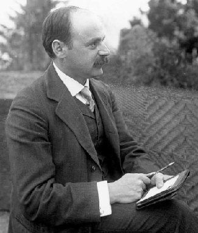

# Learning Objectives

By the end of this section, you will be able to:

* Explain the event horizon surrounding a **black hole**{: data-type="term" .no-emphasis}
* Discuss why the popular notion of black holes as great sucking monsters that can ingest material at great distances from them is erroneous
* Use the concept of warped spacetime near a black hole to track what happens to any object that might fall into a black hole
* Recognize why the concept of a singularity—with its infinite density and zero volume—presents major challenges to our understanding of matter

Let’s now apply what we have learned about gravity and spacetime curvature to the issue we started with: the collapsing core in a very massive star. We saw that if the core’s mass is greater than about 3 *M*Sun, theory says that nothing can stop the core from collapsing forever. We will examine this situation from two perspectives: first from a pre-Einstein point of view, and then with the aid of general relativity.

# Classical Collapse

Let’s begin with a thought experiment. We want to know what speeds are required to escape from the gravitational pull of different objects. A rocket must be launched from the surface of Earth at a very high speed if it is to escape the pull of Earth’s gravity. In fact, any object—rocket, ball, astronomy book—that is thrown into the air with a velocity less than 11 kilometers per second will soon fall back to Earth’s surface. Only those objects launched with a speed greater than this *escape velocity* can get away from Earth.

The **escape velocity**{: data-type="term" .no-emphasis} from the surface of the Sun is higher yet—618 kilometers per second. Now imagine that we begin to compress the Sun, forcing it to shrink in diameter. Recall that the pull of gravity depends on both the mass that is pulling you and your distance from the center of gravity of that mass. If the Sun is compressed, its *mass* will remain the same, but the *distance* between a point on the Sun’s surface and the center will get smaller and smaller. Thus, as we compress the star, the pull of gravity for an object on the shrinking surface will get stronger and stronger ([\[link\]](#OSC_Astro_24_06_Hole)).

 {: #OSC_Astro_24_06_Hole data-title="Formation of a Black Hole."}

When the shrinking Sun reaches the diameter of a neutron star (about 20 kilometers), the velocity required to escape its gravitational pull will be about half the speed of light. Suppose we continue to compress the Sun to a smaller and smaller diameter. (We saw this can’t happen to a star like our Sun in the real world because of electron degeneracy, i.e., the mutual repulsion between tightly packed electrons; this is just a quick “thought experiment” to get our bearings).

Ultimately, as the Sun shrinks, the escape velocity near the surface would exceed the speed of light. If the speed you need to get away is faster than the fastest possible speed in the universe, then nothing, not even light, is able to escape. An object with such large escape velocity emits no light, and anything that falls into it can never return.

In modern terminology, we call an object from which light cannot escape a **black hole**{: data-type="term"}, a name popularized by the America scientist John **Wheeler**{: data-type="term" .no-emphasis} starting in the late 1960s ([\[link\]](#OSC_Astro_24_06_John)). The idea that such objects might exist is, however, not a new one. Cambridge professor and amateur astronomer John **Michell**{: data-type="term" .no-emphasis} wrote a paper in 1783 about the possibility that stars with escape velocities exceeding that of light might exist. And in 1796, the French mathematician Pierre-Simon, marquis de Laplace, made similar calculations using Newton’s theory of gravity; he called the resulting objects “dark bodies.”

 "){: #OSC_Astro_24_06_John data-title="John Wheeler (1911&#x2013;2008)."}

While these early calculations provided strong hints that something strange should be expected if very massive objects collapse under their own gravity, we really need general relativity theory to give an adequate description of what happens in such a situation.

# Collapse with Relativity

General relativity tells us that gravity is really a curvature of spacetime. As gravity increases (as in the collapsing Sun of our thought experiment), the curvature gets larger and larger. Eventually, if the Sun could shrink down to a diameter of about 6 kilometers, only light beams sent out perpendicular to the surface would escape. All others would fall back onto the star ([\[link\]](#OSC_Astro_24_06_Object)). If the Sun could then shrink just a little more, even that one remaining light beam would no longer be able to escape.

 ![Light Paths near a Massive Object. In panel (a), at left, a person is drawn standing on the surface of a blue sphere while holding a flashlight in his outstretched hand. Seven arrows are drawn pointing away from the flashlight, and also pointing away from the surface of the sphere. In panel (b), at right, the same figure is drawn on a smaller blue sphere, holding the flashlight as in panel (a). Seven arrows are again drawn pointing away from the flashlight, but only the central arrow, pointing vertically upward, points away from the surface of the sphere. The remaining six arrows are all bent so they point toward the surface of the sphere.](../resources/OSC_Astro_24_06_Object.jpg "Suppose a person could stand on the surface of a normal star with a flashlight. The light leaving the flashlight travels in a straight line no matter where the flashlight is pointed. Now consider what happens if the star collapses so that it is just a little larger than a black hole. All the light paths, except the one straight up, curve back to the surface. When the star shrinks inside the event horizon and becomes a black hole, even a beam directed straight up returns."){: #OSC_Astro_24_06_Object data-title="Light Paths near a Massive Object."}

Keep in mind that gravity is not pulling on the light. The concentration of matter has curved spacetime, and light (like the trained ant of our earlier example) is “doing its best” to go in a straight line, yet is now confronted with a world in which straight lines that used to go outward have become curved paths that lead back in. The collapsing star is a *black hole* in this view, because the very concept of “out” has no geometrical meaning. The star has become trapped in its own little pocket of spacetime, from which there is no escape.

The star’s geometry cuts off communication with the rest of the universe at precisely the moment when, in our earlier picture, the escape velocity becomes equal to the speed of light. The size of the star at this moment defines a surface that we call the **event horizon**{: data-type="term"}. It’s a wonderfully descriptive name: just as objects that sink below our horizon cannot be seen on Earth, so anything happening inside the event horizon can no longer interact with the rest of the universe.

Imagine a future spacecraft foolish enough to land on the surface of a massive star just as it begins to collapse in the way we have been describing. Perhaps the captain is asleep at the gravity meter, and before the crew can say “Albert Einstein,” they have collapsed with the star inside the event horizon. Frantically, they send an escape pod straight outward. But paths outward twist around to become paths inward, and the pod turns around and falls toward the center of the black hole. They send a radio message to their loved ones, bidding good-bye. But radio waves, like light, must travel through spacetime, and curved spacetime allows nothing to get out. Their final message remains unheard. Events inside the event horizon can never again affect events outside it.

The characteristics of an event horizon were first worked out by astronomer and mathematician Karl **Schwarzschild**{: data-type="term" .no-emphasis} ([\[link\]](#OSC_Astro_24_06_Karl)). A member of the German army in World War I, he died in 1916 of an illness he contracted while doing artillery shell calculations on the Russian front. His paper on the theory of event horizons was among the last things he finished as he was dying; it was the first exact solution to Einstein’s equations of general relativity. The radius of the event horizon is called the *Schwarzschild radius* in his memory.

 {: #OSC_Astro_24_06_Karl data-title="Karl Schwarzschild (1873&#x2013;1916)."}

The **event horizon**{: data-type="term" .no-emphasis} is the boundary of the **black hole**{: data-type="term" .no-emphasis}; calculations show that it does not get smaller once the whole star has collapsed inside it. It is the region that separates the things trapped inside it from the rest of the universe. Anything coming from the outside is also trapped once it comes inside the event horizon. The horizon’s size turns out to depend only on the mass inside it. If the Sun, with its mass of 1 *M*Sun, were to become a black hole (fortunately, it can’t—this is just a thought experiment), the Schwarzschild radius would be about 3 kilometers; thus, the entire black hole would be about one-third the size of a neutron star of that same mass. Feed the black hole some mass, and the horizon will grow—but not very much. Doubling the mass will make the black hole 6 kilometers in radius, still very tiny on the cosmic scale.

The event horizons of more massive black holes have larger radii. For example, if a globular cluster of 100,000 stars (solar masses) could collapse to a black hole, it would be 300,000 kilometers in radius, a little less than half the radius of the Sun. If the entire Galaxy could collapse to a black hole, it would be only about 1012 kilometers in radius—about a tenth of a light year. Smaller masses have correspondingly smaller horizons: for Earth to become a black hole, it would have to be compressed to a radius of only 1 centimeter—less than the size of a grape. A typical asteroid, if crushed to a small enough size to be a black hole, would have the dimensions of an atomic nucleus.

The Milky Way’s Black Hole The size of the event horizon of a black hole depends on the mass of the black hole. The greater the mass, the larger the radius of the event horizon. General relativity calculations show that the formula for the Schwarzschild radius (*R*S) of the event horizon is

<math xmlns="http://www.w3.org/1998/Math/MathML"><mrow><msub><mi>R</mi><mtext>S</mtext></msub><mo>=</mo><mfrac><mrow><mn>2</mn><mi>G</mi><mi>M</mi></mrow><mrow><msup><mi>c</mi><mn>2</mn></msup></mrow></mfrac></mrow></math>

where *c* is the speed of light, *G* is the gravitational constant, and *M* is the mass of the black hole. Note that in this formula, 2, *G*, and *c* are all constant; only the mass changes from black hole to black hole.

As we will see in the chapter on [The Milky Way Galaxy](/m59947){: .target-chapter}, astronomers have traced the paths of several stars near the center of our Galaxy and found that they seem to be orbiting an unseen object—dubbed Sgr A\* (pronounced “Sagittarius A-star”)—with a mass of about 4 million solar masses. What is the size of its Schwarzschild radius?

Solution We can substitute data for *G*, *M*, and *c* (from [Appendix E](/m59997){: .target-chapter}) directly into the equation:

<math xmlns="http://www.w3.org/1998/Math/MathML"><mtable><mtr><mtd columnalign="right"><msub><mi>R</mi><mi>S</mi></msub></mtd><mtd columnalign="left"><mo>=</mo><mfrac><mrow><mn>2</mn><mi>G</mi><mi>M</mi></mrow><mrow><msup><mi>c</mi><mn>2</mn></msup></mrow></mfrac><mo>=</mo><mfrac><mrow><mn>2</mn><mo stretchy="false">(</mo><mn>6.67</mn><mspace width="0.2em" /><mo>×</mo><mspace width="0.2em" /><msup><mrow><mn>10</mn></mrow><mrow><mn>−11</mn></mrow></msup><mtext>N</mtext><mo>·</mo><msup><mtext>m</mtext><mn>2</mn></msup><msup><mrow><mtext>/kg</mtext></mrow><mn>2</mn></msup><mo stretchy="false">)</mo><mo stretchy="false">(</mo><mn>4</mn><mspace width="0.2em" /><mo>×</mo><mspace width="0.2em" /><msup><mrow><mn>10</mn></mrow><mn>6</mn></msup><mo stretchy="false">)</mo><mo stretchy="false">(</mo><mn>1.99</mn><mspace width="0.2em" /><mo>×</mo><mspace width="0.2em" /><msup><mrow><mn>10</mn></mrow><mrow><mn>30</mn></mrow></msup><mspace width="0.2em" /><mtext>kg</mtext><mo stretchy="false">)</mo></mrow><mrow><msup><mrow><mo stretchy="false">(</mo><mn>3.00</mn><mspace width="0.2em" /><mo>×</mo><mspace width="0.2em" /><msup><mrow><mn>10</mn></mrow><mn>8</mn></msup><mspace width="0.2em" /><mtext>m/s</mtext><mo stretchy="false">)</mo></mrow><mn>2</mn></msup></mrow></mfrac></mtd></mtr><mtr><mtd /><mtd columnalign="left"><mo>=</mo><mn>1.18</mn><mspace width="0.2em" /><mo>×</mo><mspace width="0.2em" /><msup><mn>10</mn><mrow><mn>10</mn></mrow></msup><mspace width="0.2em" /><mtext>m</mtext></mtd></mtr></mtable></math>

This distance is about one-fifth of the radius of Mercury’s orbit around the Sun, yet the object contains 4 million solar masses and cannot be seen with our largest telescopes. You can see why astronomers are convinced this object is a black hole.

Check Your Learning What would be the size of a black hole that contained only as much mass as a typical pickup truck (about 3000 kg)? (Note that something with so little mass could never actually form a black hole, but it’s interesting to think about the result.)

Answer:

Substituting the data into our equation gives* * *
{: data-type="newline"}

 <math xmlns="http://www.w3.org/1998/Math/MathML"><mrow><msub><mi>R</mi><mtext>S</mtext></msub><mo>=</mo><mfrac><mrow><mn>2</mn><mi>G</mi><mi>M</mi></mrow><mrow><msup><mi>c</mi><mn>2</mn></msup></mrow></mfrac><mo>=</mo><mfrac><mrow><mn>2</mn><mo stretchy="false">(</mo><mn>6.67</mn><mspace width="0.2em" /><mo>×</mo><mspace width="0.2em" /><msup><mrow><mn>10</mn></mrow><mrow><mn>−11</mn></mrow></msup><mtext>N</mtext><mo>·</mo><msup><mtext>m</mtext><mn>2</mn></msup><msup><mrow><mtext>/kg</mtext></mrow><mn>2</mn></msup><mo stretchy="false">)</mo><mo stretchy="false">(</mo><mn>3000</mn><mspace width="0.2em" /><mtext>kg</mtext><mo stretchy="false">)</mo></mrow><mrow><msup><mrow><mo stretchy="false">(</mo><mn>3.00</mn><mspace width="0.2em" /><mo>×</mo><mspace width="0.2em" /><msup><mrow><mn>10</mn></mrow><mn>8</mn></msup><mspace width="0.2em" /><mtext>m/s</mtext><mo stretchy="false">)</mo></mrow><mn>2</mn></msup></mrow></mfrac><mo>=</mo><mn>1.33</mn><mspace width="0.2em" /><mo>×</mo><mspace width="0.2em" /><msup><mrow><mn>10</mn></mrow><mrow><mn>−23</mn></mrow></msup><mspace width="0.2em" /><mtext>m</mtext><mo>.</mo></mrow></math>

* * *
{: data-type="newline"}

 For comparison, the size of a proton is usually considered to be about 8 × 10−16 m, which would be about ten million times larger.

# A Black Hole Myth

Much of the modern folklore about black holes is misleading. One idea you may have heard is that black holes go about sucking things up with their gravity. Actually, it is only very close to a **black hole**{: data-type="term" .no-emphasis} that the strange effects we have been discussing come into play. The gravitational attraction far away from a black hole is the same as that of the star that collapsed to form it.

Remember that the gravity of any star some distance away acts as if all its mass were concentrated at a point in the center, which we call the center of gravity. For real stars, we merely *imagine* that all mass is concentrated there; for black holes, all the mass *really is* concentrated at a point in the center.

So, if you are a star or distant planet orbiting around a star that becomes a black hole, your orbit may not be significantly affected by the collapse of the star (although it may be affected by any mass loss that precedes the collapse). If, on the other hand, you venture close to the event horizon, it would be very hard for you to resist the “pull” of the warped spacetime near the black hole. You have to get really close to the black hole to experience any significant effect.

If another star or a spaceship were to pass one or two solar radii from a black hole, Newton’s laws would be adequate to describe what would happen to it. Only very near the event horizon of a black hole is the gravitation so strong that Newton’s laws break down. The black hole remnant of a massive star coming into our neighborhood would be far, far safer to us than its earlier incarnation as a brilliant, hot star.

Gravity and Time Machines

Time machines are one of the favorite devices of science fiction. Such a device would allow you to move through time at a different pace or in a different direction from everyone else. General relativity suggests that it is possible, in theory, to construct a time machine using gravity that could take you into the future.

Let’s imagine a place where **gravity**{: data-type="term" .no-emphasis} is terribly strong, such as near a black hole. General relativity predicts that the stronger the gravity, the slower the pace of time (as seen by a distant observer). So, imagine a future astronaut, with a fast and strongly built spaceship, who volunteers to go on a mission to such a high-gravity environment. The astronaut leaves in the year 2222, just after graduating from college at age 22. She takes, let’s say, exactly 10 years to get to the black hole. Once there, she orbits some distance from it, taking care not to get pulled in.

She is now in a high-gravity realm where time passes much more slowly than it does on Earth. This isn’t just an effect on the mechanism of her clocks—*time itself* is running slowly. That means that every way she has of measuring time will give the same slowed-down reading when compared to time passing on Earth. Her heart will beat more slowly, her hair will grow more slowly, her antique wristwatch will tick more slowly, and so on. She is not aware of this slowing down because all her readings of time, whether made by her own bodily functions or with mechanical equipment, are measuring the same—slower—time. Meanwhile, back on Earth, time passes as it always does.

Our astronaut now emerges from the region of the black hole, her mission of exploration finished, and returns to Earth. Before leaving, she carefully notes that (according to her timepieces) she spent about 2 weeks around the black hole. She then takes exactly 10 years to return to Earth. Her calculations tell her that since she was 22 when she left the Earth, she will be 42 plus 2 weeks when she returns. So, the year on Earth, she figures, should be 2242, and her classmates should now be approaching their midlife crises.

But our astronaut should have paid more attention in her astronomy class! Because time slowed down near the black hole, much less time passed for her than for the people on Earth. While her clocks measured 2 weeks spent near the black hole, more than 2000 weeks (depending on how close she got) could well have passed on Earth. That’s equal to 40 years, meaning her classmates will be senior citizens in their 80s when she (a mere 42-year-old) returns. On Earth it will be not 2242, but 2282—and she will say that she has arrived *in the future*.

Is this scenario real? Well, it has a few practical challenges: we don’t think any black holes are close enough for us to reach in 10 years, and we don’t think any spaceship or human can survive near a black hole. But the key point about the slowing down of time is a natural consequence of Einstein’s general theory of relativity, and we saw that its predictions have been confirmed by experiment after experiment.

Such developments in the understanding of science also become inspiration for science fiction writers. Recently, the film *Interstellar* featured the protagonist traveling close to a massive black hole; the resulting delay in his aging relative to his earthbound family is a key part of the plot.

Science fiction novels, such as *Gateway* by Frederik Pohl and *A World out of Time* by Larry Niven, also make use of the slowing down of time near black holes as major turning points in the story. For a list of science fiction stories based on good astronomy, you can go to www.astrosociety.org/scifi.

# A Trip into a Black Hole

The fact that scientists cannot see inside black holes has not kept them from trying to calculate what they are like. One of the first things these calculations showed was that the formation of a **black hole**{: data-type="term" .no-emphasis} obliterates nearly all information about the star that collapsed to form it. Physicists like to say “black holes have no hair,” meaning that nothing sticks out of a black hole to give us clues about what kind of star produced it or what material has fallen inside. The only information a black hole can reveal about itself is its mass, its spin (rotation), and whether it has any electrical charge.

What happens to the collapsing star-core that made the black hole? Our best calculations predict that the material will continue to collapse under its own weight, forming an infinitely *squozen* point—a place of zero volume and infinite density—to which we give the name **singularity**{: data-type="term"}. At the singularity, spacetime ceases to exist. The laws of physics as we know them break down. We do not yet have the physical understanding or the mathematical tools to describe the singularity itself, or even if singularities actually occur. From the outside, however, the entire structure of a basic black hole (one that is not rotating) can be described as a singularity surrounded by an event horizon. Compared to humans, black holes are really very simple objects.

Scientists have also calculated what would happen if an astronaut were to fall into a black hole. Let’s take up an observing position a long, safe distance away from the event horizon and watch this astronaut fall toward it. At first he falls away from us, moving ever faster, just as though he were approaching any massive star. However, as he nears the event horizon of the black hole, things change. The strong gravitational field around the black hole will make his clocks run more slowly, when seen from our outside perspective.

If, as he approaches the event horizon, he sends out a signal once per second according to his clock, we will see the spacing between his signals grow longer and longer until it becomes infinitely long when he reaches the event horizon. (Recalling our discussion of gravitational redshift, we could say that if the infalling astronaut uses a blue light to send his signals every second, we will see the light get redder and redder until its wavelength is nearly infinite.) As the spacing between clock ticks approaches infinity, it will appear to us that the astronaut is slowly coming to a stop, frozen in time at the event horizon.

In the same way, all matter falling into a black hole will also appear to an outside observer to stop at the event horizon, frozen in place and taking an infinite time to fall through it. But don’t think that matter falling into a black hole will therefore be easily visible at the event horizon. The tremendous redshift will make it very difficult to observe any radiation from the “frozen” victims of the black hole.

This, however, is only how we, located far away from the black hole, see things. To the astronaut, his time goes at its normal rate and he falls right on through the event horizon into the black hole. (Remember, this horizon is not a physical barrier, but only a region in space where the curvature of spacetime makes escape impossible.)

You may have trouble with the idea that you (watching from far away) and the astronaut (falling in) have such different ideas about what has happened. This is the reason Einstein’s ideas about space and time are called theories of *relativity*. What each observer measures about the world depends on (is relative to) his or her frame of reference. The observer in strong gravity measures time and space differently from the one sitting in weaker gravity. When Einstein proposed these ideas, many scientists also had difficulty with the idea that two such different views of the same event could be correct, each in its own “world,” and they tried to find a mistake in the calculations. There were no mistakes: we and the astronaut really would see him fall into a black hole very differently.

For the astronaut, there is no turning back. Once inside the event horizon, the astronaut, along with any signals from his radio transmitter, will remain hidden forever from the universe outside. He will, however, not have a long time (from his perspective) to feel sorry for himself as he approaches the black hole. Suppose he is falling feet first. The force of gravity that the singularity exerts on his feet is greater than on his head, so he will be stretched slightly. Because the singularity is a point, the left side of his body will be pulled slightly toward the right, and the right slightly toward the left, bringing each side closer to the singularity. The astronaut will therefore be slightly squeezed in one direction and stretched in the other. Some scientists like to call this process of stretching and narrowing *spaghettification.* The point at which the astronaut becomes so stretched that he perishes depends on the size of the black hole. For black holes with masses billions of times the mass of the Sun, such as those found at the centers of galaxies, the spaghettification becomes significant only after the astronaut passes through the event horizon. For black holes with masses of a few solar masses, the astronaut will be stretched and ripped apart even before he reaches the event horizon.

Earth exerts similar *tidal forces* on an astronaut performing a spacewalk. In the case of Earth, the tidal forces are so small that they pose no threat to the health and safety of the astronaut. Not so in the case of a black hole. Sooner or later, as the astronaut approaches the black hole, the tidal forces will become so great that the astronaut will be ripped apart, eventually reduced to a collection of individual atoms that will continue their inexorable fall into the singularity.

From the previous discussion, you will probably agree that jumping into a black hole is definitely a once-in-a-lifetime experience! You can see an [engaging explanation][1] of death by black hole by Neil deGrasse Tyson, where he explains the effect of tidal forces on the human body until it dies by spaghettification.

A similar explanation can be seen in this [Discovery Channel video][2] excerpt.

# Key Concepts and Summary

Theory suggests that stars with stellar cores more massive than three times the mass of the Sun at the time they exhaust their nuclear fuel will collapse to become black holes. The surface surrounding a black hole, where the escape velocity equals the speed of light, is called the event horizon, and the radius of the surface is called the Schwarzschild radius. Nothing, not even light, can escape through the event horizon from the black hole. At its center, each black hole is thought to have a singularity, a point of infinite density and zero volume. Matter falling into a black hole appears, as viewed by an outside observer, to freeze in position at the event horizon. However, if we were riding on the infalling matter, we would pass through the event horizon. As we approach the singularity, the tidal forces would tear our bodies apart even before we reach the singularity.

## Glossary
{: data-type="glossary-title"}

black hole
: a region in spacetime where gravity is so strong that nothing—not even light—can escape
{: .definition}

event horizon
: a boundary in spacetime such that events inside the boundary can have no effect on the world outside it—that is, the boundary of the region around a black hole where the curvature of spacetime no longer provides any way out
{: .definition}

singularity
: the point of zero volume and infinite density to which any object that becomes a black hole must collapse, according to the theory of general relativity
{: .definition}

[1]: https://openstax.org/l/30ndegtystidfor
[2]: https://openstax.org/l/30dischatidfor
