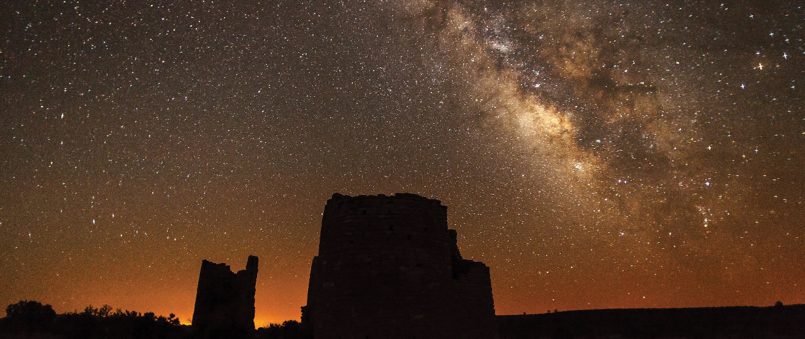

<cnx-pi data-type="cnx.flag.introduction"> class="introduction" </cnx-pi>

<cnx-pi data-type="cnx.eoc">class="summary" title="Summary"</cnx-pi>

<cnx-pi data-type="cnx.eoc">class="further-exploration" title="For Further Exploration"</cnx-pi>

<cnx-pi data-type="cnx.eoc">class="group-activities" title="Collaborative Group Activities"</cnx-pi>

<cnx-pi data-type="cnx.eoc">class="review-questions" title="Review Questions"</cnx-pi>

<cnx-pi data-type="cnx.eoc">class="thought-questions" title="Thought Questions"</cnx-pi>

<cnx-pi data-type="cnx.eoc">class="figuring-for-yourself" title="Figuring for Yourself"</cnx-pi>

 {: #OSC_Astro_25_00_MWGalaxy data-title="Milky Way Galaxy."}

Today, we know that our Sun is just one of the many billions of stars that make up the huge cosmic island we call the Milky Way Galaxy. How can we “weigh” such an enormous system of stars and measure its total mass?

One of the most striking features you can see in a truly dark sky—one without light pollution—is the band of faint white light called the Milky Way, which stretches from one horizon to the other. The name comes from an ancient Greek legend that compared its faint white splash of light to a stream of spilled milk. But folktales differ from culture to culture: one East African tribe thought of the hazy band as the smoke of ancient campfires, several Native American stories tell of a path across the sky traveled by sacred animals, and in Siberia, the diffuse arc was known as the seam of the tent of the sky.

In 1610, Galileo made the first telescopic survey of the Milky Way and discovered that it is composed of a multitude of individual stars. Today, we know that the Milky Way comprises our view inward of the huge cosmic pinwheel that we call the Milky Way Galaxy and that is our home. Moreover, our Galaxy is now recognized as just one galaxy among many billions of other galaxies in the cosmos.

