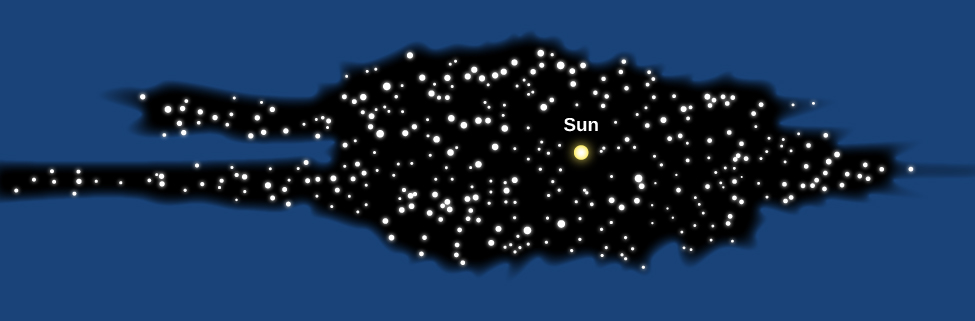

# Learning Objectives

By the end of this section, you will be able to:

* Explain why William and Caroline Herschel concluded that the Milky Way has a flattened structure centered on the Sun and solar system
* Describe the challenges of determining the Galaxy’s structure from our vantage point within it
* Identify the main components of the Galaxy

The **Milky Way Galaxy**{: data-type="term"} surrounds us, and you might think it is easy to study because it is so close. However, the very fact that we are embedded within it presents a difficult challenge. Suppose you were given the task of mapping New York City. You could do a much better job from a helicopter flying over the city than you could if you were standing in Times Square. Similarly, it would be easier to map our Galaxy if we could only get a little way outside it, but instead we are trapped inside and way out in its suburbs—far from the galactic equivalent of Times Square.

# Herschel Measures the Galaxy

In 1785, William **Herschel**{: data-type="term" .no-emphasis} ([\[link\]](#OSC_Astro_25_01_William)) made the first important discovery about the architecture of the Milky Way Galaxy. Using a large reflecting telescope that he had built, William and his sister Caroline counted stars in different directions of the sky. They found that most of the stars they could see lay in a flattened structure encircling the sky, and that the numbers of stars were about the same in any direction around this structure. Herschel therefore concluded that the stellar system to which the Sun belongs has the shape of a disk or wheel (he might have called it a Frisbee except Frisbees hadn’t been invented yet), and that the Sun must be near the hub of the wheel ([\[link\]](#OSC_Astro_25_01_Milky)).

 "){: #OSC_Astro_25_01_William data-title="William Herschel (1738&#x2013;1822) and Caroline Herschel (1750&#x2013;1848)."}

To understand why Herschel reached this conclusion, imagine that you are a member of a band standing in formation during halftime at a football game. If you count the band members you see in different directions and get about the same number each time, you can conclude that the band has arranged itself in a circular pattern with you at the center. Since you see no band members above you or underground, you know that the circle made by the band is much flatter than it is wide.

 {: #OSC_Astro_25_01_Milky data-title="Herschel&#x2019;s Diagram of the Milky Way."}

We now know that Herschel was right about the shape of our system, but wrong about where the Sun lies within the disk. As we saw in [Between the Stars: Gas and Dust in Space](/m59908){: .target-chapter}, we live in a dusty Galaxy. Because interstellar dust absorbs the light from stars, Herschel could see only those stars within about 6000 light-years of the Sun. Today we know that this is a very small section of the entire 100,000-light-year-diameter disk of stars that makes up the Galaxy.

Harlow Shapley: Mapmaker to the Stars

Until the early 1900s, astronomers generally accepted Herschel’s conclusion that the Sun is near the center of the Galaxy. The discovery of the Galaxy’s true size and our actual location came about largely through the efforts of Harlow **Shapley**{: data-type="term" .no-emphasis}. In 1917, he was studying RR Lyrae variable stars in globular clusters. By comparing the known intrinsic luminosity of these stars to how bright they appeared, Shapley could calculate how far away they are. (Recall that it is distance that makes the stars look dimmer than they would be “up close,” and that the brightness fades as the distance squared.) Knowing the distance to any star in a cluster then tells us the distance to the cluster itself.

Globular clusters can be found in regions that are free of interstellar dust and so can be seen at very large distances. When Shapley used the distances and directions of 93 globular clusters to map out their positions in space, he found that the clusters are distributed in a spherical volume, which has its center not at the Sun but at a distant point along the Milky Way in the direction of Sagittarius. Shapley then made the bold assumption, verified by many other observations since then, that the point on which the system of globular clusters is centered is also the center of the entire Galaxy ([\[link\]](#OSC_Astro_25_01_Cluster)).

 Shapley poses for a formal portrait. (b) His diagram shows the location of globular clusters, with the position of the Sun also marked. The black area shows Herschel&#x2019;s old diagram, centered on the Sun, approximately to scale."){: #OSC_Astro_25_01_Cluster data-title="Harlow Shapley and His Diagram of the Milky Way."}

Shapley’s work showed once and for all that our star has no special place in the Galaxy. We are in a nondescript region of the Milky Way, only one of 200 to 400 billion stars that circle the distant center of our Galaxy.

Born in 1885 on a farm in Missouri, Harlow Shapley at first dropped out of school with the equivalent of only a fifth-grade education. He studied at home and at age 16 got a job as a newspaper reporter covering crime stories. Frustrated by the lack of opportunities for someone who had not finished high school, Shapley went back and completed a six-year high-school program in only two years, graduating as class valedictorian.

In 1907, at age 22, he went to the University of Missouri, intent on studying journalism, but found that the school of journalism would not open for a year. Leafing through the college catalog (or so he told the story later), he chanced to see “Astronomy” among the subjects beginning with “A.” Recalling his boyhood interest in the stars, he decided to study astronomy for the next year (and the rest, as the saying goes, is history).

Upon graduation Shapley received a fellowship for graduate study at Princeton and began to work with the brilliant Henry Norris Russell (see the [Henry Norris Russell](/m59901#fs-id1164754910007) feature box). For his PhD thesis, Shapley made major contributions to the methods of analyzing the behavior of eclipsing binary stars. He was also able to show that cepheid variable stars are not binary systems, as some people thought at the time, but individual stars that pulsate with striking regularity.

Impressed with Shapley’s work, George Ellery Hale offered him a position at the Mount Wilson Observatory, where the young man took advantage of the clear mountain air and the 60-inch reflector to do his pioneering study of variable stars in globular clusters.

Shapley subsequently accepted the directorship of the Harvard College Observatory, and over the next 30 years, he and his collaborators made contributions to many fields of astronomy, including the study of neighboring galaxies, the discovery of dwarf galaxies, a survey of the distribution of galaxies in the universe, and much more. He wrote a series of nontechnical books and articles and became known as one of the most effective popularizers of astronomy. Shapley enjoyed giving lectures around the country, including at many smaller colleges where students and faculty rarely got to interact with scientists of his caliber.

During World War II, Shapley helped rescue many scientists and their families from Eastern Europe; later, he helped found UNESCO, the United Nations Educational, Scientific, and Cultural Organization. He wrote a pamphlet called *Science from Shipboard* for men and women in the armed services who had to spend many weeks on board transport ships to Europe. And during the difficult period of the 1950s, when congressional committees began their “witch hunts” for communist sympathizers (including such liberal leaders as Shapley), he spoke out forcefully and fearlessly in defense of the freedom of thought and expression. A man of many interests, he was fascinated by the behavior of ants, and wrote scientific papers about them as well as about galaxies.

By the time he died in 1972, Shapley was acknowledged as one of the pivotal figures of modern astronomy, a “twentieth-century Copernicus” who mapped the Milky Way and showed us our place in the Galaxy.

To find more information about [Shapley’s life and work][1], see the entry for him on the Bruce Medalists website. (This site features the winners of the Bruce Medal of the Astronomical Society of the Pacific, one of the highest honors in astronomy; the list is a who’s who of some of the greatest astronomers of the last twelve decades.)

# Disks and Haloes

With modern instruments, astronomers can now penetrate the “smog” of the Milky Way by studying radio and infrared emissions from distant parts of the Galaxy. Measurements at these wavelengths (as well as observations of other galaxies like ours) have given us a good idea of what the Milky Way would look like if we *could* observe it from a distance.

[\[link\]](#OSC_Astro_25_01_Galaxy) sketches what we would see if we could view the Galaxy face-on and edge-on. The brightest part of the Galaxy consists of a thin, circular, rotating disk of stars distributed across a region about 100,000 light-years in diameter and about 1000 light-years thick. (Given how thin the disk is, perhaps a CD is a more appropriate analogy than a wheel.) In addition to stars, the dust and gas from which stars form are also found mostly in the thin **disk**{: data-type="term" .no-emphasis} of the Galaxy. The mass of the interstellar matter is about 15% of the mass of the stars in this disk.

 ![A schematic representation of the Milky Way Galaxy. On the left is the face-on view of the spiral disk, with the central bar in the center, the Cygnus spiral arm on the lower left, the Perseus arm labeled on the bottom, the smaller Orion spur labeled above that, and the Carina arm labeled on the right. On the right of the schematic is the edge-on view of the spiral disk, surrounded by serval globular clusters. The nuclear bulge is labeled in the center of both views, and the Sun is labeled on the Orion spur. The distance between the Sun and the nuclear bulge is labeled 26,000 light years.](../resources/OSC_Astro_25_01_Galaxy.jpg "The left image shows the face-on view of the spiral disk; the right image shows the view looking edge-on along the disk. The major spiral arms are labeled. The Sun is located on the inside edge of the short Orion spur."){: #OSC_Astro_25_01_Galaxy data-title="Schematic Representation of the Galaxy."}

As the diagram in [\[link\]](#OSC_Astro_25_01_Galaxy) shows, the stars, gas, and dust are not spread evenly throughout the disk but are concentrated into a central bar and a series of spiral arms. Recent infrared observations have confirmed that the central bar is composed mostly of old yellow-red stars. The two main spiral arms appear to connect with the ends of the bar. They are highlighted by the blue light from young hot stars. We know many other spiral galaxies that also have bar-shaped concentrations of stars in their central regions; for that reason they are called *barred spirals.* [\[link\]](#OSC_Astro_25_01_Spiral) shows two other galaxies—one without a bar and one with a strong bar—to give you a basis for comparison to our own. We will describe our spiral structure in more detail shortly. The Sun is located about halfway between the center of the Galaxy and the edge of the disk and only about 70 light-years above its central plane.

  This image shows the unbarred spiral galaxy M74. It contains a small central bulge of mostly old yellow-red stars, along with spiral arms that are highlighted with the blue light from young hot stars. (b) This image shows the strongly barred spiral galaxy NGC 1365. The bulge and the fainter bar both appear yellowish because the brightest stars in them are mostly old yellow and red giants. Two main spiral arms project from the ends of the bar. As in M74, these spiral arms are populated with blue stars and red patches of glowing gas&#x2014;hallmarks of recent star formation. The Milky Way Galaxy is thought to have a barred spiral structure that is intermediate between these two examples. (credit a: modification of work by ESO/PESSTO/S. Smartt; credit b: modification of work by ESO)"){: #OSC_Astro_25_01_Spiral data-title="Unbarred and Barred Spiral Galaxies."}

Our thin disk of young stars, gas, and dust is embedded in a thicker but more diffuse disk of older stars; this thicker disk extends about 3000 light-years above and below the midplane of the thin disk and contains only about 5% as much mass as the thin disk.

Close in to the galactic center (within about 10,000 light-years), the stars are no longer confined to the disk but form a **central bulge**{: data-type="term"} (or **nuclear bulge**{: data-type="term" .no-emphasis}). When we observe with visible light, we can glimpse the stars in the bulge only in those rare directions where there happens to be relatively little interstellar dust. The first picture that actually succeeded in showing the bulge as a whole was taken at infrared wavelengths ([\[link\]](#OSC_Astro_25_01_MWay)).

 . Because interstellar dust does not absorb infrared as strongly as visible light, this view reveals the previously hidden bulge of old stars that surrounds the center of our Galaxy, along with the Galaxy&#x2019;s thin disk component. (credit: modification of work by 2MASS/J. Carpenter, T. H. Jarrett, and R. Hurt)"){: #OSC_Astro_25_01_MWay data-title="Inner Part of the Milky Way Galaxy."}

The fact that much of the bulge is obscured by dust makes its shape difficult to determine. For a long time, astronomers assumed it was spherical. However, infrared images and other data indicate that the bulge is about two times longer than it is wide, and shaped rather like a peanut. The relationship between this elongated inner bulge and the larger bar of stars remains uncertain. At the very center of the nuclear bulge is a tremendous concentration of matter, which we will discuss later in this chapter.

In our Galaxy, the thin and thick disks and the nuclear bulge are embedded in a spherical **halo**{: data-type="term"} of very old, faint stars that extends to a distance of at least 150,000 light-years from the galactic center. Most of the globular clusters are also found in this halo.

The mass in the Milky Way extends even farther out, well beyond the boundary of the luminous stars to a distance of at least 200,000 light-years from the center of the Galaxy. This invisible mass has been give the name *dark matter* because it emits no light and cannot be seen with any telescope. Its composition is unknown, and it can be detected only because of its gravitational effects on the motions of luminous matter that we can see. We know that this extensive **dark matter halo**{: data-type="term"} exists because of its effects on the orbits of distant star clusters and other dwarf galaxies that are associated with the Galaxy. This mysterious halo will be a subject of the section on [The Mass of the Galaxy](/m59950){: .target-chapter}, and the properties of dark matter will be discussed more in the chapter on [The Big Bang](/m59975){: .target-chapter}.

Some vital statistics of the thin and thick **disk**{: data-type="term" .no-emphasis}s and the stellar **halo**{: data-type="term" .no-emphasis} are given in [\[link\]](#fs-id1168044910932), with an illustration in [\[link\]](#OSC_Astro_25_01_MPart). Note particularly how the ages of stars correlate with where they are found. As we shall see, this information holds important clues to how the **Milky Way Galaxy**{: data-type="term" .no-emphasis} formed.

<table summary="This table has four columns and six rows. The first row is a header row and it labels each column: &#x201C;Property&#x201D;, &#x201C;Thin Disk&#x201D;, &#x201C;Thick Disk&#x201D; and &#x201C;Stellar Halo (Excludes Dark Matter)&#x201D;. Under the &#x201C;Property&#x201D; column are the values: &#x201C;Stellar mass&#x201D;, &#x201C;Luminosity&#x201D;, &#x201C;Typical age of stars&#x201D;, &#x201C;Heavier-element abundance&#x201D; and &#x201C;Rotation&#x201D;. Under the &#x201C;Thin Disk&#x201D; column are the values: &#x201C;4 &#xD7; 1010 MSun&#x201D;, &#x201C;3 &#xD7; 1010 LSun&#x201D;, &#x201C;1 million to 10 billion years&#x201D;, &#x201C;High&#x201D; and &#x201C;High&#x201D;. Under the &#x201C;Thick Disk&#x201D; column are the values: &#x201C;A few percent of the thin disk mass&#x201D;, &#x201C;A few percent of the thin disk luminosity&#x201D;, &#x201C;11 billion years&#x201D;, &#x201C;Intermediate&#x201D; and &#x201C;Intermediate&#x201D;. Finally, under the &#x201C;Stellar Halo (Excludes Dark Matter)&#x201D; column are the values: &#x201C;1010 MSun&#x201D;, &#x201C;8 &#xD7; 108 LSun&#x201D;, &#x201C;13 billion years&#x201D;, &#x201C;Very low&#x201D; and &#x201C;Very low&#x201D;." class="span-all"><thead>
<tr valign="top">
<th colspan="4" data-valign="top" data-align="center">Characteristics of the Milky Way Galaxy</th>
</tr>
<tr valign="top">
<th data-valign="top" data-align="center">Property</th>
<th data-valign="top" data-align="center">Thin Disk</th>
<th data-valign="top" data-align="center">Thick Disk</th>
<th data-valign="top" data-align="center">Stellar Halo (Excludes Dark Matter)</th>
</tr>
</thead><tbody>
<tr valign="top">
<td data-valign="middle" data-align="left">Stellar mass</td>
<td data-valign="middle" data-align="left">4 × 1010 <em>M</em>Sun</td>
<td data-valign="middle" data-align="left">A few percent of the thin disk mass</td>
<td data-valign="middle" data-align="left">1010 <em>M</em>Sun</td>
</tr>
<tr valign="top">
<td data-valign="middle" data-align="left">Luminosity</td>
<td data-valign="middle" data-align="left">3 × 1010 <em>L</em>Sun</td>
<td data-valign="middle" data-align="left">A few percent of the thin disk luminosity</td>
<td data-valign="middle" data-align="left">8 × 108 <em>L</em>Sun</td>
</tr>
<tr valign="top">
<td data-valign="middle" data-align="left">Typical age of stars</td>
<td data-valign="middle" data-align="left">1 million to 10 billion years</td>
<td data-valign="middle" data-align="left">11 billion years</td>
<td data-valign="middle" data-align="left">13 billion years</td>
</tr>
<tr valign="top">
<td data-valign="middle" data-align="left">Heavier-element abundance</td>
<td data-valign="middle" data-align="left">High</td>
<td data-valign="middle" data-align="left">Intermediate</td>
<td data-valign="middle" data-align="left">Very low</td>
</tr>
<tr valign="top">
<td data-valign="top" data-align="left">Rotation</td>
<td data-valign="top" data-align="left">High</td>
<td data-valign="top" data-align="left">Intermediate</td>
<td data-valign="top" data-align="left">Very low</td>
</tr>
</tbody></table>

 ![Schematic of the Milky Way. Our galaxy is seen edge-on in this illustration, with the major components labeled. At the center of the diagram is the &#x201C;Galactic center&#x201D; indicated with a white dot located in the middle of a white horizontal line labeled &#x201C;Thin disk&#x201D;. The Sun is about 2/3 of the way from the center to the left edge of the thin disk and indicated with a white dot. The &#x201C;Thick disk&#x201D; is shown in pink above and below the thin disk. The &#x201C;Bulge&#x201D; surrounds the galactic center and the &#x201C;Halo&#x201D;, drawn as a semi-transparent sphere, surrounds nearly the entire galaxy.](../resources/OSC_Astro_25_01_MPart.jpg "This schematic shows the major components of our Galaxy."){: #OSC_Astro_25_01_MPart data-title="Major Parts of the Milky Way Galaxy."}

Establishing this overall picture of the Galaxy from our dust-shrouded viewpoint inside the thin disk has been one of the great achievements of modern astronomy (and one that took decades of effort by astronomers working with a wide range of telescopes). One thing that helped enormously was the discovery that our Glaxy is not unique in its characteristics. There are many other flat, spiral-shaped islands of stars, gas, and dust in the universe. For example, the Milky Way somewhat resembles the Andromeda galaxy, which, at a distance of about 2.3 million light-years, is our nearest neighboring giant spiral galaxy. Just as you can get a much better picture of yourself if someone else takes the photo from a distance away, pictures and other diagnostic observations of nearby galaxies that resemble ours have been vital to our understanding of the properties of the Milky Way.

The Milky Way Galaxy in Myth and Legend

To most of us living in the twenty-first century, the **Milky Way Galaxy**{: data-type="term" .no-emphasis} is an elusive sight. We must make an effort to leave our well-lit homes and streets and venture beyond our cities and suburbs into less populated environments. Once the light pollution subsides to negligible levels, the Milky Way can be readily spotted arching over the sky on clear, moonless nights. The Milky Way is especially bright in late summer and early fall in the Northern Hemisphere. Some of the best places to view the Milky Way are in our national and state parks, where residential and industrial developments have been kept to a minimum. Some of these parks host special sky-gazing events that are definitely worth checking out—especially during the two weeks surrounding the new moon, when the faint stars and Milky Way don’t have to compete with the Moon’s brilliance.

Go back a few centuries, and these starlit sights would have been the norm rather than the exception. Before the advent of electric or even gas lighting, people relied on short-lived fires to illuminate their homes and byways. Consequently, their night skies were typically much darker. Confronted by myriad stellar patterns and the Milky Way’s gauzy band of diffuse light, people of all cultures developed myths to make sense of it all.

Some of the oldest myths relating to the Milky Way are maintained by the aboriginal Australians through their rock painting and storytelling. These legacies are thought to go back tens of thousands of years, to when the aboriginal people were being “dreamed” along with the rest of the cosmos. The Milky Way played a central role as an arbiter of the Creation. Taking the form of a great serpent, it joined with the Earth serpent to dream and thus create all the creatures on Earth.

The ancient Greeks viewed the Milky Way as a spray of milk that spilled from the breast of the goddess Hera. In this legend, Zeus had secretly placed his infant son Heracles at Hera’s breast while she was asleep in order to give his half-human son immortal powers. When Hera awoke and found Heracles suckling, she pushed him away, causing her milk to spray forth into the cosmos ([\[link\]](#OSC_Astro_25_01_MWOrigin)).

The dynastic Chinese regarded the Milky Way as a “silver river” that was made to separate two star-crossed lovers. To the east of the Milky Way, Zhi Nu, the weaving maiden, was identified with the bright star **Vega**{: data-type="term" .no-emphasis} in the constellation of Lyra the Harp. To the west of the Milky Way, her lover Niu Lang, the cowherd, was associated with the star Altair in the constellation of Aquila the Eagle. They had been exiled on opposite sides of the Milky Way by Zhi Nu’s mother, the Queen of Heaven, after she heard of their secret marriage and the birth of their two children. However, once a year, they are permitted to reunite. On the seventh day of the seventh lunar month (which typically occurs in our month of August), they would meet on a bridge over the Milky Way that thousands of magpies had made ([\[link\]](#OSC_Astro_25_01_MWOrigin)). This romantic time continues to be celebrated today as Qi Xi, meaning “Double Seventh,” with couples reenacting the cosmic reunion of Zhi Nu and Niu Lang.

 Origin of the Milky Way by Jacopo Tintoretto (circa 1575) illustrates the Greek myth that explains the formation of the Milky Way. (b) The Moon of the Milky Way by Japanese painter Tsukioka Yoshitoshi depicts the Chinese legend of Zhi Nu and Niu Lang."){: #OSC_Astro_25_01_MWOrigin data-title="The Milky Way in Myth."}

To the Quechua Indians of Andean Peru, the Milky Way was seen as the celestial abode for all sorts of cosmic creatures. Arrayed along the Milky Way are myriad dark patches that they identified with partridges, llamas, a toad, a snake, a fox, and other animals. The Quechua’s orientation toward the dark regions rather than the glowing band of starlight appears to be unique among all the myth makers. Likely, their access to the richly structured southern Milky Way had something to do with it.

Among Finns, Estonians, and related northern European cultures, the Milky Way is regarded as the “pathway of birds” across the night sky. Having noted that birds seasonally migrate along a north-south route, they identified this byway with the Milky Way. Recent scientific studies have shown that this myth is rooted in fact: the birds of this region use the Milky Way as a guide for their annual migrations.

Today, we regard the Milky Way as our galactic abode, where the foment of star birth and star death plays out on a grand stage, and where sundry planets have been found to be orbiting all sorts of stars. Although our perspective on the Milky Way is based on scientific investigations, we share with our forebears an affinity for telling stories of origin and transformation. In these regards, the Milky Way continues to fascinate and inspire us.

# Key Concepts and Summary

The Milky Way Galaxy consists of a thin disk containing dust, gas, and young and old stars; a spherical halo containing populations of very old stars, including RR Lyrae variable stars and globular star clusters; a thick, more diffuse disk with stars that have properties intermediate between those in the thin disk and the halo; a peanut-shaped nuclear bulge of mostly old stars around the center; and a supermassive black hole at the very center. The Sun is located roughly halfway out of the Milky Way, about 26,000 light-years from the center.

## Glossary
{: data-type="glossary-title"}

dark matter halo
: the mass in the Milky Way that extends well beyond the boundary of the luminous stars to a distance of at least 200,000 light-years from the center of the Galaxy; although we deduce its existence from its gravity, the composition of this matter remains a mystery
{: .definition}

halo
: the outermost extent of our Galaxy (or another galaxy), containing a sparse distribution of stars and globular clusters in a more or less spherical distribution
{: .definition}

Milky Way Galaxy
: the band of light encircling the sky, which is due to the many stars and diffuse nebulae lying near the plane of the Milky Way Galaxy
{: .definition}

central bulge
: (or nuclear bulge) the central (round) part of the Milky Way or a similar galaxy
{: .definition}

[1]: https://openstaxcollege.org/l/30shapbrumed
