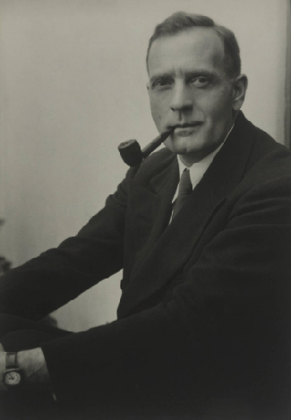

# Learning Objectives

By the end of this section, you will be able to:

* Describe the discoveries that confirmed the existence of galaxies that lie far beyond the Milky Way Galaxy
* Explain why galaxies used to be called nebulae and why we don’t include them in that category any more

Growing up at a time when the Hubble Space Telescope orbits above our heads and giant telescopes are springing up on the great mountaintops of the world, you may be surprised to learn that we were not sure about the existence of other **galaxies**{: data-type="term" .no-emphasis} for a very long time. The very idea that other galaxies exist used to be controversial. Even into the 1920s, many astronomers thought the Milky Way encompassed *all* that exists in the universe. The evidence found in 1924 that meant our Galaxy is not alone was one of the great scientific discoveries of the twentieth century.

It was not that scientists weren’t asking questions. They questioned the composition and structure of the universe as early as the eighteenth century. However, with the telescopes available in earlier centuries, galaxies looked like small fuzzy patches of light that were difficult to distinguish from the star clusters and gas-and-dust clouds that are part of our own Galaxy. All objects that were not sharp points of light were given the same name, *nebulae*, the Latin word for “clouds.” Because their precise shapes were often hard to make out and no techniques had yet been devised for measuring their distances, the nature of the nebulae was the subject of much debate.

As early as the eighteenth century, the philosopher Immanuel **Kant**{: data-type="term" .no-emphasis} (1724–1804) suggested that some of the nebulae might be distant systems of stars (other Milky Ways), but the evidence to support this suggestion was beyond the capabilities of the telescopes of that time.

# Other Galaxies

By the early twentieth century, some nebulae had been correctly identified as star clusters, and others (such as the Orion Nebula) as gaseous nebulae. Most nebulae, however, looked faint and indistinct, even with the best telescopes, and their distances remained unknown. (For more on how such nebulae are named, by the way, see the feature box on [Naming the Nebulae](/m59909#fs-id1168048477995) in the chapter on interstellar matter.) If these nebulae were nearby, with distances comparable to those of observable stars, they were most likely clouds of gas or groups of stars within our Galaxy. If, on the other hand, they were remote, far beyond the edge of the Galaxy, they could be other star systems containing billions of stars.

To determine what the nebulae are, astronomers had to find a way of measuring the distances to at least some of them. When the 2.5-meter (100-inch) telescope on Mount Wilson in Southern California went into operation, astronomers finally had the large telescope they needed to settle the controversy.

Working with the 2.5-meter telescope, Edwin **Hubble**{: data-type="term" .no-emphasis} was able to resolve individual stars in several of the brighter spiral-shaped nebulae, including M31, the great spiral in Andromeda ([\[link\]](#OSC_Astro_26_01_Andromeda)). Among these stars, he discovered some faint variable stars that—when he analyzed their light curves—turned out to be cepheids. Here were reliable indicators that Hubble could use to measure the distances to the nebulae using the technique pioneered by Henrietta **Leavitt**{: data-type="term" .no-emphasis} (see the chapter on [Celestial Distances](/m59902){: .target-chapter}). After painstaking work, he estimated that the Andromeda galaxy was about 900,000 light-years away from us. At that enormous distance, it had to be a separate galaxy of stars located well outside the boundaries of the Milky Way. Today, we know the Andromeda galaxy is actually slightly more than twice as distant as Hubble’s first estimate, but his conclusion about its true nature remains unchanged.

  and M110 (bottom). (credit: Adam Evans)"){: #OSC_Astro_26_01_Andromeda data-title="Andromeda Galaxy."}

No one in human history had ever measured a distance so great. When Hubble’s paper on the distances to nebulae was read before a meeting of the American Astronomical Society on the first day of 1925, the entire room erupted in a standing ovation. A new era had begun in the study of the universe, and a new scientific field—extragalactic astronomy—had just been born.

Edwin Hubble: Expanding the Universe

The son of a Missouri insurance agent, Edwin **Hubble**{: data-type="term" .no-emphasis} ([\[link\]](#OSC_Astro_26_05_Edwin)) graduated from high school at age 16. He excelled in sports, winning letters in track and basketball at the University of Chicago, where he studied both science and languages. Both his father and grandfather wanted him to study law, however, and he gave in to family pressure. He received a prestigious Rhodes scholarship to Oxford University in England, where he studied law with only middling enthusiasm. Returning to be the United States, he spent a year teaching high school physics and Spanish as well as coaching basketball, while trying to determine his life’s direction.

{: #OSC_Astro_26_05_Edwin data-title="Edwin Hubble (1889&#x2013;1953)."}

The pull of astronomy eventually proved too strong to resist, and so Hubble went back to the University of Chicago for graduate work. Just as he was about to finish his degree and accept an offer to work at the soon-to be completed 2.5-meter telescope, the United States entered World War I, and Hubble enlisted as an officer. Although the war had ended by the time he arrived in Europe, he received more officer’s training abroad and enjoyed a brief time of further astronomical study at Cambridge before being sent home.

In 1919, at age 30, he joined the staff at Mount Wilson and began working with the world’s largest telescope. Ripened by experience, energetic, disciplined, and a skillful observer, Hubble soon established some of the most important ideas in modern astronomy. He showed that other galaxies existed, classified them on the basis of their shapes, found a pattern to their motion (and thus put the notion of an expanding universe on a firm observational footing), and began a lifelong program to study the distribution of galaxies in the universe. Although a few others had glimpsed pieces of the puzzle, it was Hubble who put it all together and showed that an understanding of the large-scale structure of the universe was feasible.

His work brought Hubble much renown and many medals, awards, and honorary degrees. As he became better known (he was the first astronomer to appear on the cover of *Time* magazine), he and his wife enjoyed and cultivated friendships with movie stars and writers in Southern California. Hubble was instrumental (if you’ll pardon the pun) in the planning and building of the 2.5-meter telescope on Palomar Mountain, and he had begun to use it for studying galaxies when he passed away from a stroke in 1953.

When astronomers built a space telescope that would allow them to extend Hubble’s work to distances he could only dream about, it seemed natural to name it in his honor. It was fitting that observations with the Hubble Space Telescope (and his foundational work on expansion of the universe) contributed to the 2011 Nobel Prize in Physics, given for the discovery that the expansion of the universe is accelerating (a topic we will expand upon in the chapter on [The Big Bang](/m59975){: .target-chapter}).

# Key Concepts and Summary

Faint star clusters, clouds of glowing gas, and galaxies all appeared as faint patches of light (or nebulae) in the telescopes available at the beginning of the twentieth century. It was only when Hubble measured the distance to the Andromeda galaxy using cepheid variables with the giant 2.5-meter reflector on Mount Wilson in 1924 that the existence of other galaxies similar to the Milky Way in size and content was established.

