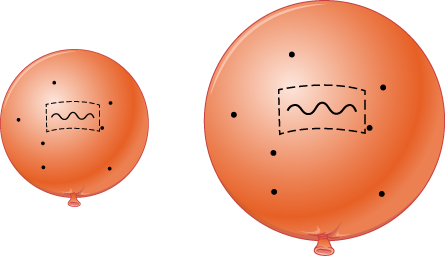
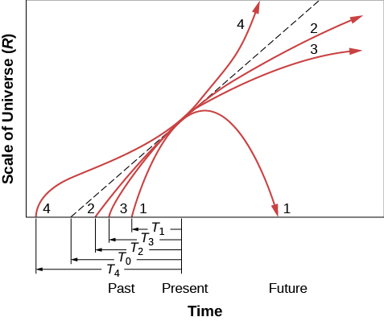

# Learning Objectives

By the end of this section, you will be able to:

* Explain how the rate of expansion of the universe affects its evolution
* Describe four possibilities for the evolution of the universe
* Explain what is expanding when we say that the universe is expanding
* Define critical density and the evidence that matter alone in the universe is much smaller than the critical density
* Describe what the observations say about the likely long-term future of the universe

Let’s now use the results about the expansion of the universe to look at how these ideas might be applied to develop a model for the evolution of the universe as a whole. With this model, astronomers can make predictions about how the universe has evolved so far and what will happen to it in the future.

# The Expanding Universe

Every model of the universe must include the expansion we observe. Another key element of the models is that the **cosmological principle**{: data-type="term" .no-emphasis} (which we discussed in [The Evolution and Distribution of Galaxies](/m59969){: .target-chapter}) is valid: on the large scale, the universe at any given time is the same everywhere (homogeneous and isotropic). As a result, the expansion rate must be the same everywhere during any epoch of cosmic time. If so, we don’t need to think about the entire universe when we think about the expansion, we can just look at any sufficiently large portion of it. (Some models for dark energy would allow the expansion rate to be different in different directions, and scientists are designing experiments to test this idea. However, until such evidence is found, we will assume that the cosmological principle applies throughout the universe.)

In [Galaxies](/m59956){: .target-chapter}, we hinted that when we think of the expansion of the universe, it is more correct to think of space itself stretching rather than of galaxies moving through static space. Nevertheless, we have since been discussing the redshifts of galaxies as if they resulted from the motion of the galaxies themselves.

Now, however, it is time to finally put such simplistic notions behind us and take a more sophisticated look at the cosmic expansion. Recall from our discussion of Einstein’s **theory of general relativity**{: data-type="term" .no-emphasis} (in the chapter on [Black Holes and Curved Spacetime](/m59938){: .target-chapter}) that space—or, more precisely, spacetime—is not a mere backdrop to the action of the universe, as Newton thought. Rather, it is an active participant—affected by and in turn affecting the matter and energy in the universe.

Since the expansion of the universe is the stretching of all spacetime, all points in the universe are stretching together. Thus, the expansion began *everywhere at once*. Unfortunately for tourist agencies of the future, there is no location you can visit where the stretching of space began or where we can say that the Big Bang happened.

To describe just how space stretches, we say the cosmic expansion causes the universe to undergo a uniform change in *scale* over time. By scale we mean, for example, the distance between two clusters of galaxies. It is customary to represent the scale by the factor *R*; if *R* doubles, then the distance between the clusters has doubled. Since the universe is expanding at the same rate everywhere, the change in *R* tells us how much it has expanded (or contracted) at any given time. For a static universe, *R* would be constant as time passes. In an expanding universe, *R* increases with time.

If it is space that is stretching rather than galaxies moving through space, then why do the galaxies show **redshift**{: data-type="term" .no-emphasis}s in their spectra? When you were young and naïve—a few chapters ago—it was fine to discuss the redshifts of distant galaxies as if they resulted from their motion away from us. But now that you are an older and wiser student of cosmology, this view will simply not do.

A more accurate view of the redshifts of galaxies is that the light waves are stretched by the stretching of the space they travel through. Think about the light from a remote galaxy. As it moves away from its source, the light has to travel through space. If space is stretching during all the time the light is traveling, the light waves will be stretched as well. A redshift is a stretching of waves—the wavelength of each wave increases ([\[link\]](#OSC_Astro_29_02_Redshift)). Light from more distant galaxies travels for more time than light from closer ones. This means that the light has stretched more than light from closer ones and thus shows a greater redshift.

 {: #OSC_Astro_29_02_Redshift data-title="Expansion and Redshift."}

Thus, what the measured redshift of light from an object is telling us is how much the universe has expanded since the light left the object. If the universe has expanded by a factor of 2, then the wavelength of the light (and all electromagnetic waves from the same source) will have doubled.

# Models of the Expansion

Before astronomers knew about dark energy or had a good measurement of how much matter exists in the universe, they made speculative models about how the universe might evolve over time. The four possible scenarios are shown in [\[link\]](#OSC_Astro_29_02_Models). In this diagram, time moves forward from the bottom upward, and the scale of space increases by the horizontal circles becoming wider.

 "){: #OSC_Astro_29_02_Models data-title="Four Possible Models of the Universe."}

The simplest scenario of an expanding universe would be one in which *R* increases with time at a constant rate. But you already know that life is not so simple. The universe contains a great deal of mass and its gravity decelerates the expansion—by a large amount if the universe contains a lot of matter, or by a negligible amount if the universe is nearly empty. Then there is the observed acceleration, which astronomers blame on a kind of dark energy.

Let’s first explore the range of possibilities with models for different amounts of mass in the universe and for different contributions by dark energy. In some models—as we shall see—the universe expands forever. In others, it stops expanding and starts to contract. After looking at the extreme possibilities, we will look at recent observations that allow us to choose the most likely scenario.

We should perhaps pause for a minute to note how remarkable it is that we can do this at all. Our understanding of the principles that underlie how the universe works on the large scale and our observations of how the objects in the universe change with time allow us to model the evolution of the entire cosmos these days. It is one of the loftiest achievements of the human mind.

What astronomers look at in practice, to determine the kind of universe we live in, is the *average density* of the universe. This is the mass of matter (including the equivalent mass of energy)[1](#footnote1){: data-type="footnote-number" name="footnote-ref1"} that would be contained in each unit of volume (say, 1 cubic centimeter) if all the stars, galaxies, and other objects were taken apart, atom by atom, and if all those particles, along with the light and other energy, were distributed throughout all of space with absolute uniformity. If the average density is low, there is less mass and less gravity, and the universe will not decelerate very much. It can therefore expand forever. Higher average density, on the other hand, means there is more mass and more gravity and that the stretching of space might slow down enough that the expansion will eventually stop. An extremely high density might even cause the universe to collapse again.

For a given rate of expansion, there is a **critical density**{: data-type="term"}—the mass per unit volume that will be just enough to slow the expansion to zero at some time infinitely far in the future. If the actual density is higher than this critical density, then the expansion will ultimately reverse and the universe will begin to contract. If the actual density is lower, then the universe will expand forever.

These various possibilities are illustrated in [\[link\]](#OSC_Astro_29_02_UModel). In this graph, one of the most comprehensive in all of science, we chart the development of the scale of space in the cosmos against the passage of time. Time increases to the right, and the scale of the universe, *R*, increases upward in the figure. Today, at the point marked “present” along the time axis, *R* is increasing in each model. We know that the galaxies are currently expanding away from each other, no matter which model is right. (The same situation holds for a baseball thrown high into the air. While it may eventually fall back down, near the beginning of the throw it moves upward most rapidly.)

The various lines moving across the graph correspond to different models of the universe. The straight dashed line corresponds to the empty universe with no deceleration; it intercepts the time axis at a time, *T*0 (the Hubble time), in the past. This is not a realistic model but gives us a measure to compare other models to. The curves below the dashed line represent models with no dark energy and with varying amounts of deceleration, starting from the Big Bang at shorter times in the past. The curve above the dashed line shows what happens if the expansion is accelerating. Let’s take a closer look at the future according to the different models.

 {: #OSC_Astro_29_02_UModel data-title="Models of the Universe."}

Let’s start with curve 1 in [\[link\]](#OSC_Astro_29_02_UModel). In this case, the actual density of the universe is higher than the critical density and there is no dark energy. This universe will stop expanding at some time in the future and begin contracting. This model is called a **closed universe**{: data-type="term"} and corresponds to the universe on the left in [\[link\]](#OSC_Astro_29_02_Models). Eventually, the scale drops to zero, which means that space will have shrunk to an infinitely small size. The noted physicist John **Wheeler**{: data-type="term" .no-emphasis} called this the “**big crunch**{: data-type="term" .no-emphasis},” because matter, energy, space, and time would all be crushed out of existence. Note that the “big crunch” is the opposite of the Big Bang—it is an *implosion*. The universe is not expanding but rather collapsing in upon itself.

Some scientists speculated that another Big Bang might follow the crunch, giving rise to a new expansion phase, and then another contraction—perhaps oscillating between successive Big Bangs and big crunches indefinitely in the past and future. Such speculation was sometimes referred to as the **oscillating theory of the universe**{: data-type="term" .no-emphasis}. The challenge for theorists was how to describe the transition from collapse (when space and time themselves disappear into the big crunch) to expansion. With the discovery of dark energy, however, it does not appear that the universe will experience a big crunch, so we can put worrying about it on the back burner.

If the density of the universe is less than the critical density (curve 2 in [\[link\]](#OSC_Astro_29_02_UModel) and the universe second from the left in [\[link\]](#OSC_Astro_29_02_Models)), gravity is never important enough to stop the expansion, and so the universe expands forever. Such a universe is infinite and this model is called an **open universe**{: data-type="term"}. Time and space begin with the Big Bang, but they have no end; the universe simply continues expanding, always a bit more slowly as time goes on. Groups of galaxies eventually get so far apart that it would be difficult for observers in any of them to see the others. (See the feature box on [What Might the Universe Be Like in the Distant Future?](#fs-id1163975543804) for more about the distant future in the closed and open universe models.)

At the critical density (curve 3), the universe can just barely expand forever. The critical-density universe has an age of exactly two-thirds *T*0, where *T*0 is the age of the empty universe. Universes that will someday begin to contract have ages less than two-thirds *T*0.

In an empty universe (the dashed line [\[link\]](#OSC_Astro_29_02_UModel) and the coasting universe in [\[link\]](#OSC_Astro_29_02_Models)), neither gravity nor dark energy is important enough to affect the expansion rate, which is therefore constant throughout all time.

In a universe with dark energy, the rate of the expansion will increase with time, and the expansion will continue at an ever-faster rate. Curve 4 in [\[link\]](#OSC_Astro_29_02_UModel), which represents this universe, has a complicated shape. In the beginning, when the matter is all very close together, the rate of expansion is most influenced by gravity. Dark energy appears to act only over large scales and thus becomes more important as the universe grows larger and the matter begins to thin out. In this model, at first the universe slows down, but as space stretches, the acceleration plays a greater role and the expansion speeds up.

# The Cosmic Tug of War

We might summarize our discussion so far by saying that a “tug of war” is going on in the universe between the forces that push everything apart and the gravitational attraction of matter, which pulls everything together. If we can determine who will win this tug of war, we will learn the ultimate fate of the universe.

The first thing we need to know is the density of the universe. Is it greater than, less than, or equal to the critical density? The critical density today depends on the value of the expansion rate today, *H*0. If the **Hubble constant**{: data-type="term" .no-emphasis} is around 20 kilometers/second per million light-years, the critical density is about 10–26 kg/m3. Let’s see how this value compares with the actual density of the universe.

Critical Density of the Universe As we discussed, the critical density is that combination of matter and energy that brings the universe coasting to a stop at time infinity. Einstein’s equations lead to the following expression for the critical density (*ρ*crit):

<math xmlns="http://www.w3.org/1998/Math/MathML"><mrow><msub><mi>ρ</mi><mrow><mtext>crit</mtext></mrow></msub><mo>=</mo><mfrac><mrow><mn>3</mn><msup><mi>H</mi><mn>2</mn></msup></mrow><mrow><mn>8</mn><mtext>π</mtext><mi>G</mi></mrow></mfrac></mrow></math>

where *H* is the Hubble constant and *G* is the universal constant of gravity (6.67 × 10–11 Nm2/kg2).

Solution Let’s substitute our values and see what we get. Take an *H* = 22 km/s per million light-years. We need to convert both km and light-years into meters for consistency. A million light-years = 106 × 9.5 × 1015 m = 9.5 × 1021 m. And 22 km/s = 2.2 × 104 m/s. That makes *H* = 2.3 ×10–18 /s and *H*2 = 5.36 × 10–36 /s2. So,

<math xmlns="http://www.w3.org/1998/Math/MathML"><mrow><msub><mi>ρ</mi><mrow><mtext>crit</mtext></mrow></msub><mo>=</mo><mfrac><mrow><mn>3</mn><mspace width="0.2em" /><mo>×</mo><mspace width="0.2em" /><mn>5.36</mn><mspace width="0.2em" /><mo>×</mo><mspace width="0.2em" /><msup><mrow><mn>10</mn></mrow><mrow><mn>–36</mn></mrow></msup></mrow><mrow><mn>8</mn><mspace width="0.2em" /><mo>×</mo><mspace width="0.2em" /><mn>3.14</mn><mspace width="0.2em" /><mo>×</mo><mspace width="0.2em" /><mn>6.67</mn><mspace width="0.2em" /><mo>×</mo><mspace width="0.2em" /><msup><mrow><mn>10</mn></mrow><mrow><mn>–11</mn></mrow></msup></mrow></mfrac><mo>=</mo><mn>9.6</mn><mspace width="0.2em" /><mo>×</mo><mspace width="0.2em" /><msup><mrow><mn>10</mn></mrow><mrow><mn>–27</mn></mrow></msup><mspace width="0.2em" /><msup><mrow><mtext>kg/m</mtext></mrow><mn>3</mn></msup></mrow></math>

which we can round off to the 10–26 kg/m3. (To make the units work out, you have to know that *N*, the unit of force, is the same as kg × m/s2.)

Now we can compare densities we measure in the universe to this critical value. Note that density is mass per unit volume, but energy has an equivalent mass of *m* = *E*/*c*2 (from Einstein’s equation *E* = *mc*2).

Check Your Learning

1.  A single grain of dust has a mass of about 1.1 × 10–13 kg. If the average mass-energy density of space is equal to the critical density on average, how much space would be required to produce a total mass-energy equal to a dust grain?
2.  If the Hubble constant were twice what it actually is, how much would the critical density be?
{: data-number-style="lower-alpha"}

Answer:

a. In this case, the average mass-energy in a volume *V* of space is *E* = *ρ*crit*V*. Thus, for space with critical density, we require that

<math xmlns="http://www.w3.org/1998/Math/MathML"><mrow><mi>V</mi><mo>=</mo><mfrac><mrow><msub><mi>E</mi><mrow><mtext>grain</mtext></mrow></msub></mrow><mrow><msub><mi>ρ</mi><mrow><mtext>crit</mtext></mrow></msub></mrow></mfrac><mo>=</mo><mfrac><mrow><mn>1.1</mn><mspace width="0.2em" /><mo>×</mo><mspace width="0.2em" /><msup><mrow><mn>10</mn></mrow><mrow><mn>–13</mn></mrow></msup><mspace width="0.2em" /><mtext>kg</mtext></mrow><mrow><mn>9.6</mn><mspace width="0.2em" /><mo>×</mo><mspace width="0.2em" /><msup><mrow><mn>10</mn></mrow><mrow><mn>–26</mn></mrow></msup><mspace width="0.2em" /><msup><mrow><mtext>kg/m</mtext></mrow><mn>3</mn></msup></mrow></mfrac><mo>=</mo><mn>1.15</mn><mspace width="0.2em" /><mo>×</mo><mspace width="0.2em" /><msup><mrow><mn>10</mn></mrow><mrow><mn>12</mn></mrow></msup><mspace width="0.2em" /><msup><mrow><mtext>m</mtext></mrow><mn>3</mn></msup><mo>=</mo><msup><mrow><mrow><mo>(</mo><mrow><mn>10,500</mn><mspace width="0.2em" /><mtext>m</mtext></mrow><mo>)</mo></mrow></mrow><mn>3</mn></msup><mo>≅</mo><msup><mrow><mrow><mo>(</mo><mrow><mn>10.5</mn><mspace width="0.2em" /><mtext>km</mtext></mrow><mo>)</mo></mrow></mrow><mn>3</mn></msup></mrow></math>

Thus, the sides of a cube of space with mass-energy density averaging that of the critical density would need to be slightly greater than 10 km to contain the total energy equal to a single grain of dust!

b. Since the critical density goes as the square of the Hubble constant, by doubling the Hubble parameter, the critical density would increase by a factor a four. So if the Hubble constant was 44 km/s per million light-years instead of 22 km/s per million light-years, the critical density would be <math xmlns="http://www.w3.org/1998/Math/MathML"><mrow><msub><mi>ρ</mi><mrow><mtext>crit</mtext></mrow></msub><mo>=</mo><mn>4</mn><mspace width="0.2em" /><mo>×</mo><mspace width="0.2em" /><mn>9.6</mn><mspace width="0.2em" /><mo>×</mo><mspace width="0.2em" /><msup><mrow><mn>10</mn></mrow><mrow><mn>–27</mn></mrow></msup><mspace width="0.2em" /><msup><mrow><mtext>kg/m</mtext></mrow><mn>3</mn></msup><mo>=</mo><mn>3.8</mn><mspace width="0.2em" /><mo>×</mo><mspace width="0.2em" /><msup><mrow><mn>10</mn></mrow><mrow><mn>–26</mn></mrow></msup><mspace width="0.2em" /><msup><mrow><mtext>kg/m</mtext></mrow><mn>3</mn></msup><mo>.</mo></mrow></math>

We can start our survey of how dense the cosmos is by ignoring the dark energy and just estimating the density of all matter in the universe, including ordinary matter and dark matter. Here is where the **cosmological principle**{: data-type="term" .no-emphasis} really comes in handy. Since the universe is the same all over (at least on large scales), we only need to measure how much matter exists in a (large) representative sample of it. This is similar to the way a representative survey of a few thousand people can tell us whom the millions of residents of the US prefer for president.

There are several methods by which we can try to determine the average density of matter in space. One way is to count all the galaxies out to a given distance and use estimates of their masses, including dark matter, to calculate the average density. Such estimates indicate a density of about 1 to 2 × 10–27 kg/m3 (10 to 20% of critical), which by itself is too small to stop the expansion.

A lot of the dark matter lies outside the boundaries of galaxies, so this inventory is not yet complete. But even if we add an estimate of the dark matter outside galaxies, our total won’t rise beyond about 30% of the critical density. We’ll pin these numbers down more precisely later in this chapter, where we will also include the effects of dark energy.

In any case, even if we ignore dark energy, the evidence is that the universe will continue to expand forever. The discovery of dark energy that is causing the rate of expansion to speed up only strengthens this conclusion. Things definitely do not look good for fans of the closed universe (big crunch) model.

What Might the Universe Be Like in the Distant Future?

\> Some say the world will end in fire,
> * * *
> {: data-type="newline"}
> 
> Some say in ice.
> * * *
> {: data-type="newline"}
> 
> From what I’ve tasted of desire
> * * *
> {: data-type="newline"}
> 
> I hold with those who favor fire.
> * * *
> {: data-type="newline"}
> 
> —From the poem “Fire and Ice” by Robert Frost (1923)

Given the destructive power of impacting asteroids, expanding red giants, and nearby supernovae, our species may not be around in the remote future. Nevertheless, you might enjoy speculating about what it would be like to live in a much, much older universe.

The observed acceleration makes it likely that we will have continued expansion into the indefinite future. If the universe expands forever (*R* increases without limit), the clusters of galaxies will spread ever farther apart with time. As eons pass, the universe will get thinner, colder, and darker.

Within each galaxy, stars will continue to go through their lives, eventually becoming white dwarfs, neutron stars, and black holes. Low-mass stars might take a long time to finish their evolution, but in this model, we would literally have all the time in the world. Ultimately, even the white dwarfs will cool down to be black dwarfs, any neutron stars that reveal themselves as pulsars will slowly stop spinning, and black holes with accretion disks will one day complete their “meals.” The remains of stars will all be dark and difficult to observe.

This means that the light that now reveals galaxies to us will eventually go out. Even if a small pocket of raw material were left in one unsung corner of a galaxy, ready to be turned into a fresh cluster of stars, we will only have to wait until the time that their evolution is also complete. And time is one thing this model of the universe has plenty of. There will surely come a time when all the stars are out, galaxies are as dark as space, and no source of heat remains to help living things survive. Then the lifeless galaxies will just continue to move apart in their lightless realm.

If this view of the future seems discouraging (from a human perspective), keep in mind that we fundamentally do not understand why the expansion rate is currently accelerating. Thus, our speculations about the future are just that: speculations. You might take heart in the knowledge that science is always a progress report. The most advanced ideas about the universe from a hundred years ago now strike us as rather primitive. It may well be that our best models of today will in a hundred or a thousand years also seem rather simplistic and that there are other factors determining the ultimate fate of the universe of which we are still completely unaware.

# Ages of Distant Galaxies

In the chapter on [Galaxies](/m59956){: .target-chapter}, we discussed how we can use **Hubble’s law**{: data-type="term" .no-emphasis} to measure the distance to a galaxy. But that simple method only works with galaxies that are not too far away. Once we get to large distances, we are looking so far into the past that we must take into account changes in the rate of the expansion of the universe. Since we cannot measure these changes directly, we must assume one of the models of the universe to be able to convert large redshifts into distances.

This is why astronomers squirm when reporters and students ask them exactly how far away some newly discovered distant quasar or galaxy is. We really can’t give an answer without first explaining the model of the universe we are assuming in calculating it (by which time a reporter or student is long gone or asleep). Specifically, we must use a model that includes the change in the expansion rate with time. The key ingredients of the model are the amounts of matter, including dark matter, and the equivalent mass (according to *E* = *mc*2) of the dark energy along with the Hubble constant.

Elsewhere in this book, we have estimated the mass density of ordinary matter plus dark matter as roughly 0.3 times the critical density, and the mass equivalent of dark energy as roughly 0.7 times the critical density. We will refer to these values as the “standard model of the universe.” The latest (slightly improved) estimates for these values and the evidence for them will be given later in this chapter. Calculations also require the current value of the Hubble constant. For [\[link\]](#fs-id1163974245030), we have adopted a Hubble constant of 67.3 kilometers/second/million parsecs (rather than rounding it to 70 kilometers/second/million parsecs), which is consistent with the 13.8 billion-year age of the universe estimated by the latest observations.

Once we assume a model, we can use it to calculate the age of the universe at the time an object emitted the light we see. As an example, [\[link\]](#fs-id1163974245030) lists the times that light was emitted by objects at different redshifts as fractions of the current age of the universe. The times are given for two very different models so you can get a feeling for the fact that the calculated ages are fairly similar. The first model assumes that the universe has a critical density of matter and no dark energy. The second model is the standard model described in the preceding paragraph. The first column in the table is the redshift, which is given by the equation z = Δλ/λ0 and is a measure of how much the wavelength of light has been stretched by the expansion of the universe on its long journey to us.

<table class="span-all" summary="No-Summary"><thead>
<tr valign="top">
<th colspan="3" data-valign="top" data-align="center">Ages of the Universe at Different Redshifts</th>
</tr>
<tr valign="top">
<th data-valign="top" data-align="center">Redshift</th>
<th data-valign="top" data-align="center">Percent of Current Age of Universe When the Light Was Emitted (mass = critical density)</th>
<th data-valign="top" data-align="center">Percent of Current Age of Universe When the Light Was Emitted (mass = 0.3 critical density; dark energy = 0.7 critical density)</th>
</tr>
</thead><tbody>
<tr valign="top">
<td data-valign="top" data-align="left">0</td>
<td data-valign="top" data-align="left">100 (now)</td>
<td data-valign="top" data-align="left">100 (now)</td>
</tr>
<tr valign="top">
<td data-valign="top" data-align="left">0.5</td>
<td data-valign="top" data-align="left">54</td>
<td data-valign="top" data-align="left">63</td>
</tr>
<tr valign="top">
<td data-valign="top" data-align="left">1.0</td>
<td data-valign="top" data-align="left">35</td>
<td data-valign="top" data-align="left">43</td>
</tr>
<tr valign="top">
<td data-valign="top" data-align="left">2.0</td>
<td data-valign="top" data-align="left">19</td>
<td data-valign="top" data-align="left">24</td>
</tr>
<tr valign="top">
<td data-valign="top" data-align="left">3.0</td>
<td data-valign="top" data-align="left">13</td>
<td data-valign="top" data-align="left">16</td>
</tr>
<tr valign="top">
<td data-valign="top" data-align="left">4.0</td>
<td data-valign="top" data-align="left">9</td>
<td data-valign="top" data-align="left">11</td>
</tr>
<tr valign="top">
<td data-valign="top" data-align="left">5.0</td>
<td data-valign="top" data-align="left">7</td>
<td data-valign="top" data-align="left">9</td>
</tr>
<tr valign="top">
<td data-valign="top" data-align="left">8.0</td>
<td data-valign="top" data-align="left">4</td>
<td data-valign="top" data-align="left">5</td>
</tr>
<tr valign="top">
<td data-valign="top" data-align="left">11.9</td>
<td data-valign="top" data-align="left">0.02</td>
<td data-valign="top" data-align="left">0.027</td>
</tr>
<tr valign="top">
<td data-valign="top" data-align="left">Infinite</td>
<td data-valign="top" data-align="left">0</td>
<td data-valign="top" data-align="left">0</td>
</tr>
</tbody></table>

Notice that as we find objects with higher and higher redshifts, we are looking back to smaller and smaller fractions of the age of the universe. The highest observed redshifts as this book is being written are close to 12 ([\[link\]](#OSC_Astro_29_02_DistantGal)). As [\[link\]](#fs-id1163974245030) shows, we are seeing these galaxies as they were when the universe was only about 3% as old as it is now. They were already formed only about 700 million years after the Big Bang.

 ![No Alt Text](../resources/OSC_Astro_29_02_DistantGal.jpg "This image, called the Hubble Ultra Deep Field, shows faint galaxies, seen very far away and therefore very far back in time. The colored squares in the main image outline the locations of the galaxies. Enlarged views of each galaxy are shown in the black-and-white images. The red lines mark each galaxy&#x2019;s location. The &#x201C;redshift&#x201D; of each galaxy is indicated below each box, denoted by the symbol &#x201C;z.&#x201D; The redshift measures how much a galaxy&#x2019;s ultraviolet and visible light has been stretched to infrared wavelengths by the universe&#x2019;s expansion. The larger the redshift, the more distant the galaxy, and therefore the further astronomers are seeing back in time. One of the seven galaxies may be a distance breaker, observed at a redshift of 11.9. If this redshift is confirmed by additional measurements, the galaxy is seen as it appeared only 380 million years after the Big Bang, when the universe was less than 3% of its present age. (credit: modification of work by NASA, ESA, R. Ellis (Caltech), and the UDF 2012 Team)"){: #OSC_Astro_29_02_DistantGal data-title="Hubble Ultra-Deep Field."}

# Key Concepts and Summary

For describing the large-scale properties of the universe, a model that is isotropic and homogeneous (same everywhere) is a pretty good approximation of reality. The universe is expanding, which means that the universe undergoes a change in scale with time; space stretches and distances grow larger by the same factor everywhere at a given time. Observations show that the mass density of the universe is less than the critical density. In other words, there is not enough matter in the universe to stop the expansion. With the discovery of dark energy, which is accelerating the rate of expansion, the observational evidence is strong that the universe will expand forever. Observations tell us that the expansion started about 13.8 billion years ago.

## Footnotes
{: data-type="footnote-title"}

1.  [1](#footnote-ref1){: data-type="footnote-ref" name="footnote1"} By equivalent mass we mean that which would result if the energy were turned into mass using Einstein’s formula, *E* = *mc*2.

## Glossary
{: data-type="glossary-title"}

closed universe
: a model in which the universe expands from a Big Bang, stops, and then contracts to a big crunch
{: .definition}

critical density
: in cosmology, the density that is just sufficient to bring the expansion of the universe to a stop after infinite time
{: .definition}

open universe
: a model in which the density of the universe is not high enough to bring the expansion of the universe to a halt
{: .definition}

