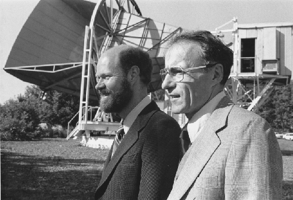
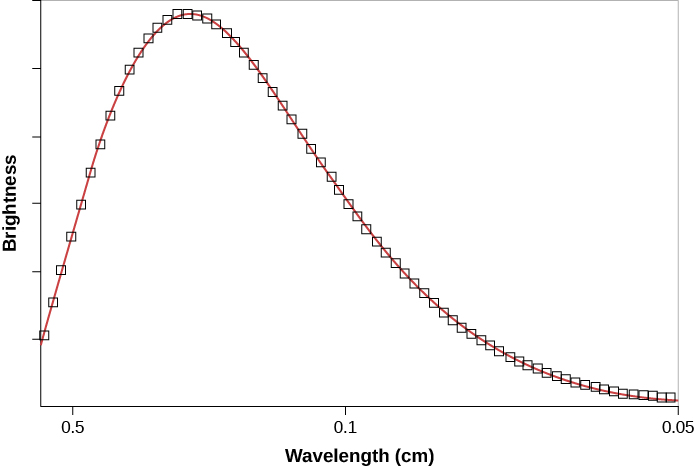

### Learning Objectives

By the end of this section, you will be able to:

* Explain why we can observe the afterglow of the hot, early universe
* Discuss the properties of this afterglow as we see it today, including its average temperature and the size of its temperature fluctuations
* Describe open, flat, and curved universes and explain which type of universe is supported by observations
* Summarize our current knowledge of the basic properties of the universe including its age and contents

The description of the first few minutes of the universe is based on theoretical calculations. It is crucial, however, that a scientific theory should be testable. What predictions does it make? And do observations show those predictions to be accurate? One success of the theory of the first few minutes of the universe is the correct prediction of the amount of helium in the universe.

Another prediction is that a significant milestone in the history of the universe occurred about 380,000 years after the Big Bang. Scientists have directly observed what the universe was like at this early stage, and these observations offer some of the strongest support for the Big Bang theory. To find out what this milestone was, let’s look at what theory tells us about what happened during the first few hundred thousand years after the Big Bang.

The fusion of helium and lithium was completed when the universe was about 4 minutes old. The universe then continued to resemble the interior of a star in some ways for a few hundred thousand years more. It remained hot and opaque, with radiation being scattered from one particle to another. It was still too hot for electrons to “settle down” and become associated with a particular nucleus; such free electrons are especially effective at scattering photons, thus ensuring that no radiation ever got very far in the early universe without having its path changed. In a way, the universe was like an enormous crowd right after a popular concert; if you get separated from a friend, even if he is wearing a flashing button, it is impossible to see through the dense crowd to spot him. Only after the crowd clears is there a path for the light from his button to reach you.

### The Universe Becomes Transparent

Not until a few hundred thousand years after the Big Bang, when the temperature had dropped to about 3000 K and the density of atomic nuclei to about 1000 per cubic centimeter, did the electrons and nuclei manage to combine to form stable atoms of hydrogen and helium ([\[link\]](/m59978#OSC_Astro_29_03_Early)). With no free electrons to scatter photons, the universe became transparent for the first time in cosmic history. From this point on, matter and radiation interacted much less frequently; we say that they *decoupled* from each other and evolved separately. Suddenly, electromagnetic radiation could really travel, and it has been traveling through the universe ever since.

### Discovery of the Cosmic Background Radiation

If the model of the universe described in the previous section is correct, then—as we look far outward in the universe and thus far back in time—the first “afterglow” of the hot, early universe should still be detectable. Observations of it would be very strong evidence that our theoretical calculations about how the universe evolved are correct. As we shall see, we have indeed detected the radiation emitted at this **photon decoupling time**{: data-type="term"}, when radiation began to stream freely through the universe without interacting with matter ([\[link\]](#OSC_Astro_29_04_Cosmic)).

  Early in the universe, photons (electromagnetic energy) were scattering off the crowded, hot, charged particles and could not get very far without colliding with another particle. But after electrons and photons settled into neutral atoms, there was far less scattering, and photons could travel over vast distances. The universe became transparent. As we look out in space and back in time, we can&#x2019;t see back beyond this time. (b) This is similar to what happens when we see clouds in Earth&#x2019;s atmosphere. Water droplets in a cloud scatter light very efficiently, but clear air lets light travel over long distances. So as we look up into the atmosphere, our vision is blocked by the cloud layers and we can&#x2019;t see beyond them. (credit: modification of work by NASA)"){: #OSC_Astro_29_04_Cosmic data-title="Cosmic Microwave Background and Clouds Compared."}

The detection of this afterglow was initially an accident. In the late 1940s, Ralph **Alpher**{: data-type="term" .no-emphasis} and Robert **Herman**{: data-type="term" .no-emphasis}, working with George **Gamow**{: data-type="term" .no-emphasis}, realized that just before the universe became transparent, it must have been radiating like a blackbody at a temperature of about 3000 K—the temperature at which hydrogen atoms could begin to form. If we could have seen that radiation just after neutral atoms formed, it would have resembled radiation from a reddish star. It was as if a giant fireball filled the whole universe.

But that was nearly 14 billion years ago, and, in the meantime, the scale of the universe has increased a thousand fold. This expansion has increased the wavelength of the radiation by a factor of 1000 (see [\[link\]](/m59977#OSC_Astro_29_02_Redshift)). According to Wien’s law, which relates wavelength and temperature, the expansion has correspondingly lowered the temperature by a factor of 1000 (see the chapter on [Radiation and Spectra](/m59791){: .target-chapter}). The cosmic background behaves like a blackbody and should therefore have a spectrum that obeys Wien’s Law.

Alpher and Herman predicted that the glow from the fireball should now be at radio wavelengths and should resemble the radiation from a blackbody at a temperature only a few degrees above absolute zero. Since the fireball was everywhere throughout the universe, the radiation left over from it should also be everywhere. If our eyes were sensitive to radio wavelengths, the whole sky would appear to glow very faintly. However, our eyes can’t see at these wavelengths, and at the time Alpher and Herman made their prediction, there were no instruments that could detect the glow. Over the years, their prediction was forgotten.

In the mid-1960s, in Holmdel, New Jersey, Arno Penzias and Robert Wilson of AT&amp;T’s Bell Laboratories had built a delicate microwave antenna ([\[link\]](#OSC_Astro_29_04_Wilson)) to measure astronomical sources, including supernova remnants like Cassiopeia A (see the chapter on [The Death of Stars](/m59931){: .target-chapter}). They were plagued with some unexpected background noise, just like faint static on a radio, which they could not get rid of. The puzzling thing about this radiation was that it seemed to be coming from all directions at once. This is very unusual in astronomy: after all, most radiation has a specific direction where it is strongest—the direction of the Sun, or a supernova remnant, or the disk of the Milky Way, for example.

 {: #OSC_Astro_29_04_Wilson data-title="Robert Wilson (left) and Arno Penzias (right)."}

Penzias and Wilson at first thought that any radiation appearing to come from all directions must originate from inside their telescope, so they took everything apart to look for the source of the noise. They even found that some pigeons had roosted inside the big horn-shaped antenna and had left (as Penzias delicately put it) “a layer of white, sticky, dielectric substance coating the inside of the antenna.” However, nothing the scientists did could reduce the background radiation to zero, and they reluctantly came to accept that it must be real, and it must be coming from space.

Penzias and Wilson were not cosmologists, but as they began to discuss their puzzling discovery with other scientists, they were quickly put in touch with a group of astronomers and physicists at Princeton University (a short drive away). These astronomers had—as it happened—been redoing the calculations of Alpher and Herman from the 1940s and also realized that the radiation from the decoupling time should be detectable as a faint afterglow of radio waves. The different calculations of what the observed temperature would be for this **cosmic microwave background (CMB)**{: data-type="term"}[1](#footnote1){: data-type="footnote-link"} were uncertain, but all predicted less than 40 K.

Penzias and Wilson found the distribution of intensity at different radio wavelengths to correspond to a temperature of 3.5 K. This is very cold—closer to absolute zero than most other astronomical measurements—and a testament to how much space (and the waves within it) has stretched. Their measurements have been repeated with better instruments, which give us a reading of 2.73 K. So Penzias and Wilson came very close. Rounding this value, scientists often refer to “the 3-degree microwave background.”

Many other experiments on Earth and in space soon confirmed the discovery by Penzias and Wilson: The radiation was indeed coming from all directions (it was isotropic) and matched the predictions of the Big Bang theory with remarkable precision. Penzias and Wilson had inadvertently observed the glow from the primeval fireball. They received the Nobel Prize for their work in 1978. And just before his death in 1966, Lemaître learned that his “vanished brilliance” had been discovered and confirmed.

You may enjoy watching *Three Degrees*, a [26-minute video][1] from Bell Labs about Penzias and Wilson’s discovery of the cosmic background radiation (with interesting historical footage).

### Properties of the Cosmic Microwave Background

One issue that worried astronomers is that Penzias and Wilson were measuring the background radiation filling space through Earth’s atmosphere. What if that atmosphere is a source of radio waves or somehow affected their measurements? It would be better to measure something this important from space.

The first accurate measurements of the CMB were made with a satellite orbiting Earth. Named the Cosmic Background Explorer (**COBE**{: data-type="term" .no-emphasis}), it was launched by NASA in November 1989. The data it received quickly showed that the CMB closely matches that expected from a blackbody with a temperature of 2.73 K ([\[link\]](#OSC_Astro_29_04_Radiation)). This is exactly the result expected if the CMB was indeed redshifted radiation emitted by a hot gas that filled all of space shortly after the universe began.

 {: #OSC_Astro_29_04_Radiation data-title="Cosmic Background Radiation."}

The first important conclusion from measurements of the CMB, therefore, is that the universe we have today has indeed evolved from a hot, uniform state. This observation also provides direct support for the general idea that we live in an evolving universe, since the universe is cooler today than it was in the beginning.

### Small Differences in the CMB

It was known even before the launch of COBE that the CMB is extremely *isotropic*. In fact, its uniformity in every direction is one of the best confirmations of the cosmological principle— that the universe is homogenous and isotropic.

According to our theories, however, the temperature could not have been *perfectly* uniform when the CMB was emitted. After all, the CMB is radiation that was scattered from the particles in the universe at the time of decoupling. If the radiation were completely smooth, then all those particles must have been distributed through space absolutely evenly. Yet it is those particles that have become all the galaxies and stars (and astronomy students) that now inhabit the cosmos. Had the particles been completely smoothly distributed, they could not have formed all the large-scale structures now present in the universe—the clusters and superclusters of galaxies discussed in the last few chapters.

The early universe must have had tiny density fluctuations from which such structures could evolve. Regions of higher-than-average density would have attracted additional matter and eventually grown into the galaxies and clusters that we see today. It turned out that these denser regions would appear to us to be colder spots, that is, they would have lower-than-average temperatures.

The reason that temperature and density are related can be explained this way. At the time of decoupling, photons in a slightly denser portion of space had to expend some of their energy to escape the gravitational force exerted by the surrounding gas. In losing energy, the photons became slightly colder than the overall average temperature at the time of decoupling. Vice versa, photons that were located in a slightly less dense portion of space lost less energy upon leaving it than other photons, thus appearing slightly hotter than average. Therefore, if the seeds of present-day galaxies existed at the time that the CMB was emitted, we should see some slight variations in the CMB temperature as we look in different directions in the sky.

Scientists working with the data from the COBE satellite did indeed detect very subtle temperature differences—about 1 part in 100,000—in the CMB. The regions of lower-than-average temperature come in a variety of sizes, but even the smallest of the colder areas detected by COBE is far too large to be the precursor of an individual galaxy, or even a supercluster of galaxies. This is because the COBE instrument had “blurry vision” (poor resolution) and could only measure large patches of the sky. We needed instruments with “sharper vision.”

The most detailed measurements of the CMB have been obtained by two satellites launched more recently than COBE. The results from the first of these satellites, the Wilkinson Microwave Anisotropy Probe (**WMAP**{: data-type="term" .no-emphasis}) spacecraft, were published in 2003. In 2015, measurements from the Planck satellite extended the WMAP measurements to even-higher spatial resolution and lower noise ([\[link\]](#OSC_Astro_29_04_CMBSatell)).

  is an all-sky map of the CMB as observed by the Planck mission. The colors in the map represent different temperatures: red for warmer and blue for cooler. These tiny temperature fluctuations correspond to regions of slightly different densities, representing the seeds of all future structures: the stars, galaxies, and galaxy clusters of today. (credit top: modification of work by NASA/JPL-Caltech/ESA; credit bottom: modification of work by ESA and the Planck Collaboration)"){: #OSC_Astro_29_04_CMBSatell data-title="CMB Observations."}

Theoretical calculations show that the sizes of the hot and cold spots in the CMB depend on the geometry of the universe and hence on its total density. (It’s not at all obvious that it should do so, and it takes some pretty fancy calculations—way beyond the level of our text—to make the connection, but having such a dependence is very useful.) The total density we are discussing here includes both the amount of mass in the universe and the mass equivalent of the dark energy. That is, we must add together mass and energy: ordinary matter, dark matter, and the dark energy that is speeding up the expansion.

To see why this works, remember (from the chapter on [Black Holes and Curved Spacetime](/m59938){: .target-chapter}) that with his **theory of general relativity**{: data-type="term" .no-emphasis}, Einstein showed that matter can curve space and that the amount of curvature depends on the amount of matter present. Therefore, the total amount of matter in the universe (including dark matter and the equivalent matter contribution by dark energy), determines the overall geometry of space. Just like the geometry of space around a black hole has a curvature to it, so the entire universe may have a curvature. Let’s take a look at the possibilities ([\[link\]](#OSC_Astro_29_04_SpaceCurve)).

If the density of matter is higher than the critical density, the universe will eventually collapse. In such a closed universe, two initially parallel rays of light will eventually meet. This kind of geometry is referred to as spherical geometry. If the density of matter is less than critical, the universe will expand forever. Two initially parallel rays of light will diverge, and this is referred to as hyperbolic geometry. In a critical-density universe, two parallel light rays never meet, and the expansion comes to a halt only at some time infinitely far in the future. We refer to this as a **flat universe**{: data-type="term"}, and the kind of Euclidean geometry you learned in high school applies in this type of universe.

 . Note that the red lines in each diagram show what happens in each kind of space&#x2014;they are initially parallel but follow different paths depending on the curvature of space. Remember that these drawings are trying to show how space for the entire universe is &#x201C;warped&#x201D;&#x2014;this can&#x2019;t be seen locally in the small amount of space that we humans occupy."){: #OSC_Astro_29_04_SpaceCurve data-title="Picturing Space Curvature for the Entire Universe."}

If the density of the universe is equal to the critical density, then the hot and cold spots in the CMB should typically be about a degree in size. If the density is greater than critical, then the typical sizes will be larger than one degree. If the universe has a density less than critical, then the structures will appear smaller. In [\[link\]](#OSC_Astro_29_04_Boomerang), you can see the differences easily. WMAP and Planck observations of the CMB confirmed earlier experiments that we do indeed live in a flat, critical-density universe.

 . If, on the other hand, the density is higher than critical (and the universe will ultimately collapse), then the images&#x2019; hot and cold spots will appear larger than one degree (bottom left). If the density of the universe is less than critical (and the expansion will continue forever), then the structures will appear smaller (bottom right). As the measurements show, the universe is at critical density. The measurements shown were made by a balloon-borne instrument called BOOMERanG (Balloon Observations of Millimetric Extragalactic Radiation and Geophysics), which was flown in Antarctica. Subsequent satellite observations by WMAP and Planck confirm the BOOMERanG result. (credit: modification of work by NASA)"){: #OSC_Astro_29_04_Boomerang data-title="Comparison of CMB Observations with Possible Models of the Universe."}

Key numbers from an analysis of the Planck data give us the best values currently available for some of the basic properties of the universe:

* Age of universe: 13.799 ± 0.038 billion years (Note: That means we know the age of the universe to within 38 million years. Amazing!)
* Hubble constant: 67.31 ± 0.96 kilometers/second/million parsecs
* Fraction of universe’s content that is “dark energy”: 68.5% ± 1.3%
* Fraction of the universe’s content that is matter: 31.5% ± 1.3%
{: data-bullet-style="bullet"}

Note that this value for the **Hubble constant**{: data-type="term" .no-emphasis} is slightly smaller than the value of 70 kilometers/second/million parsecs that we have adopted in this book. In fact, the value derived from measurements of redshifts is 73 kilometers/second/million parsecs. So precise is modern cosmology these days that scientists are working hard to resolve this discrepancy. The fact that the difference between these two independent measurements is so small is actually a remarkable achievement. Only a few decades ago, astronomers were arguing about whether the Hubble constant was around 50 kilometers/second/million parsecs or 100 kilometers/second/million parsecs.

Analysis of Planck data also shows that ordinary matter (mainly protons and neutrons) makes up 4.9% of the total density. Dark matter plus normal matter add up to 31.5% of the total density. Dark energy contributes the remaining 68.5%. The age of the universe at decoupling—that is, when the CMB was emitted—was 380,000 years.

Perhaps the most surprising result from the high-precision measurements by WMAP and the even higher-precision measurements from Planck is that there were no surprises. The model of cosmology with ordinary matter at about 5%, dark matter at about 25%, and dark energy about 70% has survived since the late 1990s when cosmologists were forced in that direction by the supernovae data. In other words, the very strange universe that we have been describing, with only about 5% of its contents being made up of the kinds of matter we are familiar with here on Earth, really seems to be the universe we live in.

After the CMB was emitted, the universe continued to expand and cool off. By 400 to 500 million years after the Big Bang, the very first stars and galaxies had already formed. Deep in the interiors of stars, matter was reheated, nuclear reactions were ignited, and the more gradual synthesis of the heavier elements that we have discussed throughout this book began.

We conclude this quick tour of our model of the early universe with a reminder. You must not think of the Big Bang as a *localized* explosion *in space*, like an exploding superstar. There were no boundaries and there was no single site where the explosion happened. It was an explosion *of space* (and time and matter and energy) that happened everywhere in the universe. All matter and energy that exist today, including the particles of which you are made, came from the Big Bang. We were, and still are, in the midst of a Big Bang; it is all around us.

### Key Concepts and Summary

When the universe became cool enough to form neutral hydrogen atoms, the universe became transparent to radiation. Scientists have detected the cosmic microwave background (CMB) radiation from this time during the hot, early universe. Measurements with the COBE satellite show that the CMB acts like a blackbody with a temperature of 2.73 K. Tiny fluctuations in the CMB show us the seeds of large-scale structures in the universe. Detailed measurements of these fluctuations show that we live in a critical-density universe and that the critical density is composed of 31% matter, including dark matter, and 69% dark energy. Ordinary matter—the kinds of elementary particles we find on Earth—make up only about 5% of the critical density. CMB measurements also indicate that the universe is 13.8 billion years old.

### Footnotes
{: data-type="footnote-refs-title"}

* {: data-type="footnote-ref" #footnote1} [1](#footnote-ref1){: data-type="footnote-ref-link"} Recall that microwaves are in the radio region of the electromagnetic spectrum.
{: data-list-type="bulleted" data-bullet-style="none"}

### Glossary
{: data-type="glossary-title"}

cosmic microwave background (CMB)
: microwave radiation coming from all directions that is the redshifted afterglow of the Big Bang
^

flat universe
: a model of the universe that has a critical density and in which the geometry of the universe is flat, like a sheet of paper
^

photon decoupling time
: when radiation began to stream freely through the universe without interacting with matter

[1]: https://openstax.org/l/30threedegvid
