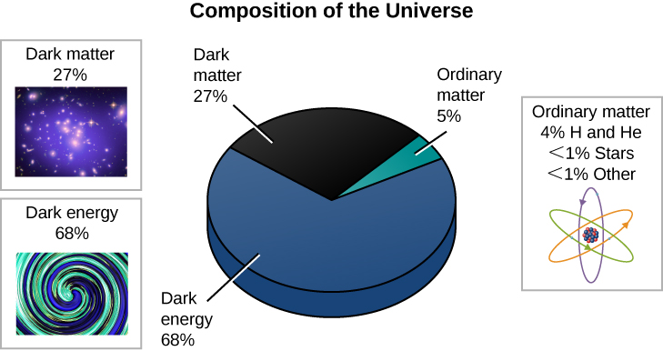

### Learning Objectives

By the end of this section, you will be able to:

* Specify what fraction of the density of the universe is contributed by stars and galaxies and how much ordinary matter (such as hydrogen, helium, and other elements we are familiar with here on Earth) makes up the overall density
* Describe how ideas about the contents of the universe have changed over the last 50 years
* Explain why it is so difficult to determine what dark matter really is
* Explain why dark matter helped galaxies form quickly in the early universe
* Summarize the evolution of the universe from the time the CMB was emitted to the present day

The model of the universe we described in the previous section is the simplest model that explains the observations. It assumes that general relativity is the correct theory of gravity throughout the universe. With this assumption, the model then accounts for the existence and structure of the CMB; the abundances of the light elements deuterium, helium, and lithium; and the acceleration of the expansion of the universe. All of the observations to date support the validity of the model, which is referred to as the standard (or concordance) model of cosmology.

[\[link\]](#OSC_Astro_29_05_Piechart) and [\[link\]](#fs-id1163975561521) summarize the current best estimates of the contents of the universe. Luminous matter in stars and galaxies and neutrinos contributes about 1% of the mass required to reach critical density. Another 4% is mainly in the form of hydrogen and helium in the space between stars and in intergalactic space. Dark matter accounts for about an additional 27% of the critical density. The mass equivalent of dark energy (according to *E* = *mc*2) then supplies the remaining 68% of the critical density.

 {: #OSC_Astro_29_05_Piechart data-title="Composition of the Universe."}

<table class="span-all" summary="No-Summary"><thead>
<tr valign="top">
<th colspan="2" data-valign="top" data-align="center">What Different Kinds of Objects Contribute to the Density of the Universe</th>
</tr>
<tr valign="top">
<th data-valign="top" data-align="center">Object</th>
<th data-valign="top" data-align="center">Density as a Percent of Critical Density</th>
</tr>
</thead><tbody>
<tr valign="top">
<td data-valign="top" data-align="left">Luminous matter (stars, etc.)</td>
<td data-valign="top" data-align="left">&lt;1</td>
</tr>
<tr valign="top">
<td data-valign="top" data-align="left">Hydrogen and helium in interstellar and intergalactic space</td>
<td data-valign="top" data-align="left">4</td>
</tr>
<tr valign="top">
<td data-valign="top" data-align="left">Dark matter</td>
<td data-valign="top" data-align="left">27</td>
</tr>
<tr valign="top">
<td data-valign="top" data-align="left">Equivalent mass density of the dark energy</td>
<td data-valign="top" data-align="left">68</td>
</tr>
</tbody></table>

This table should shock you. What we are saying is that 95% of the stuff of the universe is either dark matter or dark energy—neither of which has ever been detected in a laboratory here on Earth. This whole textbook, which has focused on objects that emit electromagnetic radiation, has generally been ignoring 95% of what is out there. Who says there aren’t big mysteries yet to solve in science!

[\[link\]](#OSC_Astro_29_05_Content) shows how our ideas of the composition of the universe have changed over just the past three decades. The fraction of the universe that we think is made of the same particles as astronomy students has been decreasing steadily.

  that was simply not producing electromagnetic radiation. By the 1980s, it was becoming likely that most of the dark matter was made of something we had not yet detected on Earth. By the late 1990s, a variety of experiments had shown that we live in a critical -density universe and that dark energy contributes about 70% of what is required to reach critical density. Note how the estimate of the relative importance of ordinary luminous matter (shown in yellow) has diminished over time."){: #OSC_Astro_29_05_Content data-title="Changing Estimates of the Content of the Universe."}

### What Is Dark Matter?

Many astronomers find the situation we have described very satisfying. Several independent experiments now agree on the type of universe we live in and on the inventory of what it contains. We seem to be very close to having a cosmological model that explains nearly everything. Others are not yet ready to jump on the bandwagon. They say, “show me the 96% of the universe we can’t detect directly—for example, find me some dark matter!”

At first, astronomers thought that **dark matter**{: data-type="term"} might be hidden in objects that appear dark because they emit no light (e.g., black holes) or that are too faint to be observed at large distances (e.g., planets or white dwarfs). However, these objects would be made of ordinary matter, and the deuterium abundance tells us that no more than 5% of the critical density consists of ordinary matter.

Another possible form that dark matter can take is some type of elementary particle that we have not yet detected here on Earth—a particle that has mass and exists in sufficient abundance to contribute 23% of the critical density. Some physics theories predict the existence of such particles. One class of these particles has been given the name WIMPs, which stands for **weakly interacting massive particles**{: data-type="term"}. Since these particles do not participate in nuclear reactions leading to the production of deuterium, the deuterium abundance puts no limits on how many WIMPs might be in the universe. (A number of other exotic particles have also been suggested as prime constituents of dark matter, but we will confine our discussion to WIMPs as a useful example.)

If large numbers of WIMPs do exist, then some of them should be passing through our physics laboratories right now. The trick is to catch them. Since by definition they interact only weakly (infrequently) with other matter, the chances that they will have a measurable effect are small. We don’t know the mass of these particles, but various theories suggest that it might be a few to a few hundred times the mass of a proton. If WIMPs are 60 times the mass of a proton, there would be about 10 million of them passing through your outstretched hand every second—with absolutely no effect on you. If that seems too mind-boggling, bear in mind that neutrinos interact weakly with ordinary matter, and yet we were able to “catch” them eventually.

Despite the challenges, more than 30 experiments designed to detect WIMPS are in operation or in the planning stages. Predictions of how many times WIMPs might actually collide with the nucleus of an atom in the instrument designed to detect them are in the range of 1 event per year to 1 event per 1000 years per kilogram of detector. The detector must therefore be large. It must be shielded from radioactivity or other types of particles, such as neutrons, passing through it, and hence these detectors are placed in deep mines. The energy imparted to an atomic nucleus in the detector by collision with a WIMP will be small, and so the detector must be cooled to a very low temperature.

The WIMP detectors are made out of crystals of germanium, silicon, or xenon. The detectors are cooled to a few thousandths of a degree—very close to absolute zero. That means that the atoms in the detector are so cold that they are scarcely vibrating at all. If a dark matter particle collides with one of the atoms, it will cause the whole crystal to vibrate and the temperature therefore to increase ever so slightly. Some other interactions may generate a detectable flash of light.

A different kind of search for WIMPs is being conducted at the Large Hadron Collider (LHC) at CERN, Europe’s particle physics lab near Geneva, Switzerland. In this experiment, protons collide with enough energy potentially to produce WIMPs. The LHC detectors cannot detect the WIMPs directly, but if WIMPs are produced, they will pass through the detectors, carrying energy away with them. Experimenters will then add up all the energy that they detect as a result of the collisions of protons to determine if any energy is missing.

So far, none of these experiments has detected WIMPs. Will the newer experiments pay off? Or will scientists have to search for some other explanation for dark matter? Only time will tell ([\[link\]](#OSC_Astro_29_05_Cartoon)).

 "){: #OSC_Astro_29_05_Cartoon data-title="Dark Matter."}

### Dark Matter and the Formation of Galaxies

As elusive as dark matter may be in the current-day universe, galaxies could not have formed quickly without it. Galaxies grew from density fluctuations in the early universe, and some had already formed only about 400–500 million years after the Big Bang. The observations with WMAP, Planck, and other experiments give us information on the size of those density fluctuations. It turns out that the density variations we observe are too small to have formed galaxies so soon after the Big Bang. In the hot, early universe, energetic photons collided with hydrogen and helium, and kept them moving so rapidly that gravity was still not strong enough to cause the atoms to come together to form galaxies. How can we reconcile this with the fact that galaxies *did* form and are all around us?

Our instruments that measure the CMB give us information about density fluctuations only for *ordinary matter*, which interacts with radiation. Dark matter, as its name indicates, does not interact with photons at all. Dark matter could have had much greater variations in density and been able to come together to form gravitational “traps” that could then have begun to attract ordinary matter immediately after the universe became transparent. As ordinary matter became increasingly concentrated, it could have turned into galaxies quickly thanks to these dark matter traps.

For an analogy, imagine a boulevard with traffic lights every half mile or so. Suppose you are part of a motorcade of cars accompanied by police who lead you past each light, even if it is red. So, too, when the early universe was opaque, radiation interacted with ordinary matter, imparting energy to it and carrying it along, sweeping past the concentrations of dark matter. Now suppose the police leave the motorcade, which then encounters some red lights. The lights act as traffic traps; approaching cars now have to stop, and so they bunch up. Likewise, after the early universe became transparent, ordinary matter interacted with radiation only occasionally and so could fall into the dark matter traps.

### The Universe in a Nutshell

In the previous sections of this chapter, we traced the evolution of the universe progressively further back in time. Astronomical discovery has followed this path historically, as new instruments and new techniques have allowed us to probe ever closer to the beginning of time. The rate of expansion of the universe was determined from measurements of nearby galaxies. Determinations of the abundances of deuterium, helium, and lithium based on nearby stars and galaxies were used to put limits on how much ordinary matter is in the universe. The motions of stars in galaxies and of galaxies within clusters of galaxies could only be explained if there were large quantities of dark matter. Measurements of supernovae that exploded when the universe was about half as old as it is now indicated that the rate of expansion of the universe has sped up since those explosions occurred. Observations of extremely faint galaxies show that galaxies had begun to form when the universe was only 400–500 million years old. And observations of the CMB confirmed early theories that the universe was initially very hot.

But all this moving further and further backward in time might have left you a bit dizzy. So now let’s instead show how the universe evolves as time moves forward.

[\[link\]](#OSC_Astro_29_05_Universe) summarizes the entire history of the observable universe from the beginning in a single diagram. The universe was very hot when it began to expand. We have fossil remnants of the very early universe in the form of neutrons, protons, electrons, and neutrinos, and the atomic nuclei that formed when the universe was 3–4 minutes old: deuterium, helium, and a small amount of lithium. Dark matter also remains, but we do not yet know what form it is in.

 . The universe was then dark (except for this background radiation) until the first stars and galaxies began to form only a few hundred million years after the Big Bang. Existing space and ground-based telescopes have made substantial progress in studying the subsequent evolution of galaxies. (credit: modification of work by NASA/WMAP Science Team)"){: #OSC_Astro_29_05_Universe data-title="History of the Universe."}

The universe gradually cooled; when it was about 380,000 years old, and at a temperature of about 3000 K, electrons combined with protons to form hydrogen atoms. At this point, as we saw, the universe became transparent to light, and astronomers have detected the CMB emitted at this time. The universe still contained no stars or galaxies, and so it entered what astronomers call “the dark ages” (since stars were not lighting up the darkness). During the next several hundred million years, small fluctuations in the density of the dark matter grew, forming gravitational traps that concentrated the ordinary matter, which began to form galaxies about 400–500 million years after the Big Bang.

By the time the universe was about a billion years old, it had entered its own renaissance: it was again blazing with radiation, but this time from newly formed stars, star clusters, and small galaxies. Over the next several billion years, small galaxies merged to form the giants we see today. Clusters and superclusters of galaxies began to grow, and the universe eventually began to resemble what we see nearby.

During the next 20 years, astronomers plan to build giant new telescopes both in space and on the ground to explore even further back in time. In 2018, the James Webb Space Telescope, a 6.5-meter telescope that is the successor to the Hubble Space Telescope, will be launched and assembled in space. The predictions are that with this powerful instrument (see [\[link\]](/m59975#OSC_Astro_29_00_Telescope)) we should be able to look back far enough to analyze in detail the formation of the first galaxies.

### Key Concepts and Summary

Twenty-seven percent of the critical density of the universe is composed of dark matter. To explain so much dark matter, some physics theories predict that additional types of particles should exist. One type has been given the name of WIMPs (weakly interacting massive particles), and scientists are now conducting experiments to try to detect them in the laboratory. Dark matter plays an essential role in forming galaxies. Since, by definition, these particles interact only very weakly (if at all) with radiation, they could have congregated while the universe was still very hot and filled with radiation. They would thus have formed gravitational traps that quickly attracted and concentrated ordinary matter after the universe became transparent, and matter and radiation decoupled. This rapid concentration of matter enabled galaxies to form by the time the universe was only 400–500 million years old.

### Glossary
{: data-type="glossary-title"}

dark matter
: nonluminous material, whose nature we don’t yet understand, but whose presence can be inferred because of its gravitational influence on luminous matter
^

weakly interacting massive particles
: (WIMPs) weakly interacting massive particles are one of the candidates for the composition of dark matter

