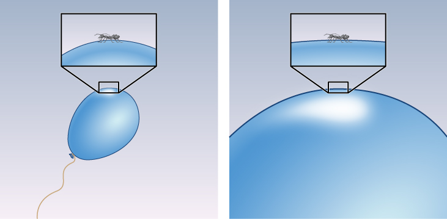

# Learning Objectives

By the end of this section, you will be able to:

* Describe two important properties of the universe that the simple Big Bang model cannot explain
* Explain why these two characteristics of the universe can be accounted for if there was a period of rapid expansion (inflation) of the universe just after the Big Bang
* Name the four forces that control all physical processes in the universe

The hot Big Bang model that we have been describing is remarkably successful. It accounts for the expansion of the universe, explains the observations of the CMB, and correctly predicts the abundances of the light elements. As it turns out, this model also predicts that there should be exactly three types of neutrinos in nature, and this prediction has been confirmed by experiments with high-energy accelerators. We can’t relax just yet, however. This standard model of the universe doesn’t explain *all* the observations we have made about the universe as a whole.

# Problems with the Standard Big Bang Model

There are a number of characteristics of the universe that can only be explained by considering further what might have happened before the emission of the CMB. One problem with the standard **Big Bang**{: data-type="term" .no-emphasis} model is that it does not explain why the density of the universe is equal to the critical density. The mass density could have been, after all, so low and the effects of dark energy so high that the expansion would have been too rapid to form any galaxies at all. Alternatively, there could have been so much matter that the universe would have already begun to contract long before now. Why is the universe balanced so precisely on the knife edge of the critical density?

Another puzzle is the remarkable *uniformity* of the universe. The temperature of the CMB is the same to about 1 part in 100,000 everywhere we look. This sameness might be expected if all the parts of the visible universe were in contact at some point in time and had the time to come to the same temperature. In the same way, if we put some ice into a glass of lukewarm water and wait a while, the ice will melt and the water will cool down until they are the same temperature.

However, if we accept the standard Big Bang model, all parts of the visible universe were *not* in contact at any time. The fastest that information can go from one point to another is the speed of light. There is a maximum distance that light can have traveled from any point since the time the universe began—that’s the distance light could have covered since then. This distance is called that point’s *horizon distance* because anything farther away is “below its horizon”—unable to make contact with it. One region of space separated by more than the **horizon distance**{: data-type="term" .no-emphasis} from another has been completely isolated from it through the entire history of the universe.

If we measure the CMB in two opposite directions in the sky, we are observing regions that were significantly beyond each other’s horizon distance at the time the CMB was emitted. We can see both regions, but *they* can never have seen each other. Why, then, are their temperatures so precisely the same? According to the standard Big Bang model, they have never been able to exchange information, and there is no reason they should have identical temperatures. (It’s a little like seeing the clothes that all the students wear at two schools in different parts of the world become identical, without the students ever having been in contact.) The only explanation we could suggest was simply that the universe somehow *started out* being absolutely uniform (which is like saying all students were born liking the same clothes). Scientists are always uncomfortable when they must appeal to a special set of initial conditions to account for what they see.

# The Inflationary Hypothesis

Some physicists suggested that these fundamental characteristics of the cosmos—its flatness and uniformity—can be explained if shortly after the Big Bang (and before the emission of the CMB), the universe experienced a sudden increase in size. A model universe in which this rapid, early expansion occurs is called an **inflationary universe**{: data-type="term"}. The inflationary universe is identical to the Big Bang universe for all time after the first 10–30 second. Prior to that, the model suggests that there was a brief period of extraordinarily rapid expansion or inflation, during which the scale of the universe increased by a factor of about 1050 times more than predicted by standard Big Bang models ([\[link\]](#OSC_Astro_29_06_Inflation)).

  and for the inflationary model (blue line). (Note that the time scale at the bottom is extremely compressed.) During inflation, regions that were very small and in contact with each other are suddenly blown up to be much larger and outside each other&#x2019;s horizon distance. The two models are the same for all times after 10&#x2013;30 second."){: #OSC_Astro_29_06_Inflation data-title="Expansion of the Universe."}

Prior to (and during) inflation, all the parts of the universe that we can now see were so small and close to each other that they *could* exchange information, that is, the horizon distance included all of the universe that we can now observe. Before (and during) inflation, there was adequate time for the observable universe to homogenize itself and come to the same temperature. Then, inflation expanded those regions tremendously, so that many parts of the universe are now beyond each other’s horizon.

Another appeal of the inflationary model is its prediction that the density of the universe should be exactly equal to the critical density. To see why this is so, remember that curvature of spacetime is intimately linked to the density of matter. If the universe began with some curvature of its spacetime, one analogy for it might be the skin of a balloon. The period of inflation was equivalent to blowing up the balloon to a tremendous size. The universe became so big that from our vantage point, no curvature should be visible ([\[link\]](#OSC_Astro_29_06_Analogy)). In the same way, Earth’s surface is so big that it looks flat to us no matter where we are. Calculations show that a universe with no curvature is one that is at critical density. Universes with densities either higher or lower than the critical density would show marked curvature. But we saw that the observations of the CMB in [\[link\]](/m59979#OSC_Astro_29_04_CMBSatell), which show that the universe has critical density, rule out the possibility that space is significantly curved.

 {: #OSC_Astro_29_06_Analogy data-title="Analogy for Inflation."}

# Grand Unified Theories

While inflation is an intriguing idea and widely accepted by researchers, we cannot directly observe events so early in the universe. The conditions at the time of inflation were so extreme that we cannot reproduce them in our laboratories or high-energy accelerators, but scientists have some ideas about what the universe might have been like. These ideas are called **grand unified theories**{: data-type="term"} or GUTs.

In GUT models, the forces that we are familiar with here on Earth, including gravity and electromagnetism, behaved very differently in the extreme conditions of the early universe than they do today. In physical science, the term *force* is used to describe anything that can change the motion of a particle or body. One of the remarkable discoveries of modern science is that all known physical processes can be described through the action of just four forces: gravity, electromagnetism, the strong nuclear force, and the weak nuclear force ([\[link\]](#fs-id1163976749235)).

<table class="span-all" summary="No-Summary"><thead>
<tr valign="top">
<th colspan="4" data-valign="top" data-align="center">The Forces of Nature</th>
</tr>
<tr valign="top">
<th data-valign="top" data-align="center">Force</th>
<th data-valign="top" data-align="center">Relative Strength Today</th>
<th data-valign="top" data-align="center">Range of Action</th>
<th data-valign="top" data-align="center">Important Applications</th>
</tr>
</thead><tbody>
<tr valign="top">
<td data-valign="top" data-align="left">Gravity</td>
<td data-valign="top" data-align="left">1</td>
<td data-valign="top" data-align="left">Whole universe</td>
<td data-valign="top" data-align="left">Motions of planets, stars, galaxies</td>
</tr>
<tr valign="top">
<td data-valign="top" data-align="left">Electromagnetism</td>
<td data-valign="top" data-align="left">1036</td>
<td data-valign="top" data-align="left">Whole universe</td>
<td data-valign="top" data-align="left">Atoms, molecules, electricity, magnetic fields</td>
</tr>
<tr valign="top">
<td data-valign="top" data-align="left">Weak nuclear force</td>
<td data-valign="top" data-align="left">1033</td>
<td data-valign="top" data-align="left">10–17 meters</td>
<td data-valign="top" data-align="left">Radioactive decay</td>
</tr>
<tr valign="top">
<td data-valign="top" data-align="left">Strong nuclear force</td>
<td data-valign="top" data-align="left">1038</td>
<td data-valign="top" data-align="left">10–15 meters</td>
<td data-valign="top" data-align="left">The existence of atomic nuclei</td>
</tr>
</tbody></table>

Gravity is perhaps the most familiar force, and certainly appears strong if you jump off a tall building. However, the force of gravity between two elementary particles—say two protons—is by far the weakest of the four forces. Electromagnetism—which includes both magnetic and electrical forces, holds atoms together, and produces the electromagnetic radiation that we use to study the universe—is much stronger, as you can see in [\[link\]](#fs-id1163976749235). The weak nuclear force is only weak in comparison to its strong “cousin,” but it is in fact much stronger than gravity.

Both the weak and strong nuclear forces differ from the first two forces in that they act only over very small distances—those comparable to the size of an atomic nucleus or less. The weak force is involved in radioactive decay and in reactions that result in the production of neutrinos. The strong force holds protons and neutrons together in an atomic nucleus.

Physicists have wondered why there are four forces in the universe—why not 300 or, preferably, just one? An important hint comes from the name *electromagnetic force*. For a long time, scientists thought that the forces of electricity and magnetism were separate, but James Clerk **Maxwell**{: data-type="term" .no-emphasis} (see the chapter on [Radiation and Spectra](/m59791){: .target-chapter}) was able to *unify* these forces—to show that they are aspects of the same phenomenon. In the same way, many scientists (including Einstein) have wondered if the four forces we now know could also be unified. Physicists have actually developed GUTs that unify three of the four forces (but not gravity).

In these theories, the strong, weak, and electromagnetic forces are not three independent forces but instead are different manifestations or aspects of what is, in fact, a single force. The theories predict that at high enough temperatures, there would be only one force. At lower temperatures (like the ones in the universe today), however, this single force has changed into three different forces ([\[link\]](#OSC_Astro_29_06_FForce)). Just as different gases or liquids freeze at different temperatures, we can say that the different forces “froze out” of the unified force at different temperatures. Unfortunately, the temperatures at which the three forces acted as one force are so high that they cannot be reached in any laboratory on Earth. Only the early universe, at times prior to 10–35 second, was hot enough to unify these forces.

  shows that at very early times when the temperature of the universe was very high, all four forces resembled one another and were indistinguishable. As the universe cooled, the forces took on separate and distinctive characteristics."){: #OSC_Astro_29_06_FForce data-title="Four Forces That Govern the Universe."}

Many physicists think that gravity was also unified with the three other forces at still higher temperatures, and scientists have tried to develop a theory that combines all four forces. For example, in **string theory**{: data-type="term" .no-emphasis}, the point-like particles of matter that we have discussed in this book are replaced by one-dimensional objects called strings. In this theory, infinitesimal strings, which have length but not height or width, are the building blocks used to construct all the forms of matter and energy in the universe. These strings exist in 11-dimensional space (not the 4-dimensional spacetime with which we are familiar). The strings vibrate in the various dimensions, and depending on how they vibrate, they are seen in our world as matter or gravity or light. As you can imagine, the mathematics of string theory is very complex, and the theory remains untested by experiments. Even the largest particle accelerators on Earth do not achieve high enough energy to show whether string theory applies to the real world.

String theory is interesting to scientists because it is currently the only approach that seems to have the potential of combining all four forces to produce what physicists have termed the Theory of Everything.[1](#footnote1){: data-type="footnote-number" name="footnote-ref1"} Theories of the earliest phases of the universe must take both quantum mechanics and gravity into account, but at the simplest level, gravity and quantum mechanics are incompatible. General relativity, our best theory of gravity, says that the motions of objects can be predicted exactly. Quantum mechanics says you can only calculate the probability (chance) that an object will do something. String theory is an attempt to resolve this paradox. The mathematics that underpins string theory is elegant and beautiful, but it remains to be seen whether it will make predictions that can be tested by observations in yet-to-be-developed, high-energy accelerators on Earth or by observations of the early universe.

The earliest period in the history of the universe from time zero to 10–43 second is called the **Planck time**{: data-type="term" .no-emphasis}. The universe was unimaginably hot and dense, and theorists believe that at this time, quantum effects of gravity dominated physical interactions—and, as we have just discussed, we have no tested theory of quantum gravity. Inflation is hypothesized to have occurred somewhat later, when the universe was between perhaps 10–35 and 10–33 second old and the temperature was 1027 to 1028 K. This rapid expansion took place when three forces (electromagnetic, strong, and weak) are thought to have been unified, and this is when GUTs are applicable.

After inflation, the universe continued to expand (but more slowly) and to cool. An important milestone was reached when the temperature was down to 1015 K and the universe was 10–10 second old. Under these conditions, all four forces were separate and distinct. High-energy particle accelerators can achieve similar conditions, and so theories of the history of the universe from this point on have a sound basis in experiments.

As yet, we have no direct evidence of what the conditions were during the inflationary epoch, and the ideas presented here are speculative. Researchers are trying to devise some experimental tests. For example, the quantum fluctuations in the very early universe would have caused variations in density and produced gravitational waves that may have left a detectable imprint on the CMB. Detection of such an imprint will require observations with equipment whose sensitivity is improved from what we have today. Ultimately, however, it may provide confirmation that we live in a universe that once experienced an epoch of rapid inflation.

If you are typical of the students who read this book, you may have found this brief discussion of dark matter, inflation, and cosmology a bit frustrating. We have offered glimpses of theories and observations, but have raised more questions than we have answered. What is dark matter? What is dark energy? Inflation explains the observations of flatness and uniformity of the university, but did it actually happen? These ideas are at the forefront of modern science, where progress almost always leads to new puzzles, and much more work is needed before we can see clearly. Bear in mind that less than a century has passed since Hubble demonstrated the existence of other galaxies. The quest to understand just how the universe of galaxies came to be will keep astronomers busy for a long time to come.

# Key Concepts and Summary

The Big Bang model does not explain why the CMB has the same temperature in all directions. Neither does it explain why the density of the universe is so close to critical density. These observations can be explained if the universe experienced a period of rapid expansion, which scientists call inflation, about 10–35 second after the Big Bang. New grand unified theories (GUTs) are being developed to describe physical processes in the universe before and at the time that inflation occurred.

## Footnotes
{: data-type="footnote-title"}

1.  [1](#footnote-ref1){: data-type="footnote-ref" name="footnote1"} This name became the title of a film about physicist Stephen Hawking in 2014.

## Glossary
{: data-type="glossary-title"}

grand unified theories
: (GUTs) physical theories that attempt to describe the four forces of nature as different manifestations of a single force
{: .definition}

inflationary universe
: a theory of cosmology in which the universe is assumed to have undergone a phase of very rapid expansion when the universe was about 10–35 second old; after this period of rapid expansion, the standard Big Bang and inflationary models are identical
{: .definition}

